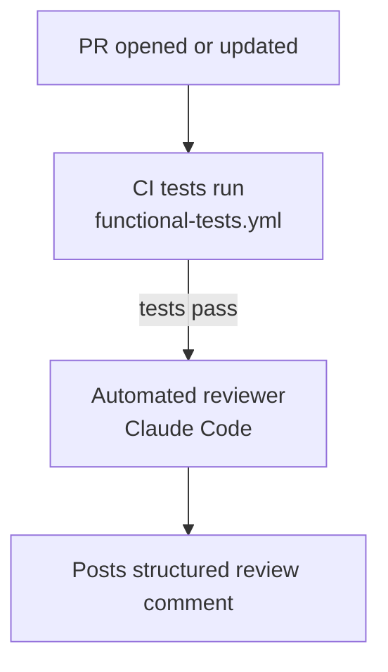

# CI Review Automation

Shaken Fist projects use Claude Code-powered automation for PR
reviews, test fixing, and comment addressing. This page describes
the workflow templates and how to add them to a new project.

## How It Works

The automation consists of several GitHub Actions workflows that
respond to PR events and bot commands:



The review is where the automation stops. Its findings are worked
through interactively; the workflow which acted on them automatically
is retired, see below.

### Bot Commands

Repository collaborators with write access can trigger these
commands by commenting on a PR:

| Command | Workflow | Description |
|---------|----------|-------------|
| `@shakenfist-bot please retest` | `pr-retest.yml` | Re-run functional tests |
| `@shakenfist-bot please re-review` | `pr-re-review.yml` | Fresh automated review |
| `@shakenfist-bot please attempt to fix` | `pr-fix-tests.yml` | Fix failing tests (separate template) |

## Security Model

These workflows use `issue_comment` triggers, which run with
elevated permissions. Security is enforced through multiple layers:

1. **Authorization** -- only repository collaborators with write
   access can trigger commands (enforced by
   `shakenfist/actions/pr-bot-trigger`)
2. **Trusted tools** -- scripts are checked out from the base branch,
   not the PR, preventing execution of malicious PR code
3. **No credential persistence** -- `persist-credentials: false`
   prevents tokens from being stored in the checkout
4. **Git hooks disabled** -- `core.hooksPath=/dev/null` prevents
   malicious git hooks from the PR
5. **No pre-commit** -- pre-commit hooks execute repository code and
   are skipped in privileged workflows
6. **Just-in-time auth** -- `gh auth setup-git` is used only when
   pushing, not during the entire workflow

See the [GitHub Security Lab article](https://securitylab.github.com/research/github-actions-preventing-pwn-requests/)
for background on `issue_comment` trigger security.

## Workflow Templates

Templates are in
[`templates/ci-review-automation/`](https://github.com/shakenfist/development/tree/main/templates/ci-review-automation):

| Template | Customisation | Description |
|----------|---------------|-------------|
| `pr-re-review.yml` | None | Manual re-review trigger |
| `pr-retest.yml` | None | Manual test re-run |

Both files are project-agnostic and can be copied directly.

For projects with large test suites that would benefit from
automatic test fixing, see the separate
[`templates/test-drift-fix/`](https://github.com/shakenfist/development/tree/main/templates/test-drift-fix)
templates which provide `pr-fix-tests.yml` and
`test-drift-fix.yml`.

## Adding CI Review Automation to a Project

### Step 1: Copy the Workflow Files

```bash
# From the target project root:
cp /path/to/development/templates/ci-review-automation/pr-re-review.yml \
    .github/workflows/
cp /path/to/development/templates/ci-review-automation/pr-retest.yml \
    .github/workflows/
```

For projects with large test suites, also copy from
`templates/test-drift-fix/`:

```bash
cp /path/to/development/templates/test-drift-fix/pr-fix-tests.yml \
    .github/workflows/
cp /path/to/development/templates/test-drift-fix/test-drift-fix.yml \
    .github/workflows/
# Then customise test-drift-fix.yml for your project
```

### Step 2: Add Automated Reviewer to CI

Modify your main CI workflow (e.g. `functional-tests.yml`) to add:

1. A top-level `permissions` block with `pull-requests: write`
2. A job calling the shared
   `shakenfist/actions/.github/workflows/pr-auto-review.yml@main`,
   with the project's test jobs in its `needs:` list

See the
[template README](https://github.com/shakenfist/development/tree/main/templates/ci-review-automation/README.md)
for the exact YAML snippets.

### Step 3: Ensure Runner Labels

Your self-hosted runners need these labels:

- `claude-code` -- runners with Claude Code CLI installed
- `static` -- small runners for non-mutating jobs (bot trigger
  parsing, permission checks)

## Not Reviewing The Bot's Own Commits

A push authored by `bot@shakenfist.com` skips the automated
reviewer. Projects calling the shared `pr-auto-review.yml` get this
for free and should delete any local `check-bot-commit` job; see
[Not Reviewing The Bot's Own Commits](/components/development/automated-pr-review/#not-reviewing-the-bots-own-commits)
for what the guard is for.

## The retired comment addresser

There is no `pr-address-comments.yml` template here, and there will
not be one: the comment addresser is retired, and a repository still
carrying any part of it fails the audit. What it was, why it went, and
exactly which files to delete are in
[`docs/audits/ci-review-automation.md`](/components/development/audits/ci-review-automation/).

One thing about the reaping belongs here, because it is about the
templates rather than about the audit. `render-review.py` in the shared action
still ends every review it posts with a line telling the reader to
use the addresser's trigger phrase. Once the chain is reaped that
invites a command nothing answers -- no workflow, no reply, no
failure -- which is the outcome the retired workflow's own failure
reporting existed to avoid. Dropping those lines is a change to
shakenfist/actions and cannot land here.

## Shared Actions

The trigger and review logic lives in the
[shakenfist/actions](https://github.com/shakenfist/actions)
repository:

- **pr-bot-trigger** -- parses `@shakenfist-bot` commands, checks
  permissions, adds reactions, posts status messages
- **review-pr-with-claude** -- runs automated code reviews with
  structured JSON output and embedded review data

## Projects Using This Automation

Which projects have which of these is measured every morning rather
than listed here, because a hand-maintained table of fleet state goes
stale silently: see the `ci-review-automation` section of
[the compliance page](/components/development/audits/compliance/#ci-review-automation).
Note that imago is not in the audit matrix, so it is the one project
carrying this automation which the audit will never report on.
