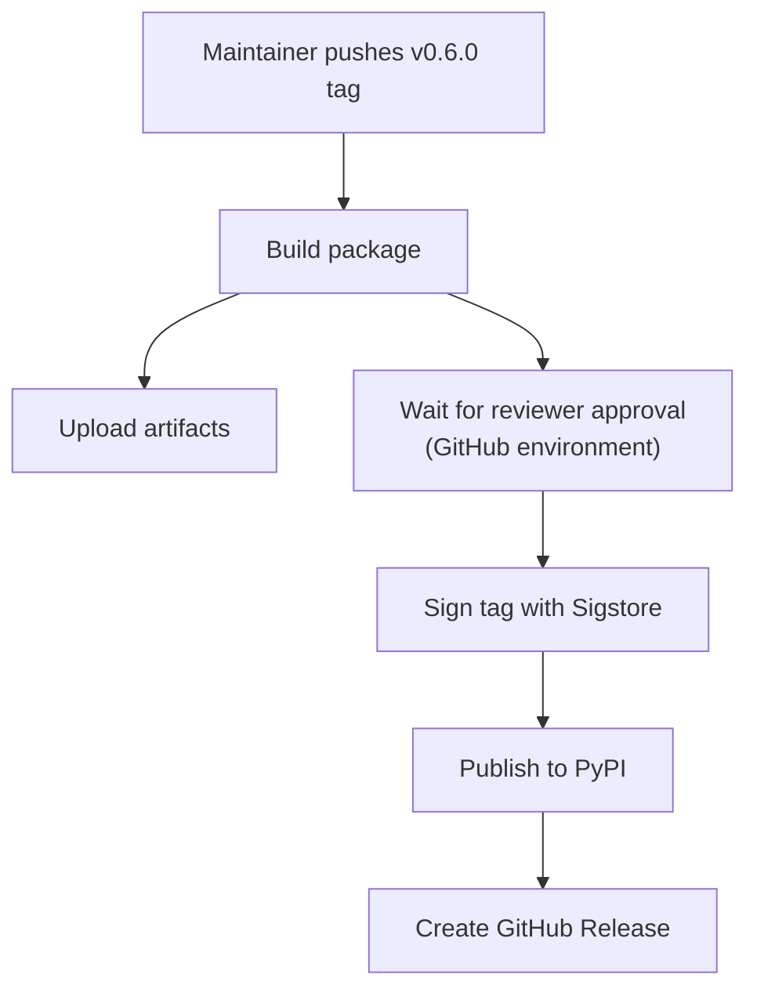

# Release Automation

Shaken Fist Python projects use a standardised release workflow
based on GitHub Actions, PyPI trusted publishers, and Sigstore
signing. This page describes the release infrastructure and how
to add it to a new project.

## How It Works

When a maintainer pushes a git tag matching `v*` (e.g. `v0.6.0`),
the `release.yml` workflow:

1. **Builds** the package using `python3 -m build` in a clean venv
2. **Validates** the package with `twine check`
3. **Waits for approval** from a required reviewer (via a GitHub
   environment)
4. **Signs the tag** using Sigstore/gitsign (keyless, OIDC-based)
5. **Publishes to PyPI** using trusted publishers (no API tokens)
6. **Creates a GitHub Release** with the built artifacts and
   auto-generated release notes

The release job downloads the distribution to a named path and sets
`fail_on_unmatched_files`, so that a release which attaches nothing
fails rather than reporting success. Both are load bearing: with a
bare download and the action's default of warning on an unmatched
glob, an empty release is indistinguishable from a good one.

The workflow can also be started by hand, which runs the build and the
`twine check` as a smoke test and stops there. Everything from the tag
signing down is confined to a pushed tag with
`if: github.event_name == 'push' && startsWith(github.ref,
'refs/tags/v')`. Both clauses are needed: aimed at a branch, an
unguarded `sign-tag` would take `refs/heads/<branch>` for a tag name and
force-push `refs/tags/refs/heads/<branch>`; aimed at an existing tag, a
ref-only guard would let the run re-sign and force-push that tag,
rewriting a signed object someone may already have verified. Re-running
a failed release still works, because "Re-run jobs" replays the original
push event.

These runners are persistent and `download-artifact` extracts into its
target rather than replacing it, so a publishing job must not read a
directory an earlier job may have left files in. The two jobs solve
that differently. `publish-pypi` checks out, which cleans the workspace
with `git clean -ffdx`, and works in `dist/` -- it has to, because
`pypa/gh-action-pypi-publish` delegates to a Docker container action,
and the container is given `RUNNER_TEMP` at `/github/runner_temp` while
`${{ runner.temp }}` expands to the host path, which is not there.
`github-release` runs a JavaScript action on the host, so it skips the
checkout and downloads into the per-job `${{ runner.temp }}` instead.



## Security Properties

The release process is designed to eliminate long-lived secrets:

- **No PyPI API tokens** -- authentication uses OIDC trusted
  publishers, where PyPI verifies the GitHub Actions workflow
  identity directly
- **No GPG keys** -- tag signing uses Sigstore's keyless signing
  with OIDC identity certificates, recorded in the Rekor
  transparency log
- **Multi-party approval** -- the `release` environment requires
  a reviewer to approve before publishing proceeds
- **Protected tags** -- tag rulesets prevent unauthorized users
  from creating release tags
- **Build provenance** -- Sigstore attestations cryptographically
  link published artifacts to the exact source commit

## Adding Release Automation to a Project

### Prerequisites

The project must:

- Use `pyproject.toml` with `setuptools_scm` (or similar) for
  version detection from git tags
- Not have an old `release.sh` script (remove it first)

### Step 1: Copy the Templates

Templates are in
[`templates/release-automation/`](https://github.com/shakenfist/development/tree/main/templates/release-automation):

| Template | Destination |
|----------|-------------|
| `release.yml` | `.github/workflows/release.yml` |
| `RELEASE-SETUP.md` | `RELEASE-SETUP.md` (repo root) |

Replace the placeholders in the copied files:

| Placeholder | Description | Example |
|-------------|-------------|---------|
| `{{PROJECT_DISPLAY_NAME}}` | Human-readable name | `Occy Strap` |
| `{{PYPI_PACKAGE_NAME}}` | PyPI package name | `occystrap` |
| `{{GITHUB_REPO_NAME}}` | GitHub repo name | `occystrap` |

### Step 2: Configure PyPI Trusted Publisher

1. Log in to [pypi.org](https://pypi.org)
2. Navigate to your project's **Publishing** settings
3. Add a trusted publisher:
   - **Owner**: `shakenfist`
   - **Repository**: your repo name
   - **Workflow**: `release.yml`
   - **Environment**: `release`

### Step 3: Create GitHub Environment

1. Go to **Settings** > **Environments** in the repository
2. Create an environment named `release`
3. Add required reviewers
4. Restrict deployment to tags matching `v*`

### Step 4: Configure Protected Tags

1. Go to **Settings** > **Rules** > **Rulesets**
2. Create a tag ruleset for `v*` with restricted creation and
   deletion
3. Add maintainers to the bypass list

### Step 5: Remove Old Release Scripts

Delete any existing `release.sh` and commit the removal.

## Projects Using This Infrastructure

| Project | PyPI Package | Status |
|---------|-------------|--------|
| [shakenfist](https://github.com/shakenfist/shakenfist) | `shakenfist` | Live |
| [occystrap](https://github.com/shakenfist/occystrap) | `occystrap` | Live |
| [kerbside](https://github.com/shakenfist/kerbside) | `kerbside` | Live |
| [agent-python](https://github.com/shakenfist/agent-python) | `shakenfist-agent` | Added |

## Verifying a Release

### Tag Signature

```bash
gitsign verify --certificate-identity-regexp='.*' \
    --certificate-oidc-issuer='https://token.actions.githubusercontent.com' \
    v0.6.0
```

### PyPI Attestation

Check the **Provenance** section on the package's PyPI page.

### Artifact Attestation

```bash
cosign verify-attestation \
    --certificate-identity-regexp='.*' \
    --certificate-oidc-issuer='https://token.actions.githubusercontent.com' \
    package-0.6.0.tar.gz
```
