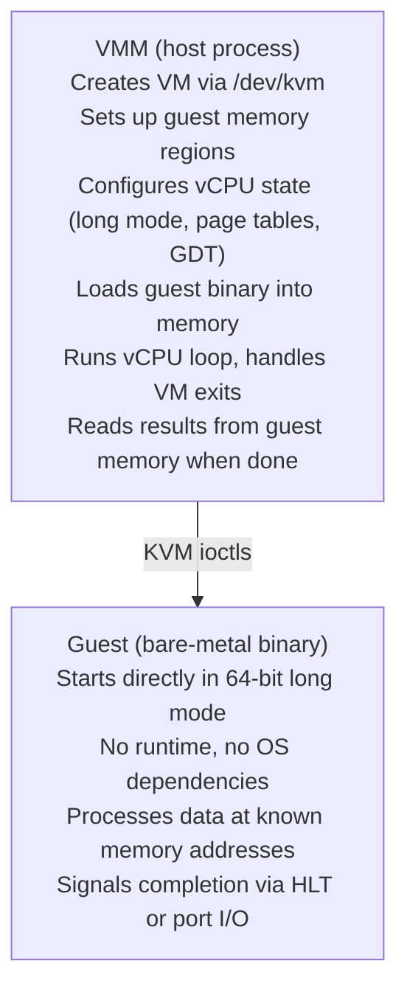

# KVM Hello World Prototype

A minimal proof-of-concept demonstrating a bare-metal binary running as a KVM
guest without any operating system.

## Motivation

The broader goal is secure, isolated data processing - specifically for
scenarios like disk image transcoding where running qemu-img in a traditional
environment presents security concerns. A minimal KVM guest with no syscall
surface provides strong isolation guarantees with a small, auditable codebase.

This prototype validates the foundational approach before building more
complex functionality.

## Architecture



## Components

### VMM (Virtual Machine Monitor)

The host-side Rust application (`vmm/`) that:

- Opens `/dev/kvm` and creates a VM and vCPU
- Allocates 2MB of guest memory
- Sets up x86-64 long mode before guest entry:
  - GDT with 64-bit code/data segments
  - Identity-mapped page tables (1GB using 2MB pages)
  - CR0, CR3, CR4, EFER configured for long mode
  - Segment registers (CS, DS, SS)
  - RSP pointing to valid stack, RIP to guest entry point
- Loads the guest binary into memory at 0x10000
- Runs the vCPU in a loop, handling exits:
  - `KVM_EXIT_IO` - Serial port output (port 0x3f8)
  - `KVM_EXIT_HLT` - Guest completion signal
  - `KVM_EXIT_SHUTDOWN` - Triple fault (debugging)

### Guest Binary

A bare-metal Rust binary (`guest/`) compiled with `#![no_std]`:

- No standard library, no OS dependencies
- Compiled for `x86_64-unknown-none` target
- Uses `build-std` to compile `core` from source
- Custom linker script places code at 0x10000
- Writes "Hello from KVM guest!" to serial port 0x3f8
- Executes HLT to signal completion

## Memory Layout

| Address Range     | Purpose              |
|-------------------|----------------------|
| 0x1000-0x1FFF     | GDT (4KB)            |
| 0x2000-0x5FFF     | Page tables (16KB)   |
| 0x10000-0x1FFFF   | Guest code (64KB)    |
| 0x20000-0x2FFFF   | Stack (64KB)         |

## Long Mode Setup

The VMM configures the vCPU with:

### Control Registers

- **CR0**: PE (bit 0) + PG (bit 31) = Protected mode + Paging
- **CR3**: Physical address of PML4 table
- **CR4**: PAE (bit 5) = Physical Address Extension
- **EFER**: LME (bit 8) + LMA (bit 10) = Long Mode Enable/Active

### GDT Structure

Minimal GDT with three entries:

- Entry 0: Null descriptor
- Entry 1: 64-bit code segment (selector 0x08)
- Entry 2: 64-bit data segment (selector 0x10)

### Page Tables

Identity mapping using 2MB pages:

- PML4 (1 entry) → PDPT (1 entry) → PD (512 entries)
- 512 × 2MB = 1GB identity mapped

## Building

### Prerequisites

- Linux with KVM support (`/dev/kvm`)
- Rust nightly toolchain (for `build-std` feature)
- `rust-src` component
- `cargo-binutils` (provides `rust-objcopy`)

### Using DevContainer (Recommended)

The prototype includes a devcontainer with all dependencies:

```bash
cd prototypes/helloworld

# Using devcontainer CLI
devcontainer up --workspace-folder .
devcontainer exec --workspace-folder . ./build.sh

# Or using Docker directly
docker build -t helloworld-dev .devcontainer/
docker run --rm -it --device=/dev/kvm \
    -v "$(pwd)":/workspace -w /workspace \
    helloworld-dev ./build.sh
```

### Manual Build

```bash
cd prototypes/helloworld

# Install Rust nightly with required components
rustup install nightly
rustup component add rust-src --toolchain nightly
rustup component add llvm-tools-preview
cargo install cargo-binutils

# Build
./build.sh
```

## Running

```bash
sudo ./target/release/vmm guest.bin
```

Note: `sudo` is required for `/dev/kvm` access unless your user is in the
`kvm` group.

### Expected Output

```
Loaded guest binary: 99 bytes from guest.bin
KVM API version: 12
Created VM
Allocated 2097152 bytes of guest memory
Configured memory region
Set up GDT at 0x1000
Set up page tables at 0x2000
Loaded guest code at 0x10000
Created vCPU
Configured special registers for long mode
Configured general registers (RIP=0x10000, RSP=0x2fff8)

--- Starting guest execution ---

Hello from KVM guest!

--- Guest executed HLT ---
Guest completed successfully!
```

## Key Implementation Details

### No IDT

Without an interrupt descriptor table, any exception (page fault, general
protection fault, divide by zero) causes a triple fault and VM shutdown. This
is acceptable for the hello world prototype; a minimal IDT would be needed for
debugging more complex guests.

### Stack Alignment

The x86-64 ABI expects 16-byte stack alignment at function calls. The initial
RSP is set to 0x2fff8 to ensure proper alignment.

### Flat Binary

The guest ELF is converted to a flat binary using `rust-objcopy -O binary`.
This strips all ELF metadata, producing raw machine code that can be loaded
directly at the entry point address.

### Identity Mapping

With physical addresses equal to virtual addresses, the guest code doesn't
need to handle address translation complexity. The VMM sets up page tables
that map the first 1GB of memory 1:1.

## Future Extensions

This prototype establishes the foundation for:

- Input/output data buffers for actual processing
- Minimal IDT for exception debugging
- Multiple vCPUs for parallel processing
- Timing and performance measurement
- Actual disk image transcoding workload

## References

- [rust-vmm project](https://github.com/rust-vmm)
- [kvm-ioctls crate](https://crates.io/crates/kvm-ioctls)
- [OSDev wiki: Long Mode](https://wiki.osdev.org/Long_Mode)
- [Linux KVM API](https://www.kernel.org/doc/html/latest/virt/kvm/api.html)
