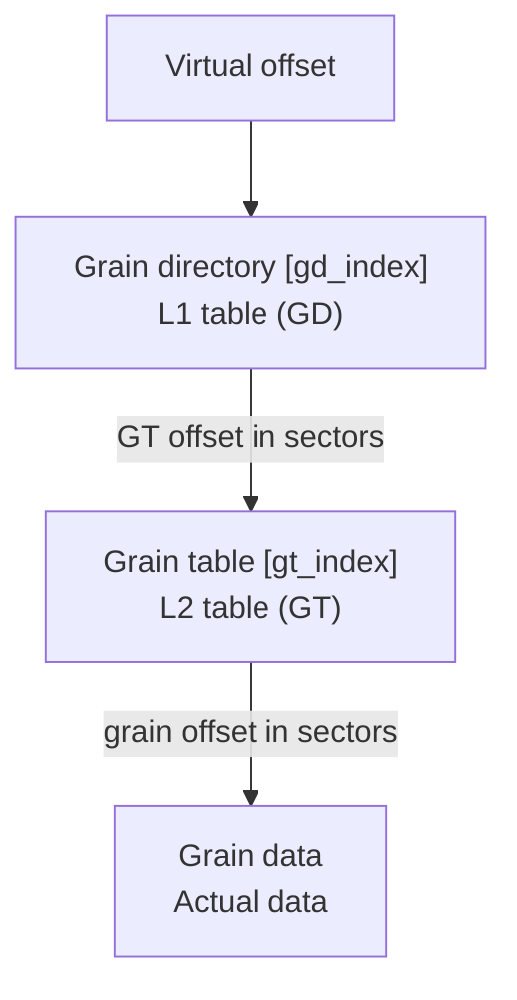

# VMDK Grain Directory and Grain Tables

VMDK sparse images use a two-level table structure for mapping virtual
disk offsets to physical grain locations.

## Terminology

| Term | Meaning |
|------|---------|
| Grain | Basic allocation unit (like qcow2 cluster) |
| Grain Directory (GD) | L1 table - points to grain tables |
| Grain Table (GT) | L2 table - points to grain data |
| GTE | Grain Table Entry |
| RGD | Redundant Grain Directory (backup) |

## Grain Size

Grains are the smallest addressable allocation units:

```c
grain_size_bytes = granularity * 512;  // From header
```

**Typical values:**
- 128 sectors = 64 KB (common default)
- 8 sectors = 4 KB (SESparse fixed)

## Two-Level Address Translation



## Index Calculations

```c
// Sectors covered by one L2 table (grain table)
l1_entry_sectors = num_gtes_per_gt * granularity;

// L1 index (which grain table)
gd_index = (offset >> 9) / l1_entry_sectors;

// L2 index (which entry in grain table)
gt_index = ((offset >> 9) / granularity) % num_gtes_per_gt;

// Offset within grain
in_grain_offset = offset % (granularity * 512);
```

### Example: 64KB Grains, 512 GTEs

```
granularity = 128 sectors (64 KB)
num_gtes_per_gt = 512
l1_entry_sectors = 512 * 128 = 65536 sectors = 32 MB per GD entry

For virtual offset 0x10000000 (256 MB):
  sector = 0x10000000 >> 9 = 524288
  gd_index = 524288 / 65536 = 8
  gt_index = (524288 / 128) % 512 = 4096 % 512 = 0
```

## Entry Formats

### VMDK3/4 (32-bit entries)

**Grain Directory Entry:**
```c
uint32_t gt_offset;  // Grain table offset in sectors (0 = not allocated)
```

**Grain Table Entry:**
```c
uint32_t grain_offset;  // Grain offset in sectors
                        // 0 = not allocated
                        // 1 = zeroed grain (if ZERO_GRAIN flag set)
```

### SESparse (64-bit entries)

**Grain Directory Entry:**
```c
uint64_t gt_offset;  // High nibble must be 0x1 if allocated
                     // Validation: (entry & 0xffffffff00000000) == 0x1000000000000000
```

**Grain Table Entry:**
```c
uint64_t entry;
// Bits [63:60] = state
//   0x0 = unallocated
//   0x1 = SCSI unmapped
//   0x2 = zero grain
//   0x3 = allocated
// Bits [59:0] = encoded offset (for state 0x3)
```

### Decoding SESparse Allocated Entry

```c
if ((entry & 0xf000000000000000) == 0x3000000000000000) {
    // Allocated grain
    uint64_t offset = ((entry & 0x0fff000000000000) >> 48) |
                      ((entry & 0x0000ffffffffffff) << 12);
    grain_sector = sesparse_clusters_offset + offset * granularity;
}
```

## Special Entry Values

| Value | Meaning |
|-------|---------|
| 0x00000000 | Not allocated (read from backing or zeros) |
| 0x00000001 | Zeroed grain (VMDK_GTE_ZEROED, if flag set) |

## Redundant Grain Directory (RGD)

When `VMDK4_FLAG_RGD` is set:
- Primary GD at `gd_offset`
- Backup GD at `rgd_offset`
- Both must be kept in sync
- Provides crash recovery capability

```c
// Update both directories
vmdk_L2update(extent, metadata, offset) {
    // Write to primary GD's grain table
    write(extent->file, gd_l2_offset, &offset);

    // Write to backup GD's grain table
    if (extent->l1_backup_table_offset != 0) {
        write(extent->file, rgd_l2_offset, &offset);
    }
}
```

## Grain Allocation

When writing to an unallocated grain:

```c
if (cluster_sector == 0 || cluster_sector == VMDK_GTE_ZEROED) {
    if (!allocate) {
        return (cluster_sector == VMDK_GTE_ZEROED) ?
               VMDK_ZEROED : VMDK_UNALLOC;
    }

    // Allocate at end of file
    cluster_sector = extent->next_cluster_sector;
    extent->next_cluster_sector += extent->cluster_sectors;

    // Perform COW if needed
    get_whole_cluster(bs, extent, cluster_sector, offset, ...);
}
```

## Copy-on-Write (COW)

When allocating a new grain with a backing file:

1. Allocate grain at `next_cluster_sector`
2. For regions outside the write:
   - Read from backing file
   - Write to new grain location
3. Update grain table entry
4. Flush and sync

```c
get_whole_cluster(bs, extent, cluster_offset, offset,
                  skip_start_bytes, skip_end_bytes, zeroed) {
    if (backing && !zeroed) {
        // Read leading bytes from backing
        bdrv_co_pread(bs->backing, offset, skip_start_bytes, buf);
        bdrv_co_pwrite(extent->file, cluster_offset, skip_start_bytes, buf);

        // Read trailing bytes from backing
        bdrv_co_pread(bs->backing, offset + skip_end_bytes, ...);
        bdrv_co_pwrite(extent->file, cluster_offset + skip_end_bytes, ...);
    }
}
```

## L2 Cache

qemu caches grain tables for performance:

```c
#define L2_CACHE_SIZE 16

struct VmdkExtent {
    void *l2_cache;                    // Cached grain tables
    uint32_t l2_cache_offsets[16];     // Which GTs are cached
    uint32_t l2_cache_counts[16];      // Access counts for LRU
};
```

- 16 grain tables cached in memory
- LRU eviction based on access counts
- Reduces disk reads for hot regions

## Table Sizes

```c
// Entries per grain table (from header)
l2_size = num_gtes_per_gt;  // Typically 512

// Bytes per grain table
l2_size_bytes = l2_size * entry_size;  // 2048 bytes for 32-bit entries

// Maximum L1 table size
max_l1_entries = 32000000;
```

## Comparison: VMDK vs qcow2

| Aspect | VMDK | qcow2 |
|--------|------|-------|
| L1 entry size | 32-bit | 64-bit |
| L2 entry size | 32-bit (64-bit SESparse) | 64-bit |
| Grain/cluster size | Variable (typically 64KB) | Variable (typically 64KB) |
| Entries per L2 | 512 (fixed) | Variable |
| Redundant tables | Yes (RGD) | No |
| Compression | Per-grain | Per-cluster |

## Implementation Notes

1. **Byte order** - All entries are little-endian
2. **Sector units** - All offsets in GD/GT are in 512-byte sectors
3. **Alignment** - Grain tables should be grain-aligned
4. **Cache invalidation** - Flush cache before switching images
5. **Concurrent access** - Lock grain tables during updates

## References

- qemu source: `block/vmdk.c`
- VMware VDDK 5.0 Technical Note
