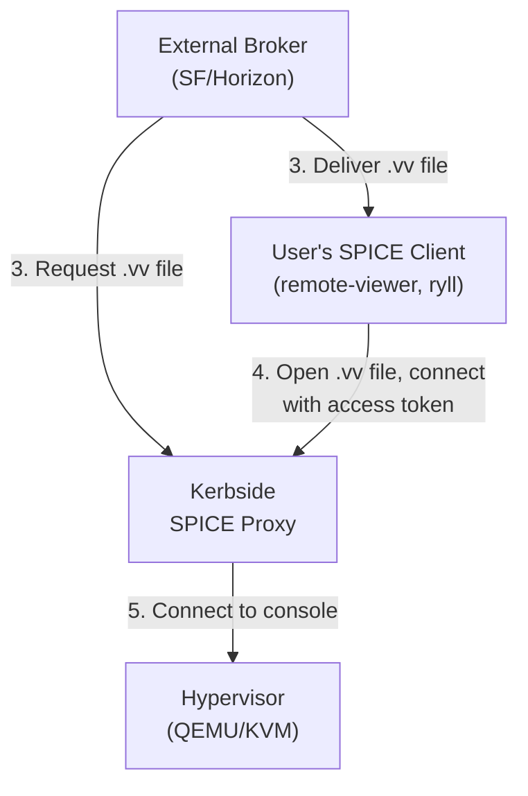

# Kerbside Documentation

Welcome to the Kerbside documentation.

## Documentation Version

This documentation covers:

- **SPICE Protocol Version**: 2.2 (current as of spice-protocol 0.14)
- **Kerbside Version**: Verified against the ryll `shakenfist-spice-protocol` crate used by the Rust proxy
- **OpenStack Integration**: Nova 2025.1 (Epoxy) and later

Protocol documentation is derived from the official SPICE protocol sources at
`gitlab.freedesktop.org/spice/spice-protocol` and verified against Kerbside's
implementation. Message IDs and constants reflect Kerbside's internal mappings.

## Introduction

Kerbside is a [SPICE](https://spice-space.org/) protocol native VDI proxy
responsible for providing rich VDI experiences to users of Shaken Fist, oVirt,
OpenStack, or any other cloud where the hypervisor is capable of providing SPICE
consoles over the network.

The SPICE protocol has existed for a long time, and still represents the
richest and most performant option for remote desktops using Open Source
technologies. Before Kerbside, consoles were generally provided by a HTML5
transcoded interface in a web client. Unfortunately, HTML5 interfaces do not
support many of the more novel features of the SPICE protocol, nor do they
support high resolution desktops. By avoiding transcoding to a HTML5 client,
we avoid these problems.

Novel features of SPICE include high resolution desktops, multi-screen desktops,
USB device passthrough, sound, multiple user connections to a single console,
adaptive compression, and more.

### Kerbside is Experimental

Kerbside is currently considered experimental. While it works, it has not yet
seen large scale deployment and it is likely that it will need modifications
as it is hardened for production use.

### Kerbside is a Proxy, Not a Complete User Interface

Whilst Kerbside presents a simple administrative interface over HTTP and has
REST APIs for orchestrating consoles, it is not intended as a complete SPICE
desktop VDI solution. It is intended that Kerbside itself is orchestrated by
an external system. That is, in order for a desktop to be presented to a user
the following steps need to occur:

1. The user requests a desktop via an external user interface that we call "the
   Broker". In Shaken Fist's case the broker is embedded in Shaken Fist itself
   and is initiated via a Shaken Fist REST API. In the OpenStack case this role
   is likely performed by Horizon or Skyline, although this is not yet
   implemented.

2. The cloud boots the instance that runs the desktop. The Broker waits for the
   instance to be booted. In some cases the broker needs to perform additional
   configuration on the instance once it has booted -- for example for OpenStack
   the broker must request a console access token that is then provided to
   Kerbside as proof of the right to connect to that specific instance.

3. The Broker requests a `.vv` virt-viewer compatible ini file from Kerbside,
   and delivers that to the requesting user. The configuration file describes a
   connection to Kerbside, along with short lived access token.

4. The user opens the `.vv` file with a SPICE client such as `remote-viewer` or
   [`ryll`](https://shakenfist.com/components/ryll/). This client connects to
   Kerbside.

5. Kerbside uses the access token to determine which instance in the cloud is
   the requested desktop and initiates a proxied connection to the hypervisor.

6. The user then happily uses their SPICE console, largely unaware of these
   various steps.

7. Kerbside monitors the SPICE protocol traffic as it flows between the client
   and the hypervisor and enforces simple packet validity and security rules
   on the traffic. This stops the client from attempting to exploit the
   hypervisor by sending deliberately malformed requests.

8. A Kerbside administrator may choose to terminate a session for various
   business reasons. If requested, Kerbside will tear down the channel between
   the client and the hypervisor, and the hypervisor will detect a client
   disconnect.

### Connection Flow Diagram

Edge numbers match the steps above. Steps 1, 2, and 6 happen outside
the components shown, and steps 7 and 8 happen inside Kerbside on the
established client to hypervisor path, so they have no arrow of their
own.

### Implementation in OpenStack

OpenStack Nova now supports native SPICE direct consoles as of the 2025.1 Epoxy
release. The
[Nova specification](https://specs.openstack.org/openstack/nova-specs/specs/2025.1/implemented/libvirt-spice-direct-consoles.html)
adds a new "spice-direct" console type that enables users to access virtual
desktops using native SPICE clients like remote-viewer instead of HTML5 proxies.

When users request a SPICE direct console, Nova returns a URL pointing to
Kerbside with an authentication token. Kerbside validates this token via the
`/os-console-auth-tokens/` API and establishes the proxied connection to the
hypervisor. This provides users with a much richer virtual desktop experience
including support for USB passthrough, audio, and multi-monitor configurations.

Kerbside needs to be deployed as a component of the OpenStack cluster to provide
a safe mechanism for users to interact with their console. OpenStack is (wisely)
unwilling to provide direct network connectivity from a client network to TCP
ports on the hypervisor, and so Kerbside acts as an intermediary to protect
those hypervisors. There is a sample implementation of Kerbside deployment using
Kolla-Ansible in the
[Kerbside Patches repository](https://github.com/shakenfist/kerbside-patches).
At the time of last update to this document, the Kolla OpenStack project had
merged the OCI build portion of the proposed Kerbside support into the Kolla
project, but had not yet merged the deployment code into Kolla-Ansible. That
deployment code is tracked on
[the OpenStack gerrit review system](https://review.opendev.org/q/topic:%22spice-direct-consoles%22)
if you are curious as to its current state.

### What About Bumblebee?

The folks over at the NECTAR research cloud developed
[Bumblebee VDI](https://github.com/NeCTAR-RC/bumblebee), which is superficially
similar to Kerbside in that it provides a mechanism to make it easier to obtain
a virtual desktop as a user. The Kerbside description above would classify
Bumblebee as a Broker to our model -- it orchestrates the creation and then
access to virtual desktops for users. However, Bumblebee exclusively orchestrates
HTML5 consoles using Apache Guacamole as its HTML5 proxy at the moment, so misses
out on some of the richer features of SPICE and has the performance implications
of a HTML5 desktop environment.

## Documentation Index

### Use Cases

One page per deployment permutation: what Kerbside is worth in that
setting, how the pieces fit together, and how to set it up. The last
column names the CI lane that exercises the scenario end to end; see
[testing.md](/components/kerbside/testing/) for what the lanes do and what the tiers mean.

| Scenario | Description | Tested in Kerbside CI |
|----------|-------------|-----------------------|
| Multi-cloud aggregation | One Kerbside brokering several sources at once, so users keep a single console entry point as workloads move between providers | Not covered |
| OpenStack | Nova 2025.1 spice-direct consoles, deployed alongside the cluster with Kolla-Ansible via kerbside-patches | `openstack_matrix`, merge tier |
| [oVirt](/components/kerbside/use-cases/ovirt/) | Replaces oVirt's SPICE proxy (squid) with a protocol-aware front door: discovery via the engine API, host-subject pinned TLS to the hypervisor, and the engine, network, and account prerequisites | `ovirt_matrix`, merge tier |
| Placement topologies | Kerbside instances placed by user population rather than by cloud — one per regional office, close to its users, with the WAN hop as the inspected backend leg | Not covered |
| Proxmox | Deferred until a Proxmox source driver exists | No source yet |
| Shaken Fist | Broker embedded in Shaken Fist itself; Ed25519 VDI console tokens exchanged offline at `/sf-console.vv` | `sf-e2e`, smoke tier and nightly |
| Standalone / static source | The static driver (`kerbside/sources/static.py`) for labs, demos, and direct-qemu style fleets. The [compose demo](/components/kerbside/installation/#try-it-the-demo-stack) is the worked example | `direct-qemu`, smoke tier and nightly |

Scenarios without a link are planned rather than written; see
[plans/PLAN-use-case-docs.md](/components/kerbside/plans/PLAN-use-case-docs/).

The `direct-qemu` lane runs the full daemon + API + MariaDB stack
against a local qemu SPICE server via the static source, so it is the
end-to-end exercise of the standalone scenario. See
[direct-qemu-harness.md](/components/kerbside/direct-qemu-harness/) for the lane and its
standalone mock-control-plane sibling, `verify-rust-proxy.sh`.

### Operator Documentation

Guides for deploying and configuring Kerbside:

- [Installation](/components/kerbside/installation/) - From `pip install` to a proxied
  console: what a running Kerbside needs, the compose demo, and where to
  go for your cloud

- [Configuration](/components/kerbside/configuration/) - Configuration reference for all Kerbside
  settings including TLS, Keystone, API, and monitoring options

- [Console Sources](/components/kerbside/console-sources/) - Configuring console sources
  (sources.yaml) for Shaken Fist, oVirt, OpenStack, and the static driver,
  including the Shaken Fist offline token exchange

- [Database Schema](/components/kerbside/schema/) - Database tables, columns, and relationships

### Developer Documentation

Guides for working on Kerbside itself:

- [Development](/components/kerbside/development/) - Database migrations, building and
  packaging the Rust proxy, dependency pinning, review tracking,
  vendored web assets, and debugging

- [Testing](/components/kerbside/testing/) - Running the test suite, the CI tiers and lane
  mechanics, the Ryll-based harnesses, the oVirt console probe, the
  Tempest plugin, and the load-test container images

- [Direct-qemu Harness](/components/kerbside/direct-qemu-harness/) - Exercising the Rust
  proxy locally against qemu with a mock control plane: end-to-end
  relay, firewall capture, and session-termination checks

### Architecture Documentation

Internal design of the Kerbside proxy:

- [Proxy Architecture](/components/kerbside/proxy-architecture/) - Internal architecture including
  the process model, the connection state machine, the relay, and the SPICE
  firewall

- [ARCHITECTURE.md](/components/kerbside/../ARCHITECTURE/) - High-level system architecture
  overview (in project root)

### SPICE Protocol Documentation

Core protocol specifications covering connection handshake, authentication, and
channel message formats:

- [Protocol Overview](/components/kerbside/spice/protocol-overview/) - Introduction to SPICE
  protocol fundamentals including channel types, message structure,
  capabilities, and security model

- [Link Protocol](/components/kerbside/spice/spice-link-protocol/) - Connection handshake details
  including SpiceLinkMess/SpiceLinkReply formats, RSA key exchange, and
  authentication flow

- [Channel Protocols](/components/kerbside/spice/channel-protocols/) - Detailed message formats
  for each SPICE channel:
  - Main channel - Session control, channel negotiation
  - Display channel - Screen updates, drawing operations, video streaming
  - Inputs channel - Keyboard and mouse input
  - Cursor channel - Cursor shape and position
  - Playback/Record channels - Audio streaming
  - Smartcard channel - Smart card redirection

- [Keyboard Scancodes](/components/kerbside/spice/scancodes/) - Complete reference for IBM PC XT
  scancodes used by the inputs channel, including standard keys, extended keys
  (E0 prefix), and media/browser keys

- [Compression Protocols](/components/kerbside/spice/compression-protocols/) - LZ and GLZ image
  compression formats used by the display channel, including header formats,
  command encoding, and dictionary-based decompression

- [Capabilities](/components/kerbside/spice/capabilities/) - Channel capability negotiation
  including common, display, audio, and input capabilities with recommended
  settings

### Device Redirection Protocols

Protocols for redirecting client devices to the virtual machine:

- [USB Redirection](/components/kerbside/spice/usb-redirection/) - USB device redirection
  protocol (usbredir) including all control and data message formats,
  capability negotiation, and device filter rules

### Guest Agent Protocol

Protocol for advanced guest integration features:

- [VD Agent Protocol](/components/kerbside/spice/vd-agent-protocol/) - Guest agent protocol for
  clipboard sharing, file transfer, display configuration, and volume sync

### Connection File Extensions

Extensions and interpretations layered on the standard
virt-viewer console.vv format:

- [console.vv Extensions](/components/kerbside/spice/console-vv-extensions/) - ryll-specific
  console.vv keys (`ticket-valid-until`) and standard-key interpretations
  (`delete-this-file=1` as a one-shot ticket signal). Producers (Kerbside,
  oVirt, custom gateways) populate these to drive client-side behaviour.

## Protocol Implementation Status

| Feature | Status | Notes |
|---------|--------|-------|
| SPICE Link Handshake | Full | Token-based auth extension |
| Main Channel | Full | Session control, agent passthrough |
| Display Channel | Full | All drawing ops, video streaming |
| Inputs Channel | Full | Keyboard, mouse, scancodes |
| Cursor Channel | Full | Shape, position, trail |
| Playback Channel | Proxy | Audio passthrough |
| Record Channel | Proxy | Audio passthrough |
| Smartcard Channel | Proxy | Passthrough |
| USB Redirection | Proxy | Passthrough with hello decoding |
| Port Channel (VMC) | Full | USB redir encapsulation |
| WebDAV Channel | Proxy | Passthrough |
| VD Agent | Proxy | Clipboard/file transfer passthrough |

**Full**: the channel's message types are modelled in the L1 firewall
allowlist (`rust/kerbside-proxy/src/allowlist.rs`); its framed traffic is
classified per message type.
**Proxy**: relayed and framed, but the channel is not individually modelled
(treated as an unmodelled channel by the firewall policy). Message bodies are
relayed opaquely in both cases; the proxy does not decode or log them.

## Quick Reference

### Channel Types

| ID | Channel   | Purpose |
|---:|-----------|---------|
|  1 | main      | Session control |
|  2 | display   | Screen updates |
|  3 | inputs    | Keyboard/mouse |
|  4 | cursor    | Cursor rendering |
|  5 | playback  | Audio output |
|  6 | record    | Audio input |
|  7 | tunnel    | Obsolete |
|  8 | smartcard | Smart card |
|  9 | usbredir  | USB devices |
| 10 | port      | VMC protocol |
| 11 | webdav    | File sharing |

### Error Codes

See [Protocol Overview - Error Codes](/components/kerbside/spice/protocol-overview/#error-codes) for the
complete list of SPICE link error codes.

### Common Capabilities

| Bit | Capability | Description |
|----:|------------|-------------|
| 0 | AuthSelection | Auth mechanism selection |
| 1 | AuthSpice | SPICE native auth |
| 2 | AuthSASL | SASL auth |
| 3 | MiniHeader | Compact message headers |

## Related Projects

[ryll](https://github.com/shakenfist/ryll) is a purpose-built SPICE test
client, written in Rust, originally built to performance-test Kerbside. It
runs on Linux, macOS, and Windows in three modes: a desktop GUI, a headless
mode suited to automation and benchmarking, and a `--web` mode that hosts a
browser frontend tunnelling SPICE over WebRTC (serving the signalling page
directly over HTTPS via `--web-tls-cert`/`--web-tls-key`, with no reverse
proxy required). It operates independently of Kerbside — no Kerbside
installation is needed — but Kerbside operators may find it useful both for
exercising the proxy under realistic workloads from headless mode and, via
the web mode, for providing browser-based access to the same SPICE consoles
in scenarios where installing a native client is not practical. See the
[ryll documentation](https://github.com/shakenfist/ryll/blob/main/docs/index.md)
for an overview, or the
[ryll web frontend guide](https://github.com/shakenfist/ryll/blob/main/docs/web-frontend.md)
for browser-deployment specifics.

## External References

Official SPICE protocol resources:

- [SPICE Protocol Documentation](https://www.spice-space.org/spice-protocol.html)
- [SPICE Protocol Source](https://gitlab.freedesktop.org/spice/spice-protocol)
- [SPICE Server Source](https://gitlab.freedesktop.org/spice/spice)
- [USB Redirection Protocol](https://www.spice-space.org/usbredir.html)
- [usbredir Source](https://gitlab.freedesktop.org/spice/usbredir)
- [usbredir Protocol Spec](https://gitlab.freedesktop.org/spice/usbredir/-/blob/main/docs/usb-redirection-protocol.md)

## Contributing

When adding new protocol support or modifying existing implementations:

1. Update the relevant documentation in this directory
2. Include binary format descriptions with field offsets
3. Document any deviations from the official SPICE protocol
4. Reflect any wire-format changes in the ryll `shakenfist-spice-protocol`
   crate (the proxy's SPICE implementation) and the L1 allowlist in
   `rust/kerbside-proxy/src/allowlist.rs`

## Document Conventions

Throughout this documentation:

- **Binary formats** use little-endian byte order unless noted otherwise
- **Offset** values are in bytes from the start of the structure
- **Size** values are in bytes
- **uint32**, **uint16**, **uint8** refer to unsigned integers
- **int32**, **int16**, **int8** refer to signed integers
- **bytes** refers to raw binary data
- **string** refers to null-terminated ASCII/UTF-8 text
- **S->C** means server to client direction
- **C->S** means client to server direction
