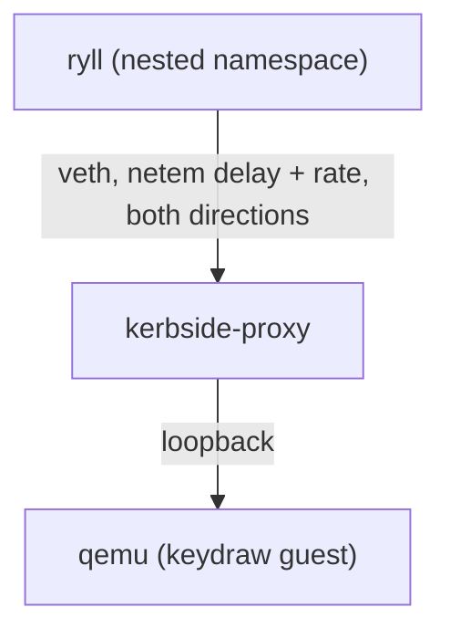

# Proxy backpressure on a shaped client link

This page records Kerbside's first keypress-to-draw latency figures
over a shaped (WAN-like) client link, and whether bounding the proxy's
own socket buffers shortens the display backlog on a slow link. The
wider SPICE performance work is tracked in
[PLAN-spice-performance](/components/kerbside/plans/PLAN-spice-performance/).

**The result is null.** `TCP_NOTSENT_LOWAT` on the client leg and a
capped `SO_RCVBUF` on the backend leg make no measurable difference
to keypress-to-draw latency or to throughput, at any link profile or
activity level tested. They do not shrink the backlog. They move it
out of the proxy and into spice-server's own socket send buffer. The
backlog is bounded by spice-server's per-channel ACK window, not by
the proxy. Both options therefore ship **off** by default
(`--client-notsent-lowat-bytes 0`, `--backend-rcvbuf-bytes 0`). The
flags stay available for operators who want to reduce the kernel
memory the proxy holds per session.

## What was measured

- **Keypress-to-draw latency.** A key press is sent through ryll's
  control socket. The clock stops at the first `surface_drawn` event
  whose rect covers the guest's *key box*. That box is a 96x96 square
  which the guest repaints on every key press, on the same display
  channel as the screen activity. The loadtest's own metric (the
  first draw of any kind) cannot be used under activity, because the
  first draw after a press is almost always an activity frame. So
  the rig carries a small ryll patch, which adds the drawn rect to
  `surface_drawn`.
- **Display-channel throughput.** This is the delivered rate on the
  proxy's client-leg display socket (`bytes_acked` over the window,
  from `ss`). The proxy's `/metrics` byte counters agree with it.
- **Where the backlog sits.** `ss -tinm` is sampled every 0.5 s
  during the window, on three sockets:
  - the proxy's client-leg Send-Q, meaning bytes written but not yet
    acknowledged: in flight plus not yet sent;
  - the proxy's backend-leg receive queue, meaning bytes spice-server
    sent that the proxy has not yet read;
  - spice-server's own Send-Q on the backend connection.

## Procedure

Everything runs unprivileged, inside a user plus network namespace
(`unshare -rn`). qemu, the mock control plane
(`tools/direct-qemu/mock-grpc-server.py`) and `kerbside-proxy` sit on
one side of a veth pair. ryll sits in a nested network namespace on
the other side:



Only the client leg is shaped. Each direction gets
`netem delay RTT/2 rate R`, with a queue of one bandwidth-delay
product on top of the packets in the delay line. The veth's GSO size
is capped at one MSS, so that netem's packet-count limit sees real
packets. Without that cap, TCP hands the qdisc 64 KiB GSO
super-packets and the bottleneck queue is several times deeper than
configured.

The guest is `tools/shaped-link/guest/keydraw.c`, a static PID 1 on
the host's own kernel with a virtio-vga display. It paints a static
text-like background and toggles the key box on each key press. It
can also animate a 640x480 plasma at 30 fps, well to the right of
the key box, as screen activity. Per-pixel noise in the low bits sets
how well spice-server can compress the activity:

- **idle**: no activity;
- **busy**: 3 noise bits, about 116 Mbit/s offered unshaped;
- **heavy**: 8 noise bits, which is incompressible.

To rerun it:

```sh
tools/shaped-link/build-guest.sh /tmp/sl/guest
tools/shaped-link/build-ryll.sh /tmp/sl        # ryll + rect patch, in Docker
make -C rust/kerbside-proxy image              # then a --release build, see
                                               # tools/direct-qemu/start-rust-proxy.sh
RYLL_BIN=/tmp/sl/ryll/target/release/ryll GUEST_DIR=/tmp/sl/guest \
    WORKDIR=/tmp/sl/results \
    PROFILES='20:50 80:10 80:50' \
    ACTIVITIES='idle:0:0 busy:30:3 heavy:30:8' \
    CONFIGS='stock:0:0 tuned:131072:262144 small:32768:65536' \
    tools/shaped-link/run-matrix.sh
tools/shaped-link/summarise.py /tmp/sl/results
```

The header of `run-matrix.sh` documents every knob. The whole matrix
above, with two interleaved repeats of 40 key presses per case, takes
about 1h45m.

The configurations compared:

| Name | `--client-notsent-lowat-bytes` | `--backend-rcvbuf-bytes` |
|---|---|---|
| stock | 0 (kernel default: unlimited) | 0 (autotuned, up to `tcp_rmem` max) |
| tuned | 131072 | 262144, clamped to 212992 by `rmem_max` (reads back 416 KiB) |
| small | 32768 | 65536 (reads back 128 KiB) |

## Test host

Run on 2026-09-23 with KVM acceleration and CUBIC congestion control:

| | |
|---|---|
| Kernel | 6.12.101+deb13-amd64 (host and guest) |
| `net.ipv4.tcp_wmem` | 4096 16384 4194304 |
| `net.ipv4.tcp_rmem` | 4096 131072 6291456 |
| `net.core.rmem_max` / `wmem_max` | 212992 / 212992 |
| `net.ipv4.tcp_notsent_lowat` | 4294967295 (unlimited) |
| qemu | 10.0.13 (Debian 13), `-device virtio-vga`, SPICE `streaming-video` left at qemu's default (off); see [the streaming re-baseline](/components/kerbside/performance/streaming-rebaseline/) for why that matters |
| ryll | ryll `ff10a17` plus `tools/shaped-link/ryll-surface-drawn-rect.patch` |

## Results

There were 80 key presses per row, pooled over two repeats, with no
timeouts and no dropped control-socket events. "Backlog" shows where
the display data waiting behind a key press sat, as the median KiB
at each of the three places:

- **client**: the proxy's client-leg Send-Q;
- **proxy rcvq**: the proxy's backend-leg Recv-Q, the payload bytes
  spice-server has sent that the proxy has not yet read (the kernel
  memory charged for them, `skmem` `r`, is higher by the per-packet
  overhead; `summarise.py` prints both);
- **qemu**: spice-server's Send-Q.

| Link (RTT / rate) | Activity | Proxy | p50 ms | p95 ms | max ms | Display Mbit/s | Backlog: client / proxy rcvq / qemu (KiB) |
|---|---|---|---|---|---|---|---|
| 20 ms / 50 Mbit | idle | stock | 39 | 50 | 51 | 0.0 | 0 / 0 / 0 |
| | | tuned | 36 | 50 | 52 | 0.0 | 0 / 0 / 0 |
| | | small | 37 | 49 | 52 | 0.0 | 0 / 0 / 0 |
| | busy | stock | 138 | 180 | 191 | 47.8 | 646 / 0 / 0 |
| | | tuned | 134 | 173 | 178 | 47.8 | 320 / 181 / 124 |
| | | small | 137 | 175 | 214 | 47.8 | 247 / 28 / 353 |
| | heavy | stock | 251 | 323 | 340 | 47.8 | 764 / 394 / 0 |
| | | tuned | 262 | 326 | 353 | 47.8 | 320 / 257 / 731 |
| | | small | 246 | 324 | 350 | 47.8 | 250 / 28 / 994 |
| 80 ms / 10 Mbit | idle | stock | 97 | 111 | 112 | 0.1 | 0 / 0 / 0 |
| | | tuned | 97 | 110 | 111 | 0.1 | 0 / 0 / 0 |
| | | small | 98 | 110 | 112 | 0.1 | 0 / 0 / 0 |
| | busy | stock | 189 | 219 | 532 | 9.5 | 201 / 0 / 0 |
| | | tuned | 184 | 223 | 229 | 9.5 | 198 / 0 / 0 |
| | | small | 186 | 224 | 248 | 9.5 | 188 / 0 / 0 |
| | heavy | stock | 2109 | 2386 | 2686 | 9.6 | 614 / 1835 / 0 |
| | | tuned | 2094 | 2440 | 2715 | 9.6 | 277 / 255 / 1995 |
| | | small | 2024 | 2343 | 2429 | 9.6 | 205 / 28 / 1952 |
| 80 ms / 50 Mbit | idle | stock | 97 | 110 | 112 | 0.1 | 0 / 0 / 0 |
| | | tuned | 96 | 109 | 111 | 0.1 | 0 / 0 / 0 |
| | | small | 96 | 110 | 112 | 0.1 | 0 / 0 / 0 |
| | busy | stock | 100 | 111 | 113 | 17.9 | 190 / 0 / 9 |
| | | tuned | 99 | 113 | 118 | 17.9 | 192 / 0 / 16 |
| | | small | 99 | 112 | 115 | 17.9 | 190 / 0 / 0 |
| | heavy | stock | 473 | 580 | 613 | 47.6 | 2027 / 128 / 0 |
| | | tuned | 457 | 580 | 608 | 47.6 | 928 / 292 / 1264 |
| | | small | 465 | 563 | 594 | 47.6 | 843 / 28 / 1517 |

`summarise.py` prints the fuller table, which adds p95 queue depths,
the client-leg sRTT and cwnd, the backend receive buffer size and the
kernel memory charged to it, the repeat counts, and the display
throughput a second time from the proxy's own `/metrics` relay counter
(it agrees with the `ss` figure above to within 0.8 Mbit/s in every
row).

## What the numbers say

- **Slow links do build seconds of stale display updates.** At 80 ms / 10 Mbit with incompressible activity,
  a key press waits about 2.1 s (p50) to be drawn, against 97 ms idle.
  The same activity at 20 ms / 50 Mbit costs about 250 ms.
- **The proxy's buffers are not what makes it that long.** With
  heavy activity on the 80 ms links, stock puts about 2.1-2.4 MiB of
  backlog in the proxy (client Send-Q plus backend Recv-Q). Tuned and
  small cut that to 0.2-0.5 MiB at 10 Mbit and 0.9-1.2 MiB at
  50 Mbit, and spice-server's Send-Q grows by roughly the difference.
  The total, and with it the latency, stays the same within noise in
  every row.
- **Why: spice-server's ACK window is the binding limit.** A display
  channel client stops sending once it has more than twice its client
  ACK window of unacknowledged *messages* in flight
  (`red-channel-client.cpp` `waiting_for_ack`, spice 91d42c4d). The
  window is 20 messages normally and 40 when the main channel's
  startup bandwidth test measures under 10 Mibit/s (`dcc.h`,
  `main-channel-client.cpp` `is_low_bandwidth`). The ACK travels end to
  end from ryll, so the proxy cannot change this bound by buffering
  more or less. What it controls is only where the bounded backlog
  sits. The bound is counted in messages, not bytes, so large
  drawables make it large: about 2 MiB of incompressible 32-pixel
  column updates is 2 s at 10 Mbit.
- **spice-server's defences already engage without a socket stall.**
  Pipe items accumulate while it waits for an ACK, just as they would
  while its socket is blocked. Its stream frame dropping tests whether
  the previous frame's pipe item is still linked
  (`video-stream.cpp`), not whether the socket is blocked. And with
  the proxy's buffers capped, spice-server's loopback send buffer
  (autotuned, about 2.5 MiB here) absorbs the backlog anyway, so its
  socket never blocks.
- **No throughput cost.** Each profile runs at the same delivered rate
  in every configuration. In particular, `small`'s 32 KiB low-water
  mark still fills a 50 Mbit link at 80 ms RTT.
- **A side finding: the ACK window also caps throughput on
  high-BDP links.** At 80 ms / 50 Mbit the compressible (busy)
  activity delivers only 17.9 Mbit/s. At 20 ms / 50 Mbit the same
  activity fills the link. About 200 KiB is in flight per RTT, which
  is roughly the ACK window's worth of these messages. The link is
  idle-limited, not congestion-limited.

## Recommended defaults

Both options are **off** by default (0). The measurement gives no
latency or throughput reason to turn them on, so they ship
disabled. The flags and the
`PROXY_CLIENT_NOTSENT_LOWAT_BYTES` / `PROXY_BACKEND_RCVBUF_BYTES`
settings remain, because they have one real effect: they move up to
about 2.5 MiB per busy session of kernel socket memory off the proxy
host and onto the hypervisor. An operator whose proxy nodes are
memory-bound can use them. Values of 131072 and 212992 cost nothing
measurable in latency or throughput here. The backend value is
clamped to `net.core.rmem_max` unless that sysctl is raised, so use a
value at or under it for the flag to mean what it says.

## What would actually help

These are follow-ups, not work done here:

- **Make the ACK window bound shorter.** Kerbside could pace the
  client's `SPICE_MSGC_ACK` messages on the display channel against
  its own client-leg backlog. spice-server would then accumulate its
  pipe earlier, where it can replace obscured drawables and drop
  stream frames, rather than on the far side of the proxy. The
  upstream alternative is a byte-denominated or RTT-aware ACK window
  in spice-server. Either one changes the bound this measurement
  found.
- **BBR on the client leg was not measured.** This host's kernel has
  only `reno` and `cubic` loaded. Loading `tcp_bbr` needs root, and
  an unprivileged network namespace cannot autoload it. With the
  module loaded, `CC=bbr tools/shaped-link/run-matrix.sh` sets it as
  the server namespace's default congestion control, which covers the
  proxy's client-leg sockets. On these profiles BBR could only trim
  the bottleneck queue (about 20 ms at 20 ms RTT, one BDP), which is
  small next to the ACK-window backlog.
- **qemu's damage-path series changes the message sizes** that
  the ACK window counts. [The streaming re-baseline](/components/kerbside/performance/streaming-rebaseline/)
  reruns the rig against it.
