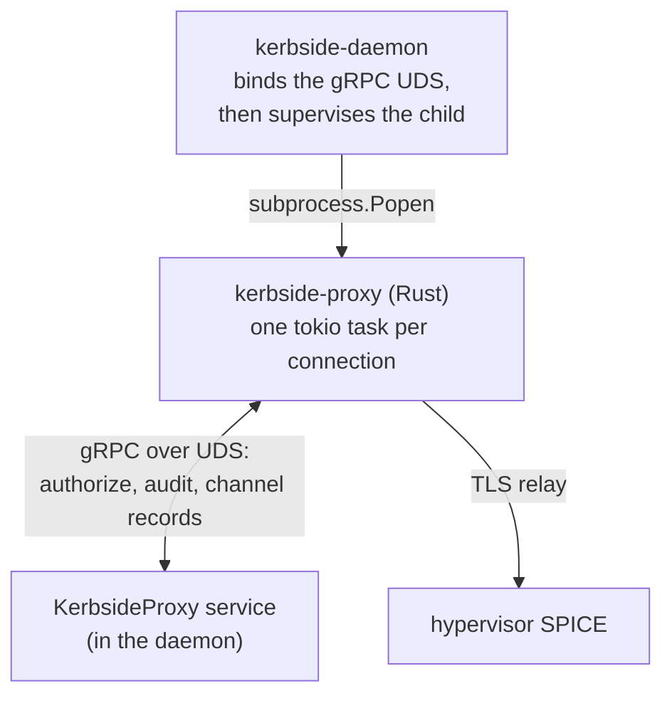
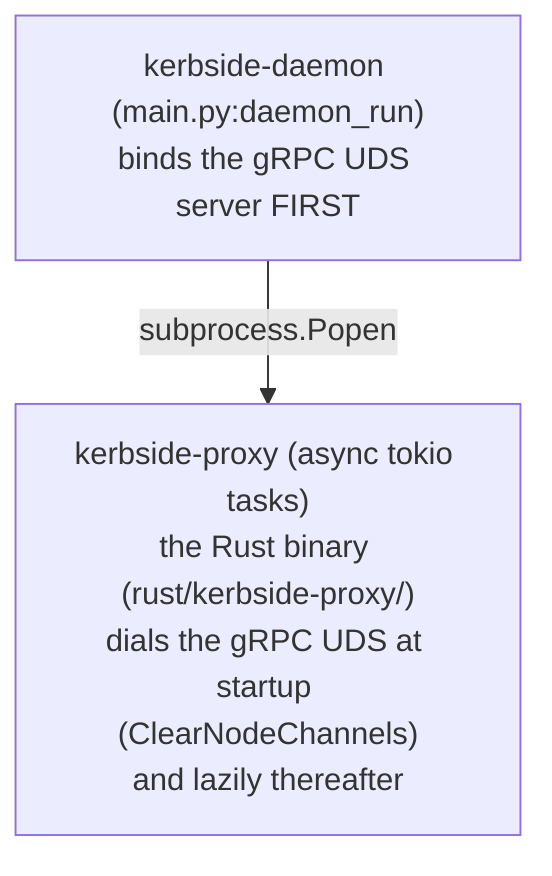
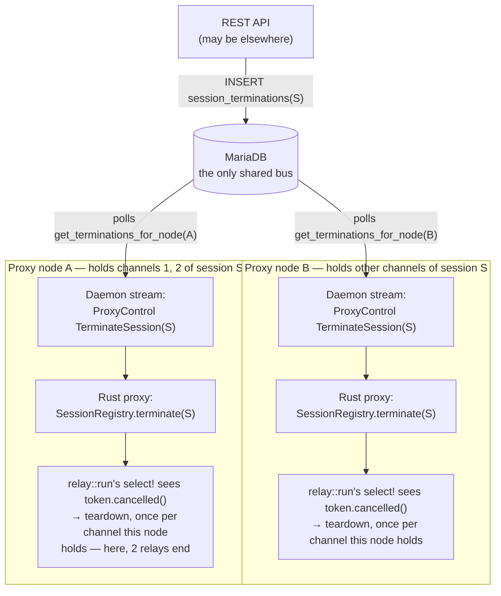

# Kerbside Proxy Architecture

This document provides a detailed technical description of Kerbside's proxy
architecture: the process model, the connection state machine, traffic
handling, and the SPICE firewall.

The SPICE proxy is the Rust `kerbside-proxy` binary (`rust/kerbside-proxy/`).
The pure-Python `kerbside` package provides the REST API, the console-source
drivers, the data model, and the daemon that supervises the proxy; the proxy
itself terminates TLS, drives the SPICE handshake, and relays traffic,
consulting the Python side over a gRPC control socket for authorization and
bookkeeping. It reuses the ryll `shakenfist-spice-protocol` crate for the
SPICE wire format.

## Process Architecture

`kerbside daemon run` (`kerbside/main.py`) supervises the proxy as a single
child process (`subprocess.Popen`, via `kerbside/proxy_supervisor.py`), binding
the gRPC control socket first. The proxy is an async **tokio** program: it
accepts connections and handles each on its own task, rather than forking a
worker process per connection. Shared state (tokens, channel bookkeeping,
audit) lives in the database, reached indirectly through the control-plane
gRPC service — the proxy never touches MariaDB directly.

## Connection Listener

`listen.rs` binds two ports (defaults):

- **Secure (5900):** TLS. The proxy terminates client TLS with its host
  certificate, then drives the SPICE link handshake.
- **Insecure (5901):** a minimal responder that issues the SPICE
  `need_secured` redirect, steering clients to the TLS port. No plaintext
  SPICE traffic is proxied.

Accepted client sockets get TCP keepalive (mirroring the backend leg), so a
silently dead peer is detected rather than pinning a task forever.

### TLS Configuration

The proxy holds a host certificate/key (`PROXY_HOST_CERT_PATH` /
`PROXY_HOST_CERT_KEY_PATH`) and a CA bundle (`CACERT_PATH`). Client-facing TLS
is terminated with the host certificate. The backend leg (`backend.rs`, via
the ryll `SpiceClient`) originates TLS to the hypervisor. When the console
carries a `host_subject`, the backend leg verifies the server certificate's
subject against it using spice-common matching semantics, substituting for
hostname verification, so a mis-issued or substituted backend certificate is
rejected. When the console has no `host_subject`, the CA chain is the only
identity check. The rustls `ring` crypto provider is installed at startup.

For Shaken Fist consoles the enforced `host_subject` is not configured on the
proxy: it is pinned at scrape time from the hosting node's published SPICE
server certificate subject (`spice_server_cert_subject`), and carried through
to the proxy in the `AuthorizeConnection` `Target`. See
[Console Sources](/components/kerbside/console-sources/).

## Connection State Machine

Each accepted connection runs this sequence (`session.rs`, `backend.rs`,
`relay.rs`):

1. **TLS terminate** the client connection (secure port).
2. **SPICE link handshake** using the ryll server-role handshake drivers:
   parse the client `SpiceLinkMess`, reply, and negotiate.
3. **Ticket decryption / authorization.** The client's RSA-encrypted ticket is
   decrypted and sent to the control plane via the `AuthorizeConnection` RPC,
   which resolves it to a hypervisor `Target` (host, port, backend ticket,
   `host_subject`, `session_id`, and the firewall policy) or returns `Denied`.
   A denial closes the connection.
4. **Backend connect.** The proxy opens the backend leg to the hypervisor's
   SPICE port (honouring a `need_secured` retry to the TLS port) and completes
   the server-side handshake with the backend ticket.
5. **Relay.** Traffic is relayed in both directions until either side closes,
   the idle-read timeout fires, the firewall issues a terminating verdict, or
   the control plane terminates the session.

The connection registers in the session registry (`session.rs`) under its
`session_id` after authorization and deregisters on teardown, so the control
plane can drop it (see "Session termination" below).

### Packet Framing and the Relay

Post-handshake SPICE traffic uses a 6-byte mini-header
(`MessageHeader`: a `u16` message type and a `u32` size) ahead of each body.
The relay (`relay.rs`) frames every message by that header rather than
copying bytes opaquely, which is what makes inspection and the firewall
possible. Each direction is a pump; `tokio::select!` drives both plus a
cancellation arm, so whichever future finishes (a closed half, a timeout, a
terminating verdict, or a control-plane cancellation) tears the whole
connection down cleanly.

Before a body is buffered, an **L0** check bounds it (per-channel size caps
and an optional rate ceiling), so an attacker-controlled length in the header
cannot drive an unbounded allocation. Framed messages are then checked at
**L1** against the per-channel/direction message-type allowlist. See "the
SPICE firewall" below.

### Channels

The proxy models the standard SPICE channels: `main`, `display`, `inputs`,
`cursor`, `playback`/`record`, `usbredir`, and the port channel. The L1
allowlist (`rust/kerbside-proxy/src/allowlist.rs`) is derived per channel and
direction from the ryll `shakenfist-spice-protocol` message-type tables.

## Metrics

The proxy exposes a Rust-native Prometheus `/metrics` endpoint
(`metrics.rs`), bound to `--metrics-address` (default loopback, config
`PROMETHEUS_METRICS_ADDRESS`) rather than the public VDI address, since the
endpoint is unauthenticated. Metrics cover accepted/authorized connections,
active connections/channels, bytes relayed per direction, and firewall
verdicts.

## Error Handling

Handshake, TLS, authorization, and backend-connect failures close the
connection and are logged with a per-connection correlation id (a `tracing`
span around the connection lifecycle). A denied authorization, a failed
backend TLS verification, an oversized/dis-allowed message, and an idle-read
timeout each end the connection deterministically rather than leaking a task.

### Log Output

The proxy writes `tracing` output to stdout. Under the daemon that stdout is
inherited into the kerbside log, so colouring is decided by the sink: ANSI
escapes are emitted only when stdout is a terminal, and a redirected log gets
plain text. This matters for anything that parses the log — with colour on,
`tracing` renders a structured field as `name<esc>[0m<esc>[2m=<esc>[0mvalue`,
so a search for a literal `name=` finds nothing at all.

## Security Considerations

### Token Validation

Tickets are validated by the control plane, not the proxy: `AuthorizeConnection`
resolves the decrypted ticket against the database and returns a `Target` or
`Denied`. The proxy enforces the decision and never reaches the database on
its own.

Two different tokens exist for a Shaken Fist console, and they live on
different surfaces:

- The **HTTP JWT bearer** is the Ed25519-signed token Shaken Fist mints and a
  viewer presents at the `/sf-console.vv` exchange endpoint on the Python API.
  The API verifies it *offline* against the cluster's cached signing public
  keys (signature, `aud`, `exp`) and enforces single use through a `jti` replay
  table (`sf_token_jtis`) — a replayed token is rejected. The Rust proxy never
  sees this JWT; the exchange happens entirely on the Python side, which then
  issues an ordinary Kerbside console token and `.vv` file.
- The **on-wire SPICE ticket** is what the proxy actually authorizes. It
  arrives RSA-encrypted inside the SPICE link handshake, is decrypted, and is
  resolved by the control plane via `AuthorizeConnection`. The proxy enforces
  only this decision; the JWT exchange has already completed before any SPICE
  connection is made.

### Audit Logging

State-changing events (channel created/removed, firewall verdicts, session
termination) are recorded as audit events through the control-plane RPCs
(`RecordAuditEvent`, and the channel register/deregister calls), so the audit
trail is owned by the Python side and consistent across proxy nodes.

### Process and Blast-Radius

The proxy runs as a single unprivileged process consulting a filesystem-guarded
UDS (directory `0700`, socket `0600`); it holds no database credentials and no
long-lived secrets. Tickets are short-lived and are never logged. The firewall
(below) bounds what an untrusted client can send through to a hypervisor.

## The SPICE Firewall

Rather than relaying post-authentication traffic opaquely, the relay
(`rust/kerbside-proxy/src/relay.rs`) is inspection-first: it frames every
message by its 6-byte `MessageHeader` and passes it through a `Policy` before
forwarding. That policy is `EnforcingPolicy` (`policy.rs`): a real, enforcing
application-level SPICE firewall, on by default.

### Per-message pipeline

For every framed message the relay's `pump` runs:

1. **Header parse.** The 6-byte header (`message_type: u16`,
   `message_size: u32`) is parsed first; nothing below inspects the body
   until this succeeds.
2. **`Policy::check_header` (L0, pre-body).** Called exactly once per
   message, before its body is buffered, so an over-cap or over-rate
   message is refused without ever accumulating it:
   - a per-(channel, direction) **size cap** — tight (4 KiB) on the
     inputs-client and cursor-client directions (key/mouse events are
     small and fixed), generous (16 MiB) everywhere else (the display
     server bulk direction and any channel with no modeled grammar);
   - a coarse per-direction **rate/throughput ceiling** (fixed window),
     disabled by default — a deployment can opt in once real traffic
     patterns justify a value.

   These policy caps sit below the relay's own unconditional
   `MAX_MESSAGE_SIZE` (16 MiB) absolute frame guard, which the relay
   enforces unconditionally regardless of policy — a peer that claims an
   absurd `message_size` is refused before the relay would buffer
   gigabytes waiting for a body that never arrives.
3. **`Policy::inspect` (L1).** Once the full body has been buffered, the
   message type is classified against a compiled-in per-channel,
   per-direction allowlist (`allowlist.rs`), derived from the ryll
   `shakenfist-spice-protocol` name tables unioned with the SPICE
   common-base opcodes (server `SPICE_MSG_*` 1..=7, client `SPICE_MSGC_*`
   1..=6, valid on every channel). Main, display, inputs, cursor, and
   playback have their own tables; usbredir/port/webdav ride the spicevmc
   table. **Record, smartcard, and tunnel have no modeled grammar** — they
   classify as `ChannelUnmodeled` and get L0-only enforcement plus
   observe-only handling for their message types (never a type-based
   terminate), rather than treating every type on those channels as a
   violation.
4. **Verdict.** `Forward` (write the original framed bytes unchanged) or
   `Terminate` (flush and end the whole relay — a single SPICE channel is
   one duplex TCP connection, so either direction ending ends the
   session). `Drop` is a variant on the `Verdict` enum reserved for future
   L2/L3 use (e.g. defanging); no rule emits it today, because silently
   dropping a mid-stream SPICE message would desynchronise the channel.

### Warn-only mode

`FirewallPolicy.mode` (`EnforcementMode::Enforce` default, or `WarnOnly`)
is the single place the enforcement decision is made
(`EnforcingPolicy::apply`). In `Enforce`, a rule's blocking verdict is
applied and recorded `action=enforced`. In `WarnOnly`, the SAME blocking
verdict is downgraded to `Forward` — the session is never actually
blocked — but still recorded `action=observed` plus a `tracing::warn!`.
This lets an operator run real traffic through a deployment and see
exactly what `Enforce` would have tripped before switching to it; it is a
mode, not a grace period, since the compiled default ships `Enforce`.

A forbidden **channel type** (a whole channel the deployment's
`FirewallPolicy.permitted_channels` excludes) is denied earlier, in
`session.rs`, before any relay is set up — a protocol-correct
`PermissionDenied` to the client plus an audit event, the same shape as
the existing unknown-channel-type rejection.

### Audit and metrics

Firewall violations must not become one audit event per message — a
hostile or broken peer could otherwise flood the audit log. Instead, both
relay directions share one lock-free per-connection `VerdictTally` (atomic
counters keyed by `(rule, action)`); `relay::run` reads it once after the
two pumps finish and, if anything was recorded, emits a single coalesced
summary `RecordAuditEvent` for the whole connection (e.g. "Firewall
verdicts this connection: disallowed_type (enforced=2, observed=0)").
Every verdict is also exported live as the Prometheus counter
`kerbside_proxy_firewall_verdicts_total{channel,direction,rule,action}`,
where `rule` is one of `disallowed_type`, `unmodeled_type`, `size_cap`, or
`rate_cap`, and `action` is `enforced` or `observed`.

### Policy delivery

Python continues to own policy; the Rust proxy only enforces it
("Python decides policy; Rust enforces it"). The tunable knobs — mode and
permitted channels — are delivered per-connection in the
`AuthorizeConnection` gRPC reply as a `FirewallPolicy` protobuf message,
built from Python's `FIREWALL_MODE`/`FIREWALL_PERMITTED_CHANNELS` config
(see `docs/configuration.md`). The L1 allowlist tables themselves are
**not** delivered over gRPC: which message types are structurally valid on
a channel is a fact about the SPICE protocol, not a deployment policy, so
they are compiled into the proxy. Size caps, the rate ceiling, and
per-verdict severities keep their compiled defaults (no gRPC config
surface yet).

Not implemented anywhere in the Rust proxy: L2 body validation (scancode
ranges, clipboard/file-transfer/usbredir device-class filtering), session
recording, and L3 rewriting/injection.

## Process Supervision and Session Termination

The Python daemon runs the Rust proxy as a child process, and API-driven
session termination drops in-flight connections rather than only blocking
new ones.

### Process model: the daemon supervises the Rust proxy as a child

`kerbside daemon run` supervises the Rust proxy binary as a child:

- The gRPC UDS server is bound **before** the child is launched, because
  the Rust proxy dials it at startup and would fail if the socket did not
  yet exist. (A subprocess child, unlike a fork, does not inherit the gRPC
  server's fds/threads.)
- `kerbside/proxy_supervisor.py`'s `find_proxy_bin()` resolves the binary
  (env `KERBSIDE_PROXY_BIN` → `PATH` → the in-repo `target/{release,debug}`
  dev build dir) and `build_proxy_argv()` maps config to the proxy's CLI
  flags (`--vdi-address`, `--secure-port`, `--cert`, `--metrics-address`,
  etc.) — the firewall knobs are excluded, since those are delivered
  per-connection over gRPC (see the firewall section above), not on the
  command line.
- The daemon polls the child's liveness every second and forwards SIGTERM
  with a 15-second deadline before SIGKILLing it; exits non-zero if the
  child dies unexpectedly. The 15-second deadline is sized above the proxy's own
  10-second graceful-drain window (below), so the daemon gives the proxy a
  chance to drain before forcing it.

### How the binary gets there: packaging

`find_proxy_bin()`'s middle leg — `shutil.which('kerbside-proxy')` — is
what resolves the binary in a real deployment. The crate is published to
PyPI as a separate `kerbside-proxy` package: a maturin
`bindings = "bin"` wheel (`rust/kerbside-proxy/pyproject.toml`) whose
compiled binary is laid into the wheel's `*.data/scripts/` directory,
which pip installs onto `PATH`.

The committed `pyproject.toml` does not carry an exact pin. It carries a
dev-inclusive FLOOR — `kerbside-proxy>=0.4.0.dev0` — anchored on the
`# KERBSIDE_PROXY_PIN` marker. Naming a `.dev0` version in the specifier
is what opts pip into pre-release resolution: without it, pip would
never consider a dev wheel a valid match for a plain `>=` floor. This
means a `pip install` from a git checkout of `kerbside` (not a tagged
release) resolves whatever `kerbside-proxy` is newest on PyPI at install
time — a tagged release, or a rolling dev wheel.

Unreleased `kerbside` still needs a working proxy to test against, which
is what `.github/workflows/dev-proxy-wheel.yml` provides: it builds and
publishes a PEP 440 dev wheel of `kerbside-proxy` (e.g. `0.4.1.dev163`,
versioned by `setuptools_scm`) to PyPI, unattended, on pushes to
`develop` that are path-filtered to the binary's inputs (`rust/**`,
`kerbside/rpc/kerbside.proto`, `tools/build-proxy-wheel.sh`,
`tools/stamp-dev-proxy-version.sh`, `tools/gen-protos.sh`, and the
workflow file itself) — minus `rust/kerbside-proxy/Cargo.lock`, since a
lockfile-only bump cannot change the binary's interface or contract
hash. Dev wheels carry build provenance attestations, the same as
tagged releases, but they are **not** Sigstore tag-signed — there is no
`v*` tag for a dev build to sign. See "Configure Dev Release Publishing"
and "Dev releases" in `RELEASE-SETUP.md`. These dev releases accumulate
on PyPI over time and are pruned manually; see "Pruning dev releases"
in `RELEASE-SETUP.md`.

At release time the two packages release in lockstep from a single `v*`
tag: `setuptools_scm` gives `kerbside` its version, and
`tools/stamp-proxy-version.sh` stamps that same version into the crate
(for maturin) and REPLACES the committed floor line in `pyproject.toml`
with the exact `kerbside-proxy==<version>` pin. A stamped release tree
is exact-pinned; the `develop` branch is not.
`tools/build-proxy-wheel.sh` builds prebuilt manylinux_2_28 wheels for
**x86_64 and aarch64** (the latter cross-compiled with maturin `--zig`, so
no aarch64 build host is required); no source distribution is published, so
an unsupported platform gets a clean pip error rather than a doomed source
build. In development you bypass all of this: `find_proxy_bin()` falls
through to the in-repo `cargo build` output, or you set
`KERBSIDE_PROXY_BIN` explicitly. See `RELEASE-SETUP.md`.

#### The gRPC contract handshake

Because the committed tree is not exact-pinned, an installed
`kerbside-proxy` binary is not guaranteed to speak the same gRPC
contract as the `kerbside` it is paired with — the pin only guarantees
that at release time. The handshake is the backstop for every other
case (dev installs, a stale local build, an operator mismatching
versions by hand):

- `tools/gen-protos.sh` (run via `tox -egenprotos`, whenever
  `kerbside/rpc/kerbside.proto` changes) writes the sha256 of the
  proto's raw bytes to a generated constant, `CONTRACT_HASH`, in the
  committed `kerbside/rpc/contract.py`.
- `rust/kerbside-proxy/build.rs` computes the same sha256 from its copy
  of `kerbside.proto` at compile time and embeds it in the binary; the
  binary prints it and exits when run with `--contract-hash`.
- Before launching the proxy, `launch_rust_proxy()`
  (`kerbside/proxy_supervisor.py`) calls `check_contract()`, which runs
  the resolved binary with `--contract-hash` and compares the result to
  `CONTRACT_HASH`. A mismatch — including a binary that predates the
  `--contract-hash` flag entirely, which reports as "unknown" rather
  than a hash — raises `RuntimeError` naming both hashes and four
  remediations (upgrade the wheel, rebuild the local Rust tree, point
  `KERBSIDE_PROXY_BIN` at a matching binary, or bypass the check).
- `KERBSIDE_SKIP_CONTRACT_CHECK` is that bypass: set it to a
  recognised truthy value (`1`, `true`, `yes`, or `on`, case-insensitively)
  and the mismatch is logged as a warning instead of refused. It exists
  for debugging only and is not a supported deployment posture.

### Session termination: dropping in-flight connections

Removing or expiring the DB token blocks a **new** connection attempt, but
it does nothing to a client that is already connected: that client keeps
its channels open until it disconnects itself. Dropping a live session
needs a path from "the API terminated this session" to "the proxy holding
that session's sockets finds out", so
`ConsolesTerminate`/`SessionTerminate` do both.

**The distributed-deployment constraint.** Kerbside can run with the REST
API and the proxy processes on different machines (the proxy is often
sized separately from the API), and proxies can sit behind a load balancer
so that different channels of the *same* session land on *different* proxy
nodes. The only component every one of these can reach is the shared
MariaDB — there is no API→proxy or proxy→proxy RPC across machines. The
`ProxyControl` gRPC stream, by contrast, is strictly **local**: one stream
between a daemon and the single proxy it supervises on the same host, over
the same UDS as every other RPC in the table above. Termination therefore
has to be a DB-mediated intent that each node acts on independently for
the channels it happens to hold:

Concretely:

1. **API** (`api.py`, `ConsolesTerminate`/`SessionTerminate`): expires or
   removes the token, and calls
   `db.request_session_termination(session_id, reason)`, which
   upserts a row into the `session_terminations` table
   (`session_id` primary key, `requested_at`, optional `reason`; migration
   `c4e7a1b9d2f3`). Idempotent — re-terminating an already-terminated
   session just refreshes `requested_at`.
2. **Daemon** (`servicer.py::ProxyControl`, one stream per local proxy):
   each poll interval, calls `db.get_terminations_for_node(NODE_NAME)` —
   an intersection of `session_terminations` with this node's live
   `proxychannels` rows — and yields a `TerminateSession(session_id)` for
   every id not already sent on this stream, interleaved with `Heartbeat`s
   so the stream stays alive between events. A DB error is logged and the
   loop continues rather than killing the stream. Natural token *expiry*
   (no explicit termination) is never pushed — expiry only blocks new
   connections.
3. **Rust proxy** (`session.rs::SessionRegistry`, `rpc.rs::
   run_proxy_control`): a `Mutex<HashMap<session_id, CancellationToken>>`
   refcounted across the session's live channels (one entry per session,
   incremented on each channel's registration, decremented and removed on
   the last channel's teardown). Receiving `TerminateSession` cancels the
   token; `relay.rs`'s `select!` gained a third arm on
   `token.cancelled()` alongside the two pumps, so every channel of the
   session this node holds tears down cleanly (no error, same shape as a
   protocol-level `Terminate` verdict) and the client is disconnected.
   Cancelling an unknown or already-torn-down session is a no-op, so a
   late or duplicate push (another node's poll cycle, a retry) is safe.
4. **Reaper** (daemon maintenance loop, `reap_session_terminations`):
   deletes `session_terminations` rows older than 5 minutes — long past
   the point every node has polled and acted — keeping the table small.

A merely-expired (not explicitly terminated) token is never pushed as a
`TerminateSession`, so natural token expiry does not tear a live session
down mid-use — only an explicit API terminate does.

### Graceful drain on shutdown

On SIGTERM, the proxy's `shutdown_signal` future resolving triggers the
same teardown path used for termination: it stops the listeners from
accepting new connections, then calls `SessionRegistry::terminate_all()`
(cancelling every live session's token at once) and waits up to a
10-second deadline for the active-connection count (the same gauge behind
`/metrics`) to reach zero before returning. The 10-second drain deadline is
deliberately shorter than the daemon's 15-second SIGTERM-to-SIGKILL window
above it, so a supervised restart lets in-flight sessions finish tearing
down on their own terms rather than being cut off mid-drain by the
daemon's SIGKILL.

### Verifying it live

The mock harness ([direct-qemu-harness.md](/components/kerbside/direct-qemu-harness/))
drives this end to end against a
real client: the mock gRPC server's `ProxyControl` stream emits a one-shot
`TerminateSession` a configurable number of seconds after the first
authorization (`MOCK_GRPC_TERMINATE_AFTER`), standing in for the
API→DB→daemon-poll leg so the harness can exercise just the proxy side
live. A recorded run against `remote-viewer` shows all four of its
channels (main, display, inputs, cursor) torn down by a single
`TerminateSession` event.

## Related Documentation

- [Protocol Overview](/components/kerbside/spice/protocol-overview/) - SPICE protocol introduction
- [Link Protocol](/components/kerbside/spice/spice-link-protocol/) - Connection handshake details
- [Channel Protocols](/components/kerbside/spice/channel-protocols/) - Per-channel message formats
