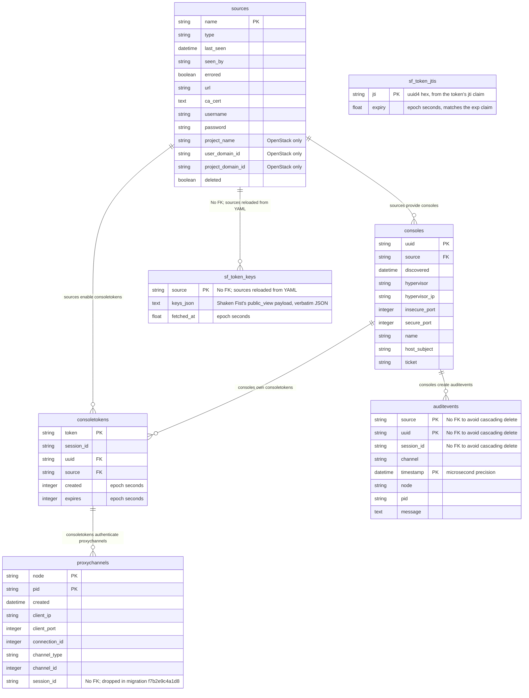

# Database Schema

This document describes the Kerbside MySQL/MariaDB database schema.

## Entity Relationship Diagram

## Table Descriptions

### sources

Console sources (cloud platforms) that provide virtual machines.

| Column | Type | Description |
|--------|------|-------------|
| name | string | Primary key, source identifier |
| type | string | Source type: `shakenfist`, `ovirt`, or `openstack` |
| last_seen | datetime | Last successful poll time |
| seen_by | string | Node that last polled this source |
| errored | boolean | Whether the source is in error state |
| url | string | API URL for the source |
| ca_cert | text | CA certificate for TLS validation |
| username | string | Authentication username |
| password | string | Authentication password/API key |
| project_name | string | OpenStack project name (OpenStack only) |
| user_domain_id | string | OpenStack user domain (OpenStack only) |
| project_domain_id | string | OpenStack project domain (OpenStack only) |
| deleted | boolean | Soft delete flag |

`password` is a live credential for the backend cloud's management
plane, and is never returned by the REST API or rendered by the web UI.
`db.get_source()` and `db.get_sources()` return only the fields listed
in `db.SOURCE_PUBLIC_FIELDS` unless a caller opts in with
`include_secrets=True`, which only the code paths that authenticate to
a backend cloud do. That list is an allowlist rather than a list of
things to strip, so a column added to the table is private until
somebody decides otherwise.

Three of the public fields are worth naming explicitly, because each
could plausibly have gone the other way:

- `ca_cert` is the public half of the backend's TLS identity rather
  than a credential. The sources page renders it and clients need it
  to validate the connection they are pointed at.
- `url` is the backend's management plane endpoint. It is public
  because the list endpoint has always returned it and because a
  console client that cannot see which cloud a source is cannot do
  much with it.
- `username` is half of a credential pair. It is public for the same
  historical reason as `url`. Narrowing either is an API behaviour
  change rather than part of withholding the password, and is tracked
  in [issue #449](https://github.com/shakenfist/kerbside/issues/449).

### consoles

Virtual machine consoles discovered from sources.

| Column | Type | Description |
|--------|------|-------------|
| uuid | string | Primary key, VM UUID |
| source | string | Foreign key to sources.name |
| discovered | datetime | When the console was first discovered |
| hypervisor | string | Hypervisor hostname |
| hypervisor_ip | string | Hypervisor IP address |
| insecure_port | integer | Non-TLS SPICE port |
| secure_port | integer | TLS SPICE port |
| name | string | VM display name |
| host_subject | string | Expected TLS certificate subject |
| ticket | string | SPICE ticket for authentication |

`ticket` is the password the SPICE server on the hypervisor will accept
for this console, and it gets the same treatment as a source's
`password`. `db.get_console()` and `db.get_consoles()` return only the
fields in `db.CONSOLE_PUBLIC_FIELDS` unless a caller opts in with
`include_secrets=True`, so it reaches neither the REST API nor the web
UI. The ticket's lifetime depends on the source: oVirt mints a fresh
one on every `.vv` request and expires it in about two minutes, while a
static source persists the console password from its configuration
indefinitely.

There are exactly two callers entitled to read it back out of the
database, and `git grep include_secrets` finds them alongside the
source ones: the static branch of the direct `.vv` handler, which
writes it into the file it returns, and the gRPC servicer, which hands
it to the proxy to present to the hypervisor.

The allowlist governs what leaves the database, which is not the whole
story for logs. Discovery holds a ticket before there is a database row
to read: the source driver yields it and `main._parse_sources()` passes
it to `db.add_console()`. A static source's driver builds that dict
straight from `sources.yaml`, so for the one source type whose ticket
does not expire, the credential is in process memory every maintenance
pass. Two log lines on that path are therefore redacted by hand rather
than by the allowlist, and they are the reason
`db.CONSOLE_SECRET_FIELDS` exists separately from
`db.CONSOLE_PUBLIC_FIELDS`:

- `main._parse_sources()` drops `CONSOLE_SECRET_FIELDS` from the
  `Found console` line, which would otherwise write a static source's
  SPICE password to the daemon log every 60 seconds.
- The static driver reports a malformed console entry by naming the
  keys it found rather than dumping the entry, which would otherwise
  log the ticket of any entry that supplied one and omitted something
  else.

Both are pinned by unit tests, because neither is protected by the
allowlist that protects everything else.

### consoletokens

Time-limited access tokens for console connections.

| Column | Type | Description |
|--------|------|-------------|
| token | string | Primary key, 48-character access token |
| session_id | string | 12-character session identifier |
| uuid | string | Foreign key to consoles.uuid |
| source | string | Foreign key to sources.name |
| created | integer | Token creation time (epoch seconds) |
| expires | integer | Token expiration time (epoch seconds) |

### proxychannels

Active SPICE channel connections being proxied.

| Column | Type | Description |
|--------|------|-------------|
| node | string | Primary key part, proxy node hostname |
| pid | string | Primary key part, worker process ID |
| created | datetime | Connection establishment time |
| client_ip | string | Client IP address |
| client_port | integer | Client source port |
| connection_id | integer | SPICE connection ID |
| channel_type | string | Channel type name (main, display, etc.) |
| channel_id | integer | Channel instance ID |
| session_id | string | Matches consoletokens.session_id (no FK; dropped in migration f7b2e9c4a1d8) |

### auditevents

Audit log for console access and protocol events.

| Column | Type | Description |
|--------|------|-------------|
| source | string | Primary key part, source name (no FK to avoid cascade) |
| uuid | string | Primary key part, console UUID (no FK to avoid cascade) |
| session_id | string | Session identifier (no FK to avoid cascade) |
| channel | string | Channel type or "session" for session events |
| timestamp | datetime | Event time with microsecond precision (PK part) |
| node | string | Proxy node that recorded the event |
| pid | string | Worker process ID |
| message | text | Event description |

### sf_token_jtis

Single-use tracking for Shaken Fist VDI console JWTs (the
`/sf-console.vv` exchange). A row is inserted once a token's signature
verifies; a jti already present means the token is being replayed.

| Column | Type | Description |
|--------|------|-------------|
| jti | string | Primary key, uuid4 hex from the token's `jti` claim |
| expiry | float | Token expiration time (epoch seconds, matches the `exp` claim) |

### sf_token_keys

Cached Shaken Fist signing public keys, one row per `shakenfist` source,
so `/sf-console.vv` verifies tokens offline without calling Shaken Fist
except on an unknown-kid cache miss.

| Column | Type | Description |
|--------|------|-------------|
| source | string | Primary key, source name (no FK; sources are reloaded from YAML) |
| keys_json | text | Shaken Fist's `public_view` key payload, verbatim JSON |
| fetched_at | float | Time the keys were last fetched (epoch seconds) |

## Relationships

- **sources → consoles**: One source provides many consoles
- **sources → consoletokens**: Tokens reference a source for validation
- **consoles → consoletokens**: Tokens grant access to a specific console
- **consoletokens → proxychannels**: Active channels reference their auth token
- **consoles → auditevents**: Audit events record console access (no FK to
  preserve audit history when consoles are deleted)
- **sources → sf_token_keys**: Each `shakenfist` source's cached signing
  keys, keyed by source name (no FK; sources are reloaded from YAML)

## Notes

- The `auditevents` table intentionally avoids foreign key constraints to
  preserve audit history even when sources or consoles are deleted.
- Timestamps in `consoletokens` use epoch seconds for easy expiration checks.
- The `proxychannels` table is used for connection tracking and cleanup.
- `sf_token_jtis` and `sf_token_keys` support offline verification of
  Shaken Fist's Ed25519-signed VDI console JWTs at `/sf-console.vv`: the
  jti table blocks replay, the keys table avoids calling Shaken Fist on
  the exchange path except when an unknown `kid` forces a refetch.

## Related Documentation

- [Configuration](/components/kerbside/configuration/) - Database connection settings
- [Console Sources](/components/kerbside/console-sources/) - Source configuration
