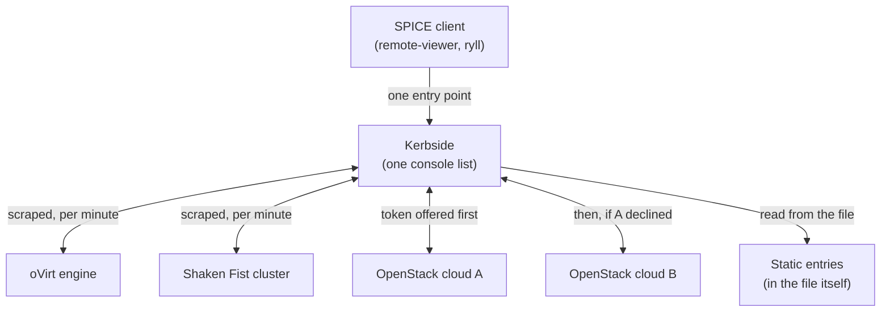

# Kerbside across several clouds

One Kerbside in front of more than one cloud. `sources.yaml` is
a list; each entry is a source with a type, and the daemon
drives every one of them. Aggregation is therefore a deployment
shape rather than a feature: it adds no driver, no
configuration key and no API of its own, and the four sibling
pages each describe one of the things it aggregates.

## Value proposition

The sibling pages each put Kerbside in front of one platform.
Most estates are not one platform. A migration that runs for a
year, an oVirt fleet being retired into OpenStack, two clouds
in two regions, a rack of appliance VMs no API will ever
enumerate — each of those is an entry in one file, and they sit
in it together.

- **Users keep one console entry point as workloads move.**
  The address a client connects to is Kerbside's own, and it
  does not change when the VM behind it changes provider. A
  migration therefore needs no client re-plumbing and no
  retraining: the same `.vv` download from the same place opens
  the same client against a console that now lives somewhere
  else. The client never learns which platform it reached.
- **Several clouds present as a single VDI estate.** A broker
  asking for the console list gets one list spanning every
  configured source, whether those sources are two regions of
  one operator's build or three different products. There is no
  federation to stand up and nothing to keep in step between
  them: the aggregation is a file with more entries in it.
- **Everything lands in one audit trail and under one firewall
  policy.** This is the operational argument rather than the
  convenience one. Every proxied console is a row you can list
  over the REST API and terminate in flight, every session is
  audited, and every framed message is classified against the
  same per-channel allowlist regardless of which cloud is
  behind it — see
  [proxy-architecture.md](/components/kerbside/proxy-architecture/). An estate
  assembled out of three platforms otherwise has three
  different answers to "who connected to what, and what were
  they allowed to send"; behind one Kerbside it has one.
- **A failing platform does not cost you the others'
  inventory.** The maintenance pass tracks what it learned per
  source and deletes consoles only for a source it enumerated
  to exhaustion, so a cloud that errored or could not be
  reached keeps its published consoles rather than having them
  cleaned up by a pass that never saw them
  (`kerbside/main.py:229-246`). Sources are neighbours in a
  file, not a shared fate — with the exceptions in the
  limitations table.

## How it works

Nothing new happens. `sources.yaml` is a list, and nothing in
Kerbside treats the second entry differently from the first.
The maintenance pass walks the entries in file order
(`kerbside/main.py:92-227`) and the entry's type decides how
its consoles arrive:

- **Scraped sources** — `shakenfist`, `ovirt` and `static` —
  are enumerated by the pass, which constructs the driver for
  each entry's type and records what it yields
  (`kerbside/main.py:169-174`).
- **OpenStack is not scraped at all.** The pass skips an entry
  of that type outright (`kerbside/main.py:175-178`). Those
  consoles are recorded when a user presents a Nova token, not
  in advance.

**Several OpenStack clouds behind one Kerbside.** More than one
OpenStack cloud can be configured at once, and a presented
token is offered to each in turn, in `sources.yaml` order,
until one validates it. `kerbside/api.py:612-645` iterates the
parsed sources in file order, skips every entry whose type is
not `openstack`, and continues past both a `NotFoundException`
and an empty validation result — so the first cloud that
validates the token wins, and the loop falls through to a 404
when none of them does (`kerbside/api.py:699`). Two
consequences follow, and both are in the limitations table:
every configured cloud is asked to validate tokens minted by
the others, and a cloud that fails to answer stops the exchange
for the rest.

**A console's source travels with it, mostly.** Each console
carries the source it came from, and that source is part of how
Kerbside talks about it: console tokens and audit events are
looked up by source and identifier together
(`kerbside/db.py:351`, `:364`), and the maintenance pass keys
its own bookkeeping on the pair (`kerbside/main.py:88`,
`:207`). The console row itself is not keyed that way —
`add_console()`, `get_console()` and `remove_console()` all
filter on the identifier alone (`kerbside/db.py:308`, `:392`,
`:434`). Identifiers are generated per cloud and nothing
coordinates them between clouds, so see the limitations table
before assuming two sources can never collide.

## How to set it up

There is nothing to enable. `sources.yaml` already holds a
list, so a second cloud is a second entry in it and a third is
a third. No option switches aggregation on, no entry is aware
of the others, and the sources may be of the same type or of
different ones.

What an entry contains depends on its type, and
[console-sources.md](/components/kerbside/console-sources/) is the reference
for all four. The only file-level fact worth knowing is that
order matters, and only for OpenStack: a presented token is
offered to the OpenStack entries in the order they appear.

## User interaction model

Kerbside is a proxy, not a portal. Something has to ask it for
a console on the user's behalf and deliver the resulting `.vv`
file — the "broker" role described in the
[documentation index](/components/kerbside/index/). Aggregation does not change
that. It changes what the broker sees.

The broker sees one console list spanning every configured
source, with each console naming the source it came from, and
the `.vv` download behaves the same way whichever source that
is: the file points at Kerbside's own address and ports and
carries a short-lived Kerbside console token as the SPICE
password, so the client authenticates to *Kerbside* rather than
to the platform behind it. That is what lets the entry point
survive a migration.

What does not aggregate is how a user reaches a broker in the
first place. Each sibling page describes its own path: Shaken
Fist's own broker mints a token and returns the file in one
call, Nova hands the user a URL at Kerbside carrying a token to
exchange, and oVirt and standalone deployments have no
integrated broker at all. A Kerbside fronting all three fronts
all three paths; it does not merge them. Kerbside's own web UI
and REST API are the one place that does show the whole estate,
and interactive login to them is Keystone-only today
([#300](https://github.com/shakenfist/kerbside/issues/300)),
which an estate with no OpenStack in it has nothing to point
at. See the limitations table.

## Status and limitations

Kerbside is experimental overall, and this is the least
exercised of the shapes documented here: every CI lane runs
exactly one source, so nothing on this page is covered by a
test. What is tested is each source in isolation, on the
lanes the sibling pages describe.

Not covered, and worth knowing before you deploy:

| Limitation | Detail |
|------------|--------|
| Nothing in CI runs two sources at once | Each lane writes a single-source `sources.yaml` and says so itself: `tools/ovirt-e2e/gen-sources.py:4` emits "exactly one ``type: ovirt`` source", `tools/sf-e2e/deploy-kerbside.sh:8` writes "sources.yaml with one type: shakenfist source", and the heredoc at `tools/direct-qemu/lane-up.sh:48` declares one static entry. Aggregation itself is therefore untested end to end: every property on this page is read out of code which is only ever exercised one source at a time. |
| Configured OpenStack clouds share a trust domain | A presented token is offered to each OpenStack entry in turn until one accepts it (`kerbside/api.py:612-645`), so every configured cloud is asked to validate tokens minted by the others, and any of them can claim a token it recognises. Nothing scopes the exchange to one cloud. This suits several clouds under one operator; it is not a boundary between clouds in separate trust domains. |
| One broken cloud degrades the others | Only a clean "not mine" moves the exchange on to the next cloud: a `NotFoundException` (`kerbside/api.py:647`) or an empty validation result. Every other failure ends the whole request rather than stepping over that cloud — an SSL failure talking to its Keystone returns a 500 immediately (`kerbside/api.py:649-656`), and anything else, such as bad credentials or an unreachable Keystone, is caught by the enclosing handler and returns a 500 too. Either way the clouds after it in the file are never asked, and their users cannot get a console either. |
| Two sources publishing one identifier are one console | The console row is keyed on the identifier alone. `add_console()` looks the row up by identifier without the source (`kerbside/db.py:308`), so a second source publishing the same identifier overwrites the first's address, ports and recorded certificate subject while the row keeps the source it was first inserted under, and `remove_console()` deletes by identifier alone (`kerbside/db.py:434`), so one source retiring a console can remove another's. Cloud-generated uuids make this unlikely between two real clouds; a hand-written static entry, or an identifier that followed a VM to its new home during a migration, is where it bites. |
| Discovery is serial across the sources | The maintenance pass walks the configured sources in file order and does each one's discovery inline (`kerbside/main.py:92-227`), with nothing running two sources concurrently. A platform which is slow to answer therefore delays every source after it in the file, and stretches the cycle for all of them. No lane has ever had two sources to run, so the behaviour at a fleet's worth of them is uncharacterised. |
| Authentication does not aggregate | The console list is one list, but the ways in are still one per platform, and Kerbside's own interactive login is Keystone-only ([#300](https://github.com/shakenfist/kerbside/issues/300)). An estate of oVirt, Shaken Fist and static sources has no Keystone to log into, so it is driven by an API client holding a token something else minted. |

## See also

- [Placement topologies](/components/kerbside/use-cases/placement/) — the inverse
  arrangement: several Kerbsides in front of one cloud, rather
  than several sources behind one Kerbside
- [Console Sources](/components/kerbside/console-sources/) — the option
  reference for every source type, and so for the contents of
  the second entry and the third
- [Proxy Architecture](/components/kerbside/proxy-architecture/) — the SPICE
  firewall, the connection state machine, and the relay
- [Testing](/components/kerbside/testing/) — the CI lanes, each of which runs
  exactly one source
- [Kerbside for oVirt](/components/kerbside/use-cases/ovirt/),
  [Kerbside for Shaken Fist](/components/kerbside/use-cases/shakenfist/),
  [Kerbside for OpenStack](/components/kerbside/use-cases/openstack/) and
  [Kerbside standalone](/components/kerbside/use-cases/standalone/) — the four source pages
  this one puts behind a single proxy
