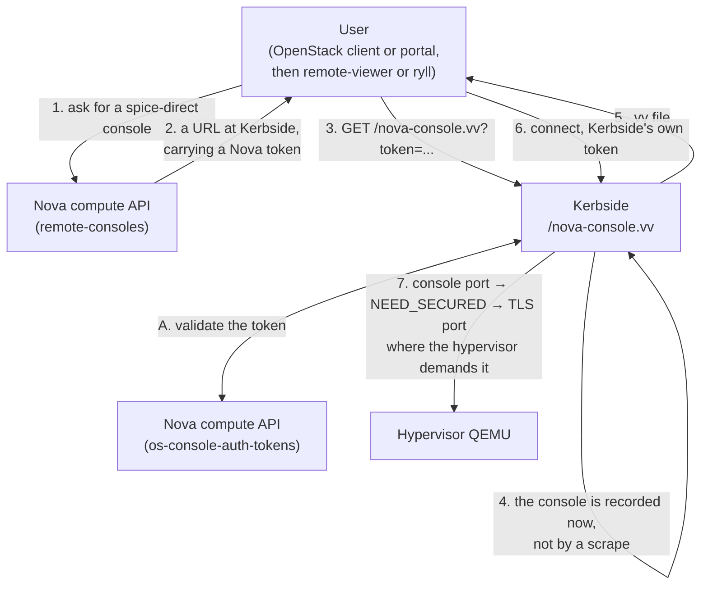

# Kerbside for OpenStack

Nova's own `spice-direct` console, answered by a protocol-aware
proxy: the URL Nova hands the user points at Kerbside, so
Kerbside is the console endpoint rather than something bolted on
beside one.

## Value proposition

Nova 2025.1 (Epoxy) added the `spice-direct` console type so
that users can open a native SPICE client instead of the HTML5
transcoding proxy. A native client has to connect to something,
and OpenStack is — wisely — unwilling to give a client network
a route to TCP ports on a hypervisor. So `spice-direct` does not
hand the user a hypervisor address at all. It hands out a URL
built from Nova's `[spice] spice_direct_proxy_base_url` with a
console auth token attached, and in a Kerbside deployment that
setting names Kerbside's `/nova-console.vv`.

Kerbside is therefore not an alternative to Nova's console
story. It is the half of it that Nova deliberately left to
someone else:

- **Kerbside is the console endpoint, not a bolt-on.** The two
  scraped deployments sit beside a console path the platform
  already had — oVirt's portal, Shaken Fist's own broker. Here
  Nova has nowhere else to point a native client, so there is
  no second path to keep in sync and nothing for a user to
  bypass Kerbside with. The console URL Nova returns *is* the
  Kerbside URL.
- **The SPICE firewall is on by default.** Kerbside terminates
  the client's connection, drives the SPICE link handshake
  itself, and classifies every framed message against a
  per-channel allowlist. See
  [proxy-architecture.md](/components/kerbside/proxy-architecture/).
- **Sessions are objects, not TCP flows.** Every proxied console
  is a row you can list over the REST API, with an audit trail,
  and can terminate in flight — which nothing else on this path
  can do once a token has been exchanged.
- **The hypervisors are never reachable from the client
  network.** Clients reach Kerbside; Kerbside reaches the
  compute nodes. This is the property OpenStack wanted in the
  first place, and it is what lets a compute node's console
  ports stay on the management network.
- **The backend leg is not subject-pinned on this path.** This
  is the one place this deployment is weaker than the two
  already documented, and it is better known now than
  discovered later. Nova's token validation answers with the
  instance uuid, the compute node's address, and the plaintext
  and TLS console ports — and nothing about the hypervisor's
  certificate. There is no subject for Kerbside to pin against,
  so the console it records carries none and the proxy relays
  that backend without host-subject enforcement. Both scraped
  deployments learn a subject from the platform during
  discovery; this one has no discovery and nothing to learn a
  subject from. What still holds: the backend leg escalates to
  TLS when the hypervisor demands it, verified against the CA
  you configure for the cloud where you configure one, and the
  firewall still inspects every message on it. And the
  *client-facing* leg is still pinned, by `PROXY_HOST_SUBJECT` —
  which is Kerbside's own certificate subject, written into the
  `.vv` file for the client to check. That is a different leg:
  client to Kerbside, not Kerbside to hypervisor. See the
  limitations table.
- **One entry point across clouds.** A single Kerbside can
  broker OpenStack alongside oVirt and Shaken Fist sources;
  users keep one console entry point as workloads move. More
  than one OpenStack cloud can be configured at once — a
  presented token is offered to each in turn, in `sources.yaml`
  order, until one validates it. That means every configured
  cloud sees tokens minted by the others, and that one broken
  cloud stops the exchange for the rest, so this suits clouds
  under one operator rather than clouds in separate trust
  domains. See the limitations table.

Users get the SPICE features an HTML5 console cannot offer:
high-resolution and multi-monitor desktops, USB passthrough,
audio, and adaptive compression.

## How it works

Nothing is discovered in advance. There is no OpenStack source
driver in `kerbside/sources/`, and the maintenance loop's scrape
pass skips an entry of this type outright
(`kerbside/main.py:175-178`), so the discovery interval that
governs the oVirt and Shaken Fist sources does not apply here at
all. A console exists in Kerbside because a user asked Nova for
one, and not before.

**The request (1, 2).** Nova, not Kerbside, decides that a user
may have a console. A client asks for one at compute API
microversion 2.99 or later — `openstack console url show
--spice-direct <instance>` is the one-line form — and Nova
answers with a console of type `spice-direct`, protocol `spice`,
and a URL. That URL is `spice_direct_proxy_base_url` with a
freshly minted console auth token attached.

**The exchange (3, A, 4).** Following that URL lands on
Kerbside's `/nova-console.vv` endpoint, which is the whole of
the OpenStack implementation (`NovaToken` in `kerbside/api.py`).
Kerbside authenticates to Keystone as the service account you
configured for the cloud and asks Nova to validate the token it
was handed. The two are not reached on the same catalogue
interface, which matters when you come to firewall it; see
**Network** below. That is a live call per exchange, so it sits
between oVirt's per-request ticket and Shaken Fist's entirely
offline signature check: a Nova that is down means no *new*
consoles, while sessions already running are untouched. Where
several OpenStack clouds are configured, each is tried in turn,
and a token none of them recognises ends as a 404. Only a clean
"I do not know this token" moves on to the next cloud, though:
a cloud that errors — bad credentials, an unreachable Keystone,
a certificate problem — ends the whole request there, so a
broken cloud early in `sources.yaml` takes out console access
for every cloud listed after it.

The validation answer carries the instance uuid, the compute
node's address, and that console's plaintext and TLS ports.
Kerbside writes them into its console table at that moment
(`kerbside/api.py:665`), creating the row if this instance has
never been asked for before and refreshing it if it has. This is
the only thing that ever creates an OpenStack console row.

**The client leg (5, 6).** The `.vv` file points at
`PUBLIC_FQDN` and Kerbside's own ports, carries Kerbside's CA
and, when `PROXY_HOST_SUBJECT` is set, Kerbside's own
certificate subject for the client to check. It carries a
short-lived Kerbside console token, which is what the client
presents on connect. The Nova token is used at the exchange and
goes no further: the client authenticates to *Kerbside*.

**The backend leg (7).** Kerbside dials the address Nova
reported — which is that compute node's
`[spice] server_proxyclient_address` — on the plaintext console
port. If the hypervisor answers the link handshake with
`NEED_SECURED`, Kerbside retries on the TLS port, verifying
against the CA configured for the cloud where one is configured
(`rust/kerbside-proxy/src/backend.rs`). Where none is, the proxy
passes no CA to the protocol crate, and `create_tls_connector`
in ryll's `shakenfist-spice-protocol` falls back to the public
web trust store with hostname verification — which an internal
hypervisor's certificate will not satisfy, so the escalation
fails rather than proceeding unverified. Whether that escalation
happens is the hypervisor's decision rather than Kerbside's: a
Kolla-Ansible deployment turns it on with
`nova_spice_require_secure`, which in turn requires libvirt TLS.
Where qemu does not demand it the leg stays on the plaintext
port, so both ports have to be reachable. Either way Kerbside
presents an empty SPICE ticket on that leg — the field is sent,
with no ticket material in it — because Nova's validation
response carries none. The console port is guarded by where it
sits on the network, which is the assumption `spice-direct` is
built on and precisely why Kerbside has to be between it and the
user.

**No scrape, and therefore no reconciliation.** The pass that
removes consoles it can no longer see is scoped to the sources
it actually enumerated, and an OpenStack entry is skipped rather
than enumerated, so its consoles are retained indefinitely and
by design (`kerbside/main.py:242-261`, and see
[console-sources.md](/components/kerbside/console-sources/#what-happens-when-a-source-fails)).
A row for an instance that has since been deleted stays listed
until the cloud is removed from `sources.yaml` altogether. Nova
will not mint a token for an instance that no longer exists, so
the row is unreachable by the path this page describes — but it
is still in the console list, and the administrative `.vv`
download described under
[User interaction model](#user-interaction-model) will still
open it. That path mints a Kerbside console token from the
stored row without calling Nova at all, so nothing in it
notices the instance is gone.

By then the recorded address and ports may belong to something
else, because libvirt reuses console ports as instances come
and go. That is the reason to remove a decommissioned cloud
from `sources.yaml` rather than leave it configured and
ignored.

## How to set it up

### OpenStack side

**Nova.** Kerbside needs Nova 2025.1 (Epoxy) or newer with SPICE
consoles enabled, and two settings in `[spice]` do the work:

- `spice_direct_proxy_base_url` must name Kerbside's exchange
  endpoint, `https://<kerbside>:13002/nova-console.vv` in the
  Kolla-Ansible deployment. This is the setting that makes a
  `spice-direct` request resolve to Kerbside; without it Nova
  has nowhere to point a native client.
- `server_proxyclient_address` is the address Nova reports for a
  console, and therefore the address Kerbside dials. It has to
  be an address Kerbside can reach — see **Network** below.

Clients must speak compute API microversion 2.99 or later.
Earlier microversions reject the `spice-direct` console type
outright, which is the first thing to check if a console request
fails before Kerbside is ever involved.

**Guests.** The instance needs a SPICE-capable virtual display,
as it would for any SPICE console, and the guest wants
`qemu-guest-agent` and `spice-vdagent` installed — they are what
give you clipboard sharing, display resizing, and clean
resolution changes. Kerbside relays the agent channel; it does
not decode it.

**Account.** Kerbside authenticates to Keystone as a service
account and validates console tokens minted for *other* users'
instances, which is an administrative operation rather than a
project-scoped one. The Kolla-Ansible role configures the
deployment's admin account for this, and carries a note in the
template that it ought to use a dedicated Kerbside account
instead. No least-privilege role has been built or tested; treat
one as untried.

**Deployment.** Kerbside is deployed as a component of the
cloud, next to the other control plane services rather than
outside them. The Kolla and Kolla-Ansible work that does this
lives in
[kerbside-patches](https://github.com/shakenfist/kerbside-patches),
and is being upstreamed under the `spice-direct-consoles` topic.
Checked on **2026-09-20**:

| Change | What it does | Status |
|--------|--------------|--------|
| [kolla 975495](https://review.opendev.org/c/openstack/kolla/+/975495) | Builds the Kerbside container image | Merged |
| [kolla-ansible 976889](https://review.opendev.org/c/openstack/kolla-ansible/+/976889) | Deploys Kerbside with Kolla-Ansible | Open |
| [kolla-ansible 988189](https://review.opendev.org/c/openstack/kolla-ansible/+/988189) | Adds the Kerbside CI scenario jobs | Open |
| [kolla-ansible 967801](https://review.opendev.org/c/openstack/kolla-ansible/+/967801) | Always configures a routable console address, which `spice-direct` needs and only the HTML5 path used to get | Open |

The SPICE settings those depend on are already upstream:
kolla-ansible
[967800](https://review.opendev.org/c/openstack/kolla-ansible/+/967800)
added the SPICE configuration options and
[967802](https://review.opendev.org/c/openstack/kolla-ansible/+/967802),
which is where `nova_spice_require_secure` comes from, allows
requiring secure channels.

So the image build is upstream and the deployment code is not.
Until 976889 merges, take the deployment from
`kerbside-patches`, which carries these as patches against
Kolla-Ansible master and is what Kerbside's own CI deploys. The
[topic on the OpenStack Gerrit](https://review.opendev.org/q/topic:spice-direct-consoles)
is the live answer if this snapshot has aged.

### Network

Kerbside needs direct L3 reachability to **every compute node's
SPICE console port range** — both the plaintext and TLS ports,
typically from 5900 upwards — at whatever address that node's
`server_proxyclient_address` names.

This is the prerequisite most likely to be missed, and it fails
in a distinctive way on this path. The exchange itself only
needs Keystone and Nova, so a `.vv` file is produced and
downloads perfectly; the failure appears only when the SPICE
client tries to connect, one step later than an operator
watching the exchange would expect.

Kerbside must also reach Keystone and Nova, and not on the same
interface. The exchange builds its connection with
`identity_interface='internal'`, so Keystone is taken from the
catalogue's **internal** endpoint. That setting is per-service:
Nova is resolved with the SDK's default interface, which is
**public**. Both endpoints therefore have to be reachable from
Kerbside.

Firewalling to the internal network alone is the trap here,
because it half works. Keystone authentication succeeds and the
validation call cannot reach Nova, so the symptom is the one
described above — an exchange that fails while everything it
appears to depend on is up. There is currently no setting that
moves Nova to the internal interface; that would be a change to
Kerbside rather than to your deployment.

Clients need to reach two things and only two things: Nova's
API, to ask for a console, and Kerbside, at the name
`spice_direct_proxy_base_url` uses, both to exchange the token
and to run the SPICE session. Nothing needs a route to a compute
node, which is the entire point.

### Kerbside side

Add an OpenStack entry to `sources.yaml`. It names the Keystone
endpoint and the service account, and — because there is no
discovery pass — that is all Kerbside does with it until a token
arrives. The option reference is in
[console-sources.md](/components/kerbside/console-sources/#openstack); two
things about it are worth knowing here rather than there:

- **The CA you configure for the cloud is the hypervisor's, not
  the client's.** It is what the backend leg verifies against
  when a hypervisor escalates to TLS. Kerbside's own
  certificate, which the *client* verifies, is a separate
  setting entirely. Configuring only the second does not leave
  the backend leg unverified; it leaves it verifying against the
  public web trust store, which an internal hypervisor's
  certificate will not satisfy. A hypervisor that escalates then
  fails the handshake — see **The backend leg** above.
- **There is no discovery interval to tune, and no errored
  state to watch.** The entry is registered and appears in the
  administrative interface, and every scrape pass then skips it.
  It will never be marked errored by a failed scrape, because it
  is never scraped — a wrong credential or an unreachable
  Keystone surfaces at the first exchange, as a failed console
  request, not as a red source in the UI.

General settings, including `PUBLIC_FQDN`, Kerbside's own ports
and CA, and `PROXY_HOST_SUBJECT`, are in
[configuration.md](/components/kerbside/configuration/).

### A worked example

The `openstack_matrix` job in
`.github/workflows/functional-tests.yml` builds an all-in-one
Kolla-Ansible deployment from `kerbside-patches` on a Debian 13
Shaken Fist guest, with this checkout's Kerbside deployed into
it, then runs `kerbside-patches`' `tools/test-console` smoke
check followed by a curated Tempest subset from this
repository's `tempest-plugin/`.
[testing.md](/components/kerbside/testing/#tempest-tests-against-a-kolla-ansible-deployment)
is the authority on how it is built, including why the guest
distribution is load-bearing rather than incidental.

What the Tempest test proves is worth stating precisely, because
it is less than the other two use-case lanes prove.
`test_spice_console_via_kerbside` boots an instance, asks Nova
for a `spice-direct` console, follows the returned URL, parses
the `.vv` Kerbside serves, and completes a SPICE link handshake
against Kerbside over TLS using the CA embedded in that file.
That exercises the whole exchange — Nova's mint, the validation
callback, the console row, the `.vv` — and proves the front door
answers as SPICE. It stops there: it does not authenticate
through to a hypervisor console, so the backend leg is not
driven end to end the way the oVirt and Shaken Fist lanes drive
theirs. The upstream `spice-direct` Tempest test is deliberately
left out of the default selection, because it bypasses Kerbside
and connects straight to the libvirt console port.

Two differences from a real deployment. The lane is all-in-one,
so the control plane, the single compute node and Kerbside share
a machine. And it runs in the merge queue rather than on pull
requests — see the limitations table.

## User interaction model

Kerbside is a proxy, not a portal. Something has to ask for a
console on the user's behalf and deliver the resulting `.vv`
file — the "broker" role described in the
[documentation index](/components/kerbside/index/). OpenStack is the case where
that something is already standard equipment:

- **Nova itself.** The intended path, and the reason this
  deployment needs no portal written for it. The user asks Nova
  for a console for an instance; Nova decides whether they may
  have it, using Keystone and its own project model, and mints
  the token. Kerbside never needs an opinion about who owns
  which instance. The one thing Nova does not do is deliver the
  `.vv`: it returns a URL, and something has to fetch it and
  hand the result to a SPICE client. A desktop with
  `remote-viewer` associated with `application/x-virt-viewer`
  does that by itself; a portal does it on the user's behalf.
- **Kerbside's own web UI and REST API**, which list consoles
  and offer a `.vv` download. They run under Kerbside's own
  authentication rather than Keystone's, so this is an
  administrative entry point rather than a user-facing one — and
  it is also where an operator inspects or terminates a live
  session. Note that for OpenStack the list contains only
  instances somebody has already opened a console on: an
  instance nobody has asked Nova about is not there to be
  listed.
- **Nova's HTML5 console**, which can be enabled alongside
  `spice-direct`. It bypasses Kerbside entirely and is not a
  session Kerbside can see, audit or terminate. Useful as a
  fallback; not the path the native client users are on.

## Status and limitations

Kerbside is experimental overall. The OpenStack path is
exercised on every merge-queue entry against a real
Kolla-Ansible deployment, which covers the Nova console request,
the token exchange including the validation callback, the
console row created by it, the `.vv` Kerbside serves, and a
SPICE link handshake against the proxy over TLS.

Not covered, and worth knowing before you deploy:

| Limitation | Detail |
|------------|--------|
| No backend host-subject pinning | Nova's token validation returns no certificate subject for the compute node, so the console Kerbside records carries none and the proxy relays that backend without host-subject enforcement. A redirected backend is then caught by CA verification, where a CA is configured and the hypervisor escalated to TLS, but never by identity. This is *not* `PROXY_HOST_SUBJECT`, which pins the client-to-Kerbside leg and is unaffected; the unpinned leg is Kerbside-to-hypervisor. Both the oVirt and Shaken Fist paths can pin this leg because their discovery learns a subject; this path has no discovery. |
| `openstack_matrix` is merge-tier only | The lane builds container images and an all-in-one cloud, so it runs in the merge queue and on `workflow_dispatch`, never on a pull request. An OpenStack regression therefore surfaces after review has finished, when the change is already queued to land, and ejects the merge group rather than failing the author's own PR. The Shaken Fist and static equivalents are smoke-tier and catch the same class of regression per-PR. See [testing.md](/components/kerbside/testing/#ci-tiers). |
| The backend leg is not driven end to end in CI | The Tempest test completes a SPICE link handshake against Kerbside but does not authenticate through to a hypervisor console, so the relay, the TLS escalation and the firewall are proven on this cloud's traffic only as far as the front door. They are driven end to end by the oVirt, Shaken Fist and direct-qemu lanes, against other sources. |
| Least-privilege accounts untested | Only the deployment's admin account has been exercised. Validating another user's console token is an administrative call, so a project-scoped account is not expected to work; no minimal role has been built. |
| Console rows are never reconciled | Nothing scrapes this cloud, so nothing ever removes a console it can no longer see. A row for a deleted instance stays listed until the cloud is removed from `sources.yaml`. Nova will not mint a token for it, so it is unreachable through the `spice-direct` path — but Kerbside's own administrative `.vv` download mints a token from the stored row without calling Nova, and will still open it. Since libvirt reuses console ports, the recorded address and ports may by then belong to a different instance, possibly another tenant's. Remove a decommissioned cloud from `sources.yaml` rather than leaving it configured. |
| A token is offered to every configured cloud | The exchange presents the token it was handed to each configured OpenStack cloud in turn, in `sources.yaml` order, until one validates it. Every cloud therefore sees console tokens minted by the others, and a cloud earlier in the file sees every token destined for one later in it. Configuring clouds that are under separate operational control means each one's operators can observe the others' tokens. |
| One broken cloud breaks the others | The exchange moves on to the next cloud only when a cloud cleanly reports the token as unknown. Any other failure — bad credentials, an unreachable Keystone, a certificate error — ends the request instead of being skipped, so a cloud that is down or misconfigured denies console access to every cloud after it in `sources.yaml`. Order therefore matters, and a cloud being removed from service should be removed from the file rather than left to fail. |
| Single-node deployments only, in testing | The lane is all-in-one, so one compute node. Multiple compute nodes should work — the address and ports come from the token validation on every exchange rather than from a cached inventory — but no lane covers them. |
| Deployment support is not upstream yet | As of 2026-09-20 the Kolla image build has merged and kolla-ansible change 976889 is still open, so a stock Kolla-Ansible cannot deploy Kerbside. `kerbside-patches` is the supported route until it lands. |
| Certificate verification for the cloud | The Kolla-Ansible role in `kerbside-patches` turns `verify` off, which is how a deployment using an internal CA the Kerbside container does not trust is made to work at all. One session carries both the Keystone authentication and the Nova validation call, so turning it off also means the answer that decides a caller may reach a hypervisor console is accepted over an unverified connection. Turning it off is not the only way to solve the CA problem: `verify` also accepts a path to a CA bundle, so pointing it at the internal CA is a security fix rather than tidiness. See [console-sources.md](/components/kerbside/console-sources/#openstack). |
| The exchange endpoint is unauthenticated and uncached | `/nova-console.vv` carries a Nova token instead of Kerbside credentials, so it has to be reachable by users without authenticating first. Every request re-reads `sources.yaml` and performs a fresh Keystone password authentication and Nova validation call for each configured cloud in turn, with no session reuse, caching or rate limiting. An unauthenticated caller can therefore drive repeated Keystone authentications, and exchange latency grows with the number of configured clouds. Rate limiting in front of Kerbside is a deployment concern. |
| Live migration during a session | Not characterised. The compute node's address and the console ports are captured at exchange time; an instance that migrates mid-session has not been tested. |
| Nova 2025.1 or newer only | No `spice-direct` console type exists before it, and no earlier release is tested. |

## See also

- [Console Sources](/components/kerbside/console-sources/#openstack) — the
  option reference for OpenStack sources, and the on-demand
  model in general
- [Configuration](/components/kerbside/configuration/) — proxy settings,
  including `PUBLIC_FQDN`, ports, the proxy CA, and
  `PROXY_HOST_SUBJECT`
- [Proxy Architecture](/components/kerbside/proxy-architecture/) — the SPICE
  firewall, the connection state machine, and the relay
- [Testing](/components/kerbside/testing/#tempest-tests-against-a-kolla-ansible-deployment)
  — the CI lanes, including the Kolla-Ansible lane described
  above
- [Kerbside for oVirt](/components/kerbside/use-cases/ovirt/),
  [Kerbside for Shaken Fist](/components/kerbside/use-cases/shaken-fist/) and
  [Kerbside standalone](/components/kerbside/use-cases/standalone/) — the sibling
  deployment guides
- [kerbside-patches](https://github.com/shakenfist/kerbside-patches)
  — the Kolla and Kolla-Ansible changes, until they are upstream
