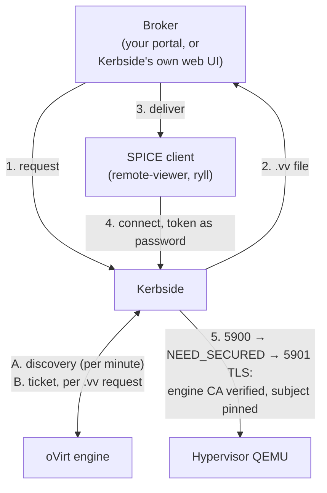

# Kerbside for oVirt

Native SPICE desktops for oVirt users, without exposing
hypervisors to the client network and without an opaque
byte-relay in the middle.

## Value proposition

oVirt's own answer for clients that cannot reach the hypervisor
network is an HTTP CONNECT proxy — conventionally squid —
configured engine-wide, per cluster, or per VM pool. It works,
but it is a layer 4 relay: it sees a CONNECT to a host and port,
and after that it moves bytes it does not understand. It has no
idea a SPICE session is in progress, cannot tell you which
sessions are live, cannot end one, and cannot stop a client from
sending anything the hypervisor will accept.

Kerbside replaces it with a protocol-aware front door:

- **The SPICE firewall is on by default.** Kerbside terminates
  the client's connection, drives the SPICE link handshake
  itself, and classifies every framed message against a
  per-channel allowlist. See
  [proxy-architecture.md](/components/kerbside/proxy-architecture/).
- **Sessions are objects, not TCP flows.** Every proxied console
  is a row you can list over the REST API, with an audit trail,
  and can terminate in flight. This is especially important because
  SPICE console sessions produce multiple flows, but the multiplier
  varies based on the client's capabilities and usage -- so you can't
  simply divide the number of observed flows by a constant to
  determine the number of connected clients.
- **The hypervisor is never reachable from the client network.**
  Clients reach kerbside; kerbside reaches oVirt. The SPICE
  ports do not need a route to users at all.
- **The backend leg is pinned.** Kerbside verifies the
  hypervisor's certificate against the engine CA *and* pins the
  certificate subject it discovered from the engine, so a
  redirected backend connection fails rather than succeeding
  quietly.
- **One entry point across clouds.** A single kerbside can
  broker oVirt alongside Shaken Fist and OpenStack sources;
  users keep one console entry point as workloads move.

Users get the SPICE features an HTML5 console cannot offer:
high-resolution and multi-monitor desktops, USB passthrough,
audio, and adaptive compression.

## How it works

Kerbside is not in oVirt's proxy chain and does not want to be.
It talks to the engine API to find consoles and to acquire
tickets, then connects to the hypervisor's SPICE port directly.
It never reads an engine-generated `.vv` file.



**Discovery (A).** Once a minute the `type: ovirt` source driver
(`kerbside/sources/ovirt.py`) walks the engine:

| Engine call | What kerbside takes from it |
|-------------|-----------------------------|
| `GET /services/pki-resource?resource=ca-certificate` | the engine CA, compared for equality against the `ca_cert` you configured |
| `vms_service().list()` | every VM; those not `up` are skipped |
| `hosts_service().list(search='id=<host id>')` | the host's `certificate.subject`, which becomes the pin for that VM's backend leg |
| `graphics_consoles_service().list(current=True)` | the console `address`, `port`, and `tls_port` |

Only VMs that are `up` and have a SPICE graphics console become
consoles kerbside will broker.

**Ticket (B).** oVirt graphics-console tickets are short-lived
(on the order of two minutes), so kerbside does not cache them.
`console_service(<id>).ticket()` is called at the moment a `.vv`
file is generated, and the ticket is stored against that console
for the connection that is about to happen. A `.vv` that sits in
a download folder for five minutes will not work — this is oVirt
behaviour, not a kerbside limitation, and any broker built on
this path should hand the file to the client immediately.

**The client leg (4).** The `.vv` points at `PUBLIC_FQDN` and
kerbside's own ports, carries kerbside's CA, and uses a
short-lived kerbside token as the SPICE password. The client
authenticates to *kerbside*; the oVirt ticket never leaves the
server side.

**The backend leg (5).** Kerbside connects to the hypervisor's
plaintext port, which answers the link handshake with
`NEED_SECURED`, and escalates to `tls_port`, verifying against
the engine CA and pinning the subject discovered in step A. It
then authenticates with the oVirt ticket and relays — inspecting
as it goes.

**One proxy layer, not two.** The chain people expect when they
hear "SPICE proxy plus kerbside" —
`client -> kerbside -> squid -> hypervisor` — never forms.
Kerbside dials the hypervisor itself, so the path is
`client -> kerbside -> hypervisor`, exactly as short as the
squid arrangement it replaces.

## How to set it up

### Engine side

**Account.** Kerbside authenticates to the engine with a
username and password. The account must be able to list VMs,
list hosts (for the certificate subject), read graphics
consoles, and acquire console tickets — the last of which
requires the `RECONNECT_TO_VM` action group on the VMs
concerned. Listing hosts is an administrative operation, so a
plain VM-portal user role is not sufficient.

The only account exercised in CI is the built-in `SuperUser`. A
minimal custom role has not been built or tested; the call table
above is there so you can construct one, but treat it as
untried.

Note the principal form. oVirt 4.4.7 and later name the built-in
administrator `admin@ovirt@internalsso` (`user@profile@authz`);
older deployments use `admin@internal`. The CI lane uses the
former. If authentication fails immediately against a modern
engine, the principal form is the first thing to check.

**Guests.** Install `qemu-guest-agent` and `spice-vdagent` in
the guest, as you would for any SPICE console — they are what
give you clipboard sharing, display resizing, and clean
resolution changes. Kerbside relays the agent channel; it does
not decode it.

**The engine's own SPICE proxy.** `SpiceProxyDefault` (set with
`engine-config -s SpiceProxyDefault=protocol://host:port`,
overridable per cluster and disableable per VM) affects only the
`.vv` files the *engine portal* hands out. Kerbside never reads
those, so this setting neither helps nor hinders it.

The recommendation for a kerbside deployment is therefore simply
to not deploy squid: nothing in the kerbside path needs it.
Engine-portal consoles remain available for administrators who
sit on the management network, or you can disable them. If you
already run a squid for portal users, you may keep it — the two
paths do not interact.

**What about pointing `SpiceProxyDefault` at kerbside?** It is
the obvious idea and it is the wrong one. Portal-issued `.vv`
files carry oVirt's ticket and expect TLS end to end from the
client to the hypervisor, verified against the engine CA with
the host subject pinned. Kerbside could not terminate or inspect
that without a man-in-the-middle it has no business performing,
so it would degrade to exactly the opaque tunnel squid already
is — losing the firewall, the session model, and the audit trail
that are the reason to run it. Considered and rejected.

Patching ovirt-engine to hand out kerbside `.vv` files directly
(the analogue of what
[kerbside-patches](https://github.com/shakenfist/kerbside-patches)
does for Kolla-Ansible) is not proposed: it is deep surgery in
the engine's Java `.vv` generation path.

### Network

Kerbside needs direct L3 reachability from itself to **every
hypervisor's SPICE port range** — both the plaintext and TLS
ports the engine reports, typically from 5900 upwards. This is
the reachability squid provides in a stock oVirt deployment, and
it is the prerequisite most likely to be missed: discovery works
fine over the engine API alone, so a firewall between kerbside
and the hypervisors produces a console list that looks healthy
and connections that fail.

Clients need to reach only kerbside.

Kerbside must also resolve and verify the engine's HTTPS name.
The engine certificate is issued for its FQDN, so `url` must use
that name and it must resolve — an IP address URL fails
certificate verification.

### Kerbside side

Add an oVirt source to `sources.yaml`:

```yaml
- source: ovirt
  type: ovirt
  url: https://ovirt.example.org/ovirt-engine
  username: admin@ovirt@internalsso
  password: secret
  ca_cert: |
    -----BEGIN CERTIFICATE-----
    ...the engine CA...
    -----END CERTIFICATE-----
```

Two things bite people, both worth checking first when a source
comes up errored:

- **`url` must not end in `/api`.** Kerbside appends `/api`
  itself, and appends a different suffix again for the CA
  fetch. `https://ovirt.example.org/ovirt-engine` is correct.
- **`ca_cert` is inline PEM, not a path**, and it is checked for
  equality. At startup kerbside re-fetches the CA from the
  engine — this time verified against the certificate you
  supplied — and marks the source errored unless the two match
  after trailing whitespace is stripped. A source that errors
  immediately usually means the pasted CA is stale or truncated,
  not that the engine is unreachable.

The full option table is in
[console-sources.md](/components/kerbside/console-sources/#ovirt). General
settings, including `PUBLIC_FQDN` and the proxy's own ports and
CA, are in [configuration.md](/components/kerbside/configuration/).

### A worked example

The `ovirt_matrix` job in
`.github/workflows/functional-tests.yml` builds a single-node
oVirt 4.5 environment and deploys kerbside against it on every
merge-queue entry. The runner-side scripts are in
`tools/ovirt-e2e/` (see `tools/ovirt-e2e/README.md`):
`gen-sources.py` writes the `sources.yaml` above — including
fetching the engine CA so the equality check passes by
construction — `deploy-kerbside.sh` installs and starts
kerbside, and `drive-console.py` mints a token, fetches a `.vv`,
and drives a real SPICE session through the proxy.

One difference from a real deployment: in CI, kerbside runs on
the GitHub Actions runner rather than on a host of its own,
because the oVirt node is Rocky 8 with a Python 3.6 interpreter
and kerbside requires 3.11 or newer. That is a CI expedient. The
topology it produces — kerbside off-box from oVirt, reaching the
engine by name and the hypervisor by address — is the shape a
real deployment has anyway.

## User interaction model

Kerbside is a proxy, not a portal. Something has to ask it for a
console on the user's behalf and deliver the resulting `.vv`
file — the "broker" role described in the
[documentation index](/components/kerbside/index/). For oVirt there is no
integrated broker today, so the options are:

- **Kerbside's own web UI**, which lists consoles and offers the
  `.vv` download. Adequate for small deployments and for
  administrators.
- **Your own portal**, calling kerbside's REST API. This is the
  intended production shape: the portal decides who may see
  which VM, then asks kerbside for the file.
- **The engine's own console buttons**, which bypass kerbside
  entirely and connect the user to the hypervisor directly.
  Useful for administrators on the management network; not the
  path you want for general users, and not one kerbside can see
  or audit.

## Status and limitations

Kerbside is experimental overall; the oVirt source specifically
is exercised end to end on every merge-queue entry, which covers
discovery against a live engine, the CA equality check, ticket
acquisition, the TLS escalation with subject pinning, a real
relayed SPICE session, and API-driven termination.

Not covered, and worth knowing before you deploy:

| Limitation | Detail |
|------------|--------|
| Single-host clusters only, in testing | CI runs engine and hypervisor on one node, so subject pinning is proven against exactly one host certificate. Multi-host clusters should work — the subject is cached per host — but are untested. |
| oVirt 4.5 only | No other version is tested. |
| Least-privilege accounts untested | Only `SuperUser` has been exercised. See the account note above. |
| Live migration during a session | Not tested. The console's address and subject are captured at discovery; a VM that migrates mid-session has not been characterised. |
| Ticket lifetime | Roughly two minutes, set by oVirt. Brokers must deliver the `.vv` promptly. |
| oVirt upstream | oVirt itself is minimally maintained. This integration is kept working, not extended. |

## See also

- [Console Sources](/components/kerbside/console-sources/#ovirt) — the option
  reference for `type: ovirt`
- [Configuration](/components/kerbside/configuration/) — proxy settings,
  including `PUBLIC_FQDN`, ports, and the proxy CA
- [Proxy Architecture](/components/kerbside/proxy-architecture/) — the SPICE
  firewall, the connection state machine, and the relay
- [Testing](/components/kerbside/testing/) — the CI lanes, including the oVirt
  end-to-end lane described above
