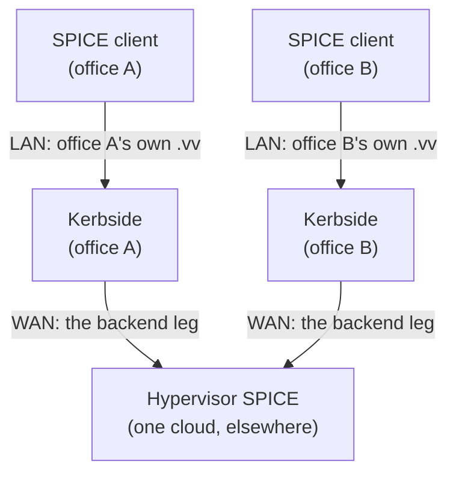

# Kerbside placement topologies

Several Kerbsides placed by user population rather than by
cloud — one per regional office, close to its users — so the
long hop is the Kerbside-to-hypervisor leg rather than the
client-to-Kerbside one. No new driver, no new configuration
key, and nothing in CI.

## Value proposition

The other five use-case pages describe what a Kerbside talks
to. This one describes where you put it, and there is really
only one thing being decided: which leg of the path crosses
the wide-area network.

Kerbside dials the hypervisor itself, so the path is
`client -> Kerbside -> hypervisor` wherever the proxy sits and
the number of hops does not change. A Kerbside beside the
cloud puts the distance between the user's SPICE client and
Kerbside. A Kerbside in the user's office puts it between
Kerbside and the hypervisor instead. That is the whole
topology, and there are two reasons to want it and one thing
to check before you do.

- **The office gets a single egress point for consoles.**
  Clients reach only their local Kerbside, and the
  hypervisors' SPICE ports need no route into the office's
  client network at all — the reachability requirement moves
  to the one host that is Kerbside. Every console session
  leaving the office leaves through one process, on one
  address, on one pair of ports.
- **The long hop carries an inspected session rather than a
  tunnel.** The relay is inspection-first: it frames every
  message and classifies it against a per-channel,
  per-direction allowlist, in both directions, instead of
  copying bytes opaquely
  ([proxy-architecture.md](/components/kerbside/proxy-architecture/)). The
  session that hop belongs to is a row you can list over the
  REST API, with an audit trail, and can terminate in flight.
  That is true of whichever leg is the long one; what the
  office placement adds is that the traffic crossing the WAN
  is now the aggregate of an office rather than one user's
  client connection.
- **Whether that leg is encrypted is the hypervisor's
  decision, not yours.** The proxy dials the hypervisor's
  plaintext port first and escalates to TLS only when the
  hypervisor rejects plaintext by asking for a secure
  connection *and* a secure port is configured to escalate to
  (`rust/kerbside-proxy/src/backend.rs:85-108`). It pins the
  backend certificate's subject only when the source supplied
  one: an empty `host_subject` maps to `None` and leaves the
  connection unpinned, and an empty `ca_cert` maps to `None`
  too (`backend.rs:198-211`), which leaves the target checked
  against the public web trust store — an internal
  certificate will not satisfy that, so the handshake fails
  rather than proceeding unverified. Before moving a WAN hop
  onto this leg, check that your source supplies both. One
  never does; see the limitations table.

## How it works

**The address in the `.vv` file is free.** Every `.vv`
Kerbside emits builds the client-facing address from the
configuration of the Kerbside that generated it —
`config.PUBLIC_FQDN`, at `kerbside/api.py:533` for a direct
request, `:686` for the Nova token exchange and `:814` for the
Shaken Fist one. An office instance therefore hands out its
own address without being told anything about the others, and
without any per-office configuration beyond its own.

**Who tells the user which Kerbside to use.** That is the axis
that actually decides whether per-office placement works, and
it differs by source.

- **Shaken Fist.** The console token is verified entirely
  offline, an Ed25519 signature check against signing keys the
  `shakenfist` source cached during its own scrape
  (`kerbside/sf_token.py`). The exchange route deliberately
  carries no `@verify_token` decorator, and the comment at
  `kerbside/api.py:707-711` says why. Any Kerbside that
  scrapes the cluster can therefore serve any of the cluster's
  tokens, so an office instance needs no coordination with the
  others.
- **oVirt and static.** The user authenticates to a Kerbside
  directly and each instance scrapes or reads its sources
  independently, so the same holds: an office instance is
  self-contained.
- **OpenStack.** This one does not work that way. Nova is
  configured with a single Kerbside URL by
  [kerbside-patches](https://github.com/shakenfist/kerbside-patches),
  and the token it mints is presented to whichever Kerbside
  that URL names — see
  [Kerbside for OpenStack](/components/kerbside/use-cases/openstack/). Per-office placement
  needs something to route each user to their own office's
  instance, and Kerbside does not provide it. See the
  limitations table.

## How to set it up

Each office runs an ordinary Kerbside against the same source
configuration. There is no clustering step, no peer list, and
no configuration key that has anything to say about the other
offices; the source page you are deploying from describes the
whole of the work, done once per office.

What the instances share is worth being exact about. Within
one deployment the shared MariaDB is the only bus every
component can reach — there is no API-to-proxy or
proxy-to-proxy RPC across machines
([proxy-architecture.md](/components/kerbside/proxy-architecture/)). Offices
with their own databases share nothing at all: each runs its
own sixty-second maintenance pass over its sources
(`kerbside/main.py:341-354`), and each console token is a
random value stored in the issuing instance's database
(`kerbside/consoletoken.py:19-44`), so a `.vv` minted in one
office is only usable against the Kerbside that minted it.

The distributed layout Kerbside does support is a different
thing and is not a substitute. The REST API and the proxy
nodes may be on different machines, with a load balancer
spreading one session's channels across several proxy nodes
(see `ARCHITECTURE.md`). But the `.vv` is built by the API
from one `PUBLIC_FQDN`, so pushing only proxy nodes out to the
offices still hands every user the same address. Placement by
user population means whole Kerbsides.

## User interaction model

Kerbside is a proxy, not a portal. Something has to ask it for
a console on the user's behalf and deliver the resulting `.vv`
file — the "broker" role described in the
[documentation index](/components/kerbside/index/). Placement does not change
that; it changes which Kerbside the broker asks.

A user in an office is handed a `.vv` naming their office's
instance, connects to it, and sees the console list that
instance's sources enumerate — the same list in every office
where the source configuration is the same, because each
instance discovers the same clouds for itself. What a user
does not get is a second instance as a fallback: the token in
their `.vv` is a row in the database of the Kerbside that
issued it. What an *operator* does not get is one session
view; see the limitations table.

## Status and limitations

Kerbside is experimental overall, and this topology is the
least exercised scenario in this directory: nothing in CI or
in the compose demo runs more than one Kerbside, so what is
written above is reasoned from the code rather than proven by
a lane.

Not covered, and worth knowing before you deploy:

| Limitation | Detail |
|------------|--------|
| No CI lane runs two Kerbsides | Every lane deploys exactly one. `tools/sf-e2e/deploy-kerbside.sh` co-locates a single Kerbside on the Shaken Fist primary node, and `tools/ovirt-e2e/deploy-kerbside.sh` deploys a single one on the CI runner pointed at the lane's engine. Nothing anywhere stands up two instances, so this topology is untested end to end. |
| OpenStack per-office placement needs routing Kerbside does not provide | Nova is configured with one Kerbside URL by [kerbside-patches](https://github.com/shakenfist/kerbside-patches), and the token it mints is presented to whichever Kerbside that URL names, so every user reaches whatever that single URL resolves to regardless of which office they are in. Kerbside has no mechanism for sending a user to their local instance, and nothing of the sort has been tested. Not solved here. |
| The WAN hop is not protected by moving it | TLS on the backend leg happens only when the hypervisor rejects plaintext by asking for a secure connection and a secure port is configured to escalate to (`rust/kerbside-proxy/src/backend.rs:85-108`), and the certificate subject is pinned only when the source supplied one — an empty subject maps to `None` and leaves the leg unpinned (`backend.rs:198-211`). The OpenStack path supplies neither: `kerbside/api.py:665-671` is the only `db.add_console()` on that path, and it passes no `host_subject` and no `ca_cert`. Putting a wide-area hop on this leg therefore does not encrypt or pin it by itself. |
| Each instance is its own session and audit view | Tokens, sessions and audit events are rows in the database the instance uses (`kerbside/consoletoken.py:19-44`), and the shared database is the only thing components coordinate through ([proxy-architecture.md](/components/kerbside/proxy-architecture/)). Offices that do not share a database give an operator one console list, one session list and one audit trail per office, with nothing joining them. |
| Discovery load multiplies with offices | Each instance runs its own maintenance pass every sixty seconds and scrapes its sources independently (`kerbside/main.py:341-354`), so ten offices means ten scrapes of the same cloud. Nothing coordinates or bounds that, and no lane runs even two instances to measure it. |

## See also

- [Multi-cloud aggregation](/components/kerbside/use-cases/multi-cloud/) — the inverse
  arrangement: several sources behind one Kerbside, rather
  than several Kerbsides in front of one cloud
- [Proxy Architecture](/components/kerbside/proxy-architecture/) — the SPICE
  firewall, the connection state machine, the relay, and the
  distributed-deployment constraint
- [Kerbside for oVirt](/components/kerbside/use-cases/ovirt/),
  [Kerbside for Shaken Fist](/components/kerbside/use-cases/shakenfist/),
  [Kerbside for OpenStack](/components/kerbside/use-cases/openstack/) and
  [Kerbside standalone](/components/kerbside/use-cases/standalone/) — the source pages, one
  of which describes the deployment you are placing
