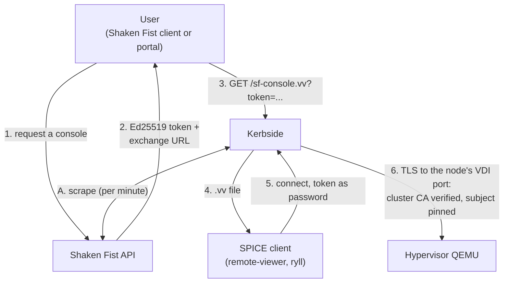

# Kerbside for Shaken Fist

Shaken Fist's own console flow, with the broker already built:
the cluster mints the token, Kerbside verifies it offline and
brokers the desktop.

## Value proposition

A Shaken Fist instance with a SPICE video model exposes its
console on the node that currently hosts it, on the ports the
instance record calls `vdi_port` and `vdi_tls_port`. Handing that
to a user means giving the user a route to the hypervisor, and
once the bytes start flowing nothing on the cluster side knows
what a session is, which ones are live, or how to end one.

Kerbside is the front door for that console, and unlike every
other source it is not bolted on beside the cloud's own flow —
it *is* the second half of it:

- **The broker is Shaken Fist's.** Shaken Fist mints a
  short-lived Ed25519-signed token and hands the viewer an
  exchange URL at Kerbside; a single client call
  (`get_vdi_console_proxy_file()`) returns a `.vv` file pointed
  at the proxy. There is no portal to write and no ticket
  plumbing to build, which is not true of the oVirt or
  OpenStack paths.
- **Verification is offline, and single use.** Kerbside checks
  the token's signature against the cluster's published signing
  public keys, which it caches when the source is initialised.
  On the normal path verification touches nothing but those
  cached keys, and a token is accepted exactly once. Two things
  follow that are worth having: a console opens even while the
  Shaken Fist API is busy or restarting, and a token that leaks
  after use is worth nothing to whoever leaked it. A signing-key
  rotation is the one exception that reaches back to the
  cluster. The mechanism is in
  [console-sources.md](/components/kerbside/console-sources/#shaken-fist).
- **The SPICE firewall is on by default.** Kerbside terminates
  the client's connection, drives the SPICE link handshake
  itself, and classifies every framed message against a
  per-channel allowlist. See
  [proxy-architecture.md](/components/kerbside/proxy-architecture/).
- **Sessions are objects, not TCP flows.** Every proxied console
  is a row you can list over the REST API, with an audit trail,
  and can terminate in flight.
- **The hypervisors are never reachable from the client
  network.** Clients reach Kerbside; Kerbside reaches the nodes.
- **The backend leg is pinned.** Kerbside verifies the node's
  SPICE certificate against the cluster CA and pins the
  certificate subject the node publishes, so a redirected
  backend connection fails rather than succeeding quietly.
- **One entry point across clouds.** A single Kerbside can
  broker Shaken Fist alongside oVirt and OpenStack sources;
  users keep one console entry point as workloads move.

Users get the SPICE features an HTML5 console cannot offer:
high-resolution and multi-monitor desktops, USB passthrough,
audio, and adaptive compression.

## How it works

Two independent paths meet at the proxy. A periodic scrape keeps
an inventory of consoles; a user-driven token exchange turns one
of those consoles into a connection. Nothing joins them at
connect time except the database.



**Discovery (A).** Once a minute the `type: shakenfist` source
driver (`kerbside/sources/shakenfist.py`) walks the cluster:

| Shaken Fist call | What Kerbside takes from it |
|------------------|-----------------------------|
| `get_nodes()`, always as `system` | a map of node uuid to the node's fqdn, IP address, and published SPICE server certificate subject |
| `get_instances(all=True)` when the source's `username` is `system`, otherwise that namespace's `get_instances()` | every instance the credential can see |
| the instance record | `vdi_port` and `vdi_tls_port`, the hosting node, and the console name, which Kerbside qualifies as `<instance>.<namespace>` |

Only instances in the `created` state whose VDI video model is a
SPICE variant become consoles, and only those whose hosting node
appears in the node map. The `system` credential is the
interesting case: one source then covers *every* namespace in
the cluster, so a single `sources.yaml` entry makes the whole
cluster brokerable. Because the node map is rebuilt each pass, a
console is always associated with the hypervisor hosting it at
the time of the scrape.

**The exchange (3).** Shaken Fist, not Kerbside, decides that a
user may have a console. It mints a short-lived Ed25519-signed
JWT naming the instance and hands out
`<KERBSIDE_URL>/sf-console.vv?token=<jwt>`. Kerbside verifies
that token entirely offline against the cluster's signing public
keys, looks the instance up in the inventory the scrape built,
confirms it belongs to the source whose key verified the token,
and only then consumes the token's single use. That order is
deliberate: a token for an instance the scrape has not reached
yet is refused without being spent, so a retry can still
succeed.

That is as far as this page goes. The per-claim checks, what is
and is not recorded as an audit event, how a signing-key
rotation is tolerated, and what an operator sees when a token is
rejected are all documented once, in
[console-sources.md](/components/kerbside/console-sources/#shaken-fist). The
audience the token must carry is a configuration setting;
see [configuration.md](/components/kerbside/configuration/#shaken-fist-console-tokens).

**The client leg (4, 5).** The `.vv` file points at
`PUBLIC_FQDN` and Kerbside's own ports, carries Kerbside's CA,
and uses a short-lived Kerbside console token as the SPICE
password. The client authenticates to *Kerbside*; the Shaken
Fist token never leaves the exchange.

**The backend leg (6).** Kerbside connects to the node's VDI
ports, verifying the node's certificate against the cluster CA
configured on the source. Where the node publishes a
`spice_server_cert_subject`, that subject was captured at scrape
time and is pinned for this connection, so a backend that
answers with the wrong identity is refused. Where it publishes
none, the subject is unset and the proxy relays without
host-subject enforcement for that backend — see the limitations
table below.

**No per-connection call to the cloud.** Unlike the oVirt path,
which acquires a ticket from the engine at the moment a `.vv` is
generated, the Shaken Fist connect path normally asks the cluster
nothing: the inventory is up to a scrape interval old and the
token verifies against cached keys, so a connection survives a
control plane that is busy or restarting. The exception is a
token signed by a key Kerbside has not cached, which is what a
signing-key rotation produces; `console-sources.md` describes how
that is handled.

## How to set it up

### Shaken Fist side

**Cluster configuration.** Two cluster-wide settings turn the
integration on: `KERBSIDE_URL`, the base of the exchange URL,
and `KERBSIDE_TOKEN_DURATION`, the lifetime of a minted token.
`KERBSIDE_URL` is simultaneously the exchange URL base and the
`aud` claim of every token, and it must equal Kerbside's
`SF_CONSOLE_TOKEN_AUDIENCE` byte for byte — scheme, port, and
trailing path included. `sf-api` reads `KERBSIDE_URL` into its
configuration at process start, so restart it after changing
the value.

**Signing keys.** Shaken Fist signs console tokens with a VDI
token signing key, and the cluster must have one before any
token can be minted or verified; Kerbside caches only its public
half. Creating the key is an explicit operator step, and
[console-sources.md](/components/kerbside/console-sources/#shaken-fist) has the
command and describes exactly what Kerbside does when a cluster
has no key yet.

**Credentials.** Kerbside authenticates with a namespace name
and its key, and in practice that namespace must be `system`.
Only the instance listing uses the namespace you configure; the
CA fetch, the signing-key fetch and the node listing are always
made as `system` with the same key, so a credential that cannot
authenticate as `system` fails at startup rather than narrowing
the scrape to its own namespace. Using `system` is also what
makes the scrape cluster-wide. See the limitations table.

**Instances.** An instance is only brokerable while it is in the
`created` state and was booted with a SPICE video model. Install
`qemu-guest-agent` and `spice-vdagent` in the guest as you would
for any SPICE console — they are what give you clipboard
sharing, display resizing, and clean resolution changes.
Kerbside relays the agent channel; it does not decode it.

**Nodes.** A node that publishes its SPICE server certificate
subject gets a pinned backend leg for free. A cluster where the
nodes do not publish one still works, with enforcement skipped
for those backends.

### Network

Kerbside needs direct L3 reachability to **every hypervisor
node's VDI ports** — both the plaintext and TLS ports the
instance record reports — and to the Shaken Fist API URL, whose
certificate it verifies against the configured CA.

This is the prerequisite most likely to be missed, because
discovery works over the API alone: a firewall between Kerbside
and the nodes produces a console list that looks perfectly
healthy and connections that fail.

Users need to reach two things and only two things: the Shaken
Fist API, to ask for a console, and Kerbside, at the address
`KERBSIDE_URL` names, both to exchange the token and to run the
SPICE session. Nothing needs a route to a hypervisor.

### Kerbside side

Add a Shaken Fist source to `sources.yaml`:

```yaml
- source: shakenfist
  type: shakenfist
  url: https://sf.example.org
  username: system
  password: secret
  ca_cert: |
    -----BEGIN CERTIFICATE-----
    ...the cluster CA...
    -----END CERTIFICATE-----
```

Then set `SF_CONSOLE_TOKEN_AUDIENCE` to the same string as the
cluster's `KERBSIDE_URL`. Left empty it is derived from
`PUBLIC_FQDN` as `https://<PUBLIC_FQDN>`, which is right only
when the public URL has no port or path of its own — so set it
explicitly if in any doubt, because a mismatch rejects every
token.

One other thing bites people: **`ca_cert` is inline PEM, not a
path**, and it must match the CA the cluster advertises. A
source that errors immediately usually means the pasted CA is
stale or truncated, not that the cluster is unreachable;
[console-sources.md](/components/kerbside/console-sources/#shaken-fist) has the
check and what it does on a mismatch.

The full option table, including the optional knob for clusters
whose nodes publish no certificate subject, is in
[console-sources.md](/components/kerbside/console-sources/#shaken-fist).
General settings, including `PUBLIC_FQDN` and the proxy's own
ports and CA, are in [configuration.md](/components/kerbside/configuration/).

### A worked example

`.github/workflows/sf-e2e-functional.yml` stands up a real
single-node Shaken Fist, deploys this checkout's Kerbside
against it, and drives the whole flow — mint, offline
verification, exchange, and a proxied SPICE session against a
guest booted inside the Shaken Fist instance. The driver scripts
are in `tools/sf-e2e/` (see `tools/sf-e2e/README.md`):
`provision-sf.sh` sets `KERBSIDE_URL` and the signing key on the
cluster side, `gen-sources.py` writes the `sources.yaml` above
— fetching the cluster CA so the equality check passes by
construction — `deploy-kerbside.sh` installs and starts
Kerbside, `drive-happy-path.py` exchanges a token and drives a
session, and `drive-adversarial.py` asserts five rejections
across the joined flow — four at Kerbside's exchange endpoint,
and one at the Shaken Fist mint, where a namespace asking for
another namespace's instance is refused a token at all.

This is a stronger worked example than the oVirt lane's. It is a
**smoke-tier gate**, so it runs on every pull request as well as
nightly, rather than only on entry to the merge queue; see
[testing.md](/components/kerbside/testing/#the-shaken-fist-end-to-end-lane-sf-e2e).

Two differences from a real deployment, both CI expedients
rather than recommendations. Kerbside runs co-located on the
Shaken Fist primary node as plain processes, where a real
deployment would put it on a host of its own. And the audience
contract is exercised over a loopback `http://` URL, not the
public HTTPS name a deployment would use.

## User interaction model

Kerbside is a proxy, not a portal. Something has to ask it for a
console on the user's behalf and deliver the resulting `.vv`
file — the "broker" role described in the
[documentation index](/components/kerbside/index/). Shaken Fist is unusual in
that the broker already exists:

- **Shaken Fist's own broker.** The intended path. The user asks
  Shaken Fist for a console for an instance; Shaken Fist decides
  whether they may have it, mints the token, and the client
  library's one call returns the `.vv` file. Authorisation is
  Shaken Fist's namespace model, which is where the answer
  belongs, and Kerbside never needs its own opinion about who
  owns which instance.
- **Kerbside's own web UI and REST API**, which list the scraped
  consoles and offer a `.vv` download. Useful for
  administrators, and the path an operator uses to inspect or
  terminate a live session — but it is Kerbside's own
  authentication, not Shaken Fist's, so it is an administrative
  entry point rather than a user-facing one.

## Status and limitations

Kerbside is experimental overall. The Shaken Fist source
specifically is exercised end to end on every pull request,
which covers discovery against a live cluster, the CA equality
check, offline token verification, the exchange, a real relayed
SPICE session, an audit row for that session, API-driven
termination, and an adversarial matrix of rejections.

Not covered, and worth knowing before you deploy:

| Limitation | Detail |
|------------|--------|
| Single-node clusters only, in testing | The `sf-e2e` lane builds a one-node Shaken Fist, so the node map, the per-node certificate subjects, and consoles spread across hypervisors are each proven against exactly one node. Multi-node clusters should work — the node map is rebuilt every pass and the subject is pinned per console — but no lane covers them. A multinode lane is listed as future work in [PLAN-two-tier-ci.md](/components/kerbside/plans/PLAN-two-tier-ci/). |
| Backend pinning depends on the cluster | A node that publishes no `spice_server_cert_subject` leaves `host_subject` unset, and the proxy relays that backend without host-subject enforcement rather than refusing it. Whether your cluster publishes one depends on its version and node configuration. The optional knob for turning enforcement on anyway, and the PKI assumption it makes, are in [console-sources.md](/components/kerbside/console-sources/#shaken-fist). |
| Off-box deployment untested in CI | The lane runs Kerbside on the Shaken Fist primary over loopback. The real topology — Kerbside on its own host, reaching the API by name and the nodes by address — is the shape the oVirt lane proves, not this one. |
| Token exchange can be unavailable while scraping is fine | A cluster Kerbside scrapes happily is not necessarily one it can exchange tokens for; the two capabilities fail independently by design. The causes and the operator fix are in [console-sources.md](/components/kerbside/console-sources/#shaken-fist). |
| Non-`system` namespaces | A source configured with any other namespace is untested and is not expected to work: only the instance listing uses the configured namespace, while the CA fetch, the signing-key fetch and the node listing are always made as `system` with the same key. The unit tests cover the branch with a namespace-to-mock map, which proves the branch and not that a non-`system` credential works against a real cluster. Tracked as #444. |
| Shaken Fist client version | The `shakenfist_client` library is imported by name rather than being a runtime dependency, so any version at all can be installed alongside Kerbside. Versions older than 0.8.3 cannot fetch signing keys, which leaves token exchange unavailable for every Shaken Fist source. |
| Freshly created consoles | The inventory is a scrape, not a subscription, so a console can be up to a minute old. A token minted for an instance Kerbside has not yet scraped is rejected and must be retried once the scrape catches up. |
| Live migration during a session | Not characterised. The console's node, address, ports, and certificate subject are captured at scrape time; an instance that moves between nodes mid-session has not been tested. |
| Non-SPICE and non-running instances | Only instances in the `created` state with a SPICE video model are brokered. Everything else is invisible to Kerbside, by design. |

## See also

- [Console Sources](/components/kerbside/console-sources/#shaken-fist) — the
  option reference for `type: shakenfist`, and the full detail
  of the token exchange, its failure modes, and backend pinning
- [Configuration](/components/kerbside/configuration/#shaken-fist-console-tokens)
  — `SF_CONSOLE_TOKEN_AUDIENCE`, and the general proxy settings
  including `PUBLIC_FQDN`, ports, and the proxy CA
- [Proxy Architecture](/components/kerbside/proxy-architecture/) — the SPICE
  firewall, the connection state machine, and the relay
- [Testing](/components/kerbside/testing/#the-shaken-fist-end-to-end-lane-sf-e2e)
  — the CI lanes, including the Shaken Fist end-to-end lane
  described above
- [Kerbside for oVirt](/components/kerbside/use-cases/ovirt/) — the sibling deployment guide
