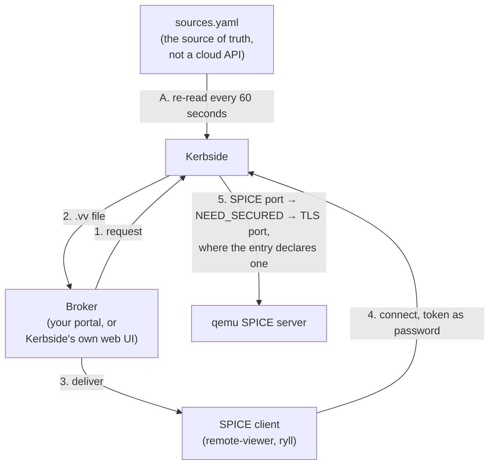

# Kerbside standalone

A fixed list of SPICE targets and nothing behind them: the
`static` source driver (`kerbside/sources/static.py`) reads its
console list out of `sources.yaml`, so Kerbside brokers qemu
directly with no cloud to discover anything from.

## Value proposition

The other three pages put Kerbside in front of a platform that
already knows where every console of its own is. This one is for
when there is no such platform: a lab bench, a CI job, a rack of
appliance VMs no API will ever enumerate. The `static` driver
is how you get the proxy's session model, its audit trail and
its SPICE firewall without standing anything else up first.

- **There is nothing to stand up and nothing to authenticate
  to.** The driver makes no external call at all. There is no
  service account to create, no discovery CA to paste and have
  checked for equality, no discovery interval to tune, and no
  platform outage that can put the source into an errored state.
  (Reaching a target over TLS still needs that target's CA; what
  is absent is the second one, for talking to a platform.)
  Everything Kerbside knows comes from one local file, which is
  also the only thing that can be wrong.
- **The console list reloads every sixty seconds, in both
  directions.** The maintenance loop re-reads `sources.yaml` and
  rebuilds the driver from it, so a target added to the file
  becomes a console in a little over a minute — audited as
  `Discovered new console` — and a target removed from the file
  stops being one, audited as `Console no longer available`. No
  restart is needed, and neither direction has to be taken on
  trust: both leave a record. It is a live inventory you edit
  with a text editor, with one exception: a changed SPICE
  password for a target already in the list is discarded rather
  than applied, and changing one means removing the entry,
  letting the removal land, and adding it back. See
  [Status and limitations](#status-and-limitations).
- **Backend pinning is a field you write by hand, and this is
  the only deployment where that is true.** All four pages
  answer the same question — what stops Kerbside's backend
  connection being redirected to a host that is not the one it
  meant to reach — and all four answer it differently. oVirt
  learns the certificate subject from the engine during
  discovery. Shaken Fist learns it from the cluster's node map.
  OpenStack cannot learn it at all, because Nova's token
  validation response carries no certificate subject, so that
  leg is relayed without host-subject enforcement. Here there is
  no platform to learn from, and the answer is that the operator
  writes `host_subject` into the target's entry. That is more
  work and a better guarantee where you write one: the pin is
  exactly the value you chose, and the proxy refuses a backend
  whose subject does not match it. It is also the only one of
  the four that can be left out by accident — the field is
  optional, an omitted `host_subject` leaves the leg unpinned
  rather than erroring, and the pin is only reached at all on a
  leg that escalated to TLS. See
  [Status and limitations](#status-and-limitations).
- **The SPICE firewall is on by default.** Kerbside terminates
  the client's connection, drives the SPICE link handshake
  itself, and classifies every framed message against a
  per-channel allowlist. See
  [proxy-architecture.md](/components/kerbside/proxy-architecture/).
- **Sessions are objects, not TCP flows.** Every proxied console
  is a row you can list over the REST API, with an audit trail,
  and can terminate in flight. That is worth as much in front of
  a bench qemu as in front of a cloud, because qemu itself
  offers none of it.
- **It composes with the clouds.** A static entry sits in the
  same file as oVirt, Shaken Fist and OpenStack entries, which
  is how a target no platform knows about — an appliance, a bare
  qemu, something mid-migration — joins the same console list as
  everything else. One thing comes with that; see
  [User interaction model](#user-interaction-model).

Users get the SPICE features a serial console or an HTML5
wrapper cannot offer: high-resolution and multi-monitor
desktops, USB passthrough, audio, and adaptive compression.

## How it works

Nothing is discovered, but something is still enumerated.
Kerbside runs its ordinary maintenance pass over a static
source; the pass simply reads the file instead of calling a
platform API, and `sources.yaml` is the source of truth for what
exists rather than a cache of what a cloud said.

**The reload (A).** `_parse_sources()` re-opens the sources file
on every call (`kerbside/main.py:64`, the `open()` at `:90`),
and the maintenance loop calls it every sixty seconds
(`kerbside/main.py:349`). The driver is not kept between passes:
it is constructed fresh from the YAML that pass parsed
(`kerbside/main.py:174`), so the console list is re-read with
it. A target that has appeared in the file is added and audited
`Discovered new console` (`kerbside/main.py:201-206`). A target
that has been removed from the file is deleted and audited
`Console no longer available` (`kerbside/main.py:243-261`) — the
retention rule that keeps an OpenStack cloud's rows indefinitely
covers only sources the pass did not enumerate, and this source
is enumerated, so it does not apply. Both directions therefore
land in a little over a minute — the loop sleeps a second at a
time and fires once more than sixty have passed
(`kerbside/main.py:335-354`) — and both leave an audit event you
can check rather than a claim you have to believe.

**What the reload does not carry.** A console which already
exists has its host, address, ports, name and `host_subject`
reassigned on every pass, but not its SPICE password: that is
set only when the row is first inserted
(`kerbside/db.py:303-318`), and the `.vv` handler then
deliberately leaves the stored value alone for a static source,
on the grounds that the driver persisted it at enumeration time
(`kerbside/api.py:509-512`). An edited password is therefore
parsed, yielded by the driver, passed to the database layer and
dropped, with no log line, no audit event and no errored source.
Removing the entry, letting the removal land, and adding it back
does apply it, because that takes the insert path — at a cost
worth knowing before you rely on it: the console is deleted on
the first pass and absent from the inventory, the API and the
web UI until the second, it comes back as a fresh row with its
discovery timestamp reset, and rotating a password therefore
takes two maintenance cycles rather than one. The audit trail
does survive, which is the one piece of good news here: audit
events are keyed on the source and the identifier rather than
on the console row, and nothing deletes them, so re-adding the
same identifier picks the history back up.
Tracked as
[#463](https://github.com/shakenfist/kerbside/issues/463).

**What a bad edit does depends on how it is bad.** Three
outcomes, and only one of them is the safe one. A console entry
which is malformed — not a dict, or missing a required field —
marks the whole source errored for that pass, so the source is
never enumerated, falls under the same retention rule as an
unreachable cloud, and what was already published stays
published rather than being deleted by a typo. That is the
fail-closed case, and it is the one to expect from a mistake
*inside* an entry. Deleting or misspelling the key that holds
the entries is not caught: the list is read with a default, so
it comes back empty, nothing validates an empty list, the source
is enumerated successfully with nothing in it, and every
console it had published is deleted
([#464](https://github.com/shakenfist/kerbside/issues/464)). And
a YAML syntax error anywhere in the file is worse still, because
the parse happens outside the per-source error handling and the
maintenance loop does not guard the call: the daemon exits, and
restarts into the same failure until the file is repaired
([#465](https://github.com/shakenfist/kerbside/issues/465)). The
rule of thumb until those are fixed is that the blast radius of
an edit grows as the mistake moves outward — inside an entry it
is contained, at the key above them it costs that source's
inventory, and at the file's syntax it costs the daemon.

**Nothing is fetched per request.** oVirt acquires a short-lived
credential from the engine for every `.vv` file, and OpenStack
calls Nova to validate a token on every exchange. Here the SPICE
password Kerbside presents to the target is written in the file
and stored with the console when the pass records it, so `.vv`
generation makes no call to anything. There is no external
dependency that can be down, which is the other half of "no
control plane".

**The client leg (4).** The `.vv` file points at `PUBLIC_FQDN`
and Kerbside's own ports, carries Kerbside's CA and, when
`PROXY_HOST_SUBJECT` is set, Kerbside's own certificate subject
for the client to check. It carries a short-lived Kerbside
console token as the SPICE password. The client authenticates to
*Kerbside*; the password you wrote in the file never leaves the
server side.

**The backend leg (5).** Kerbside dials the address the entry
gives, on the plaintext SPICE port it gives. Where the entry
also declares a TLS port, a `NEED_SECURED` answer from qemu
escalates the connection to it, and where the entry carries
`host_subject`, the proxy refuses a backend whose certificate
subject does not match — exactly, down to attribute count, order
and type. Both are optional and both default to absent, so the
default shape of this deployment is a plaintext backend leg:
acceptable on a loopback bench, not acceptable across a network.
See the limitations table.

## How to set it up

### The SPICE server side

The target needs a SPICE server listening on a port Kerbside can
reach, with a password set — Kerbside always presents one, so an
open SPICE server is not what this path expects.

Encrypting the backend leg takes three separate things, and two
of them are easy to mistake for the whole job. qemu needs its
TLS channel configured. Kerbside needs the CA that signed the
target's certificate, as `ca_cert` on the *source* rather than
on the target's entry: the daemon reads it for every source type
and forwards it to the proxy as the backend CA
(`kerbside/rpc/servicer.py:136`). And `host_subject` on the
entry pins which certificate is acceptable. The CA is not
optional decoration on top of the other two — without it the
protocol crate verifies the target against the public web trust
store, which an internal certificate will not satisfy, so the
escalation fails the handshake rather than proceeding
unverified.

Guests want `qemu-guest-agent` and `spice-vdagent` installed, as
they would for any SPICE console — they are what give you
clipboard sharing, display resizing, and clean resolution
changes. Kerbside relays the agent channel; it does not decode
it.

### Network

Kerbside needs direct L3 reachability to every target's SPICE
port, and to its TLS port where one is declared. Clients need to
reach only Kerbside. Nothing else needs a route anywhere,
because there is no API for Kerbside to call: the reachability
surface of this deployment is the targets and nothing more.

The failure mode the sibling pages warn about is sharper here.
Discovery is what usually notices that a platform has become
unreachable; there is no discovery on this path, so nothing at
all is contacted while the console list is being built. An entry
becomes a console whether or not anything is listening, and the
first thing that touches the target is the user's SPICE client.
See the limitations table.

### Kerbside side

Add a static entry to `sources.yaml`, with one block per target
saying where it is, which port to reach it on, and which SPICE
password to present — plus, optionally, a TLS port and the
`host_subject` to pin the backend leg against, and `ca_cert` on
the source itself if any target is to be reached over TLS. The
option and
field reference, a worked example entry, and the ryll
control-socket pairing for driving such a session headlessly are
all in
[console-sources.md](/components/kerbside/console-sources/#static-source).

General settings, including `PUBLIC_FQDN`, Kerbside's own ports
and CA, and `PROXY_HOST_SUBJECT`, are in
[configuration.md](/components/kerbside/configuration/).

### A worked example

There are two, and neither needs repeating here.

The compose demo in
[installation.md](/components/kerbside/installation/#try-it-the-demo-stack) is
the one to run: three containers, a disk-less qemu with a SPICE
server, a single static entry, and a real proxied SPICE session
at the end of it. It is this deployment in miniature, and
`demo/sources.yaml` is a commented example of the entry
described above, including why it deliberately leaves the
backend leg plaintext. What the stack is *not* is tabulated
under
[What the demo is not](/components/kerbside/installation/#what-the-demo-is-not),
and [demo/README.md](https://github.com/shakenfist/kerbside/blob/develop/demo/README.md)
is the reference for the stack itself.

The `direct-qemu` lane is the same shape under CI: the full
daemon, API and MariaDB against a local qemu SPICE server
declared through a static source, on every pull request and
nightly.
[testing.md](/components/kerbside/testing/#the-direct-qemu-lane) covers the
lane, and
[direct-qemu-harness.md](/components/kerbside/direct-qemu-harness/) covers the
daemon-less mock harness beside it, which drives the proxy with
no database and no daemon at all.

## User interaction model

Kerbside is a proxy, not a portal. Something has to ask it for a
console on the user's behalf and deliver the resulting `.vv`
file — the "broker" role described in the
[documentation index](/components/kerbside/index/). This is the deployment with
the least help available: there is no platform portal to embed
in and no platform token to exchange, so the options are
Kerbside's own web UI and REST API, or a portal of your own
written against that API.

That is sharpened by interactive login being Keystone-only today
([#300](https://github.com/shakenfist/kerbside/issues/300)). A
standalone deployment usually has no Keystone anywhere near it,
which leaves a human no way to log into the web UI, so in
practice such a deployment is driven by an API client holding a
token that something else minted.

The exception is the demonstration affordance the compose stack
uses. `kerbside demo token` mints a bearer token straight from
the signing seed, and it refuses to do so unless *every* source
configured in the file is `type: static`
(`kerbside/main.py:474-526`), naming the offending source and
its type in the refusal and adding "See issue #300 for the
underlying gap". The reasoning is in the code: a session token
is not scoped to a source, so it authorises every console of
every configured source and there is no coherent per-source
version of the guard. That makes the composability described
above conditional — add a real cloud beside your static entry
and the command stops minting, by design, because it stands in
for authentication in a demonstration rather than being one.
Past that point, tokens come from the API the way a broker would
get them.

## Status and limitations

Kerbside is experimental overall. The standalone path is
exercised on every pull request rather than only in the merge
queue: the `direct-qemu` lane runs the full daemon, API and
database against a real qemu declared through a static source,
and drives a SPICE session through the proxy, including live
termination.

Not covered, and worth knowing before you deploy:

| Limitation | Detail |
|------------|--------|
| Nothing checks that the target is alive | There is no liveness check of any kind. An entry in the file is a console whether or not anything is listening on the port, so Kerbside will happily mint a `.vv` for a qemu that exited an hour ago and the user discovers it by the SPICE client failing to connect. Nothing in the console list, the web UI or the API distinguishes a live target from a dead one. This, rather than anything about the file format, is the honest reason the static source is not intended for production use. |
| A changed SPICE password is never applied | Every other field of an entry which already exists is reassigned on the next pass; the password is not. It is set only when the console row is first inserted (`kerbside/db.py:303-318`), and the `.vv` handler leaves the stored value alone for a static source (`kerbside/api.py:509-512`), so an edit to it is parsed and discarded with no log line, no audit event and no errored source. The file and the database disagree and nothing says so; the first sign is the target refusing the handshake. Remove the entry, let the removal land, and add it back to change one. Tracked as [#463](https://github.com/shakenfist/kerbside/issues/463). |
| The inventory is only as good as your editing | There is no discovery, so nothing ever corrects the file. A target rebuilt on a different port, or with a different SPICE password, is simply wrong until somebody edits it, and the wrongness shows up as a failed connection rather than as an errored source. The sixty-second reload makes the fix fast; it does not make it automatic. |
| Backend TLS needs three things, and is untested through this source | A static entry is plaintext to the target unless you declare a TLS port, unverified unless the source carries a `ca_cert`, and unpinned unless you write a `host_subject`. The CA is the one most easily missed: without it the target is checked against the public web trust store, which an internal certificate will not satisfy, so the escalation fails the handshake. The proxy's enforcement of a pin is exercised both ways in CI — a matching pin accepted, a mismatched one refused — but by `tools/direct-qemu/run-host-subject-checks.sh`, which drives the proxy from a mock control plane rather than from a source; the `direct-qemu` lane's own static entry is plaintext, and the compose demo deliberately leaves all three out. So the enforcement is proven and the path that reaches it *from this source* is not. |
| Nobody can log in | Interactive login is Keystone-only ([#300](https://github.com/shakenfist/kerbside/issues/300)), which a deployment with no OpenStack in it has nothing to point at, and the session JWT scheme has no revocation or issuance audit ([#301](https://github.com/shakenfist/kerbside/issues/301)). A standalone deployment therefore needs something else to hold credentials and call the API. |
| Duplicate identifiers are tolerated | Two entries in one source sharing an identifier produce a warning and the last definition wins. Nothing errors and nothing is marked unhealthy, so a copy-paste mistake silently publishes one target and hides another. |
| A bad edit is contained, unless it is not | Validation is per source rather than per entry, so one entry missing a required field marks the whole source errored and its published list is retained rather than refreshed — a stale list beside an errored source, not an empty one. Two edits escape that: removing or misspelling the key holding the entries enumerates the source successfully with nothing in it and deletes every console it had ([#464](https://github.com/shakenfist/kerbside/issues/464)), and a YAML syntax error exits the daemon into a restart loop because the parse is outside the per-source error handling ([#465](https://github.com/shakenfist/kerbside/issues/465)). |
| The SPICE passwords are in the file | Each target's SPICE password is written in `sources.yaml` in the clear, as the cloud sources' credentials are — but here there is one per target rather than one per platform, so the file grows in sensitivity with the fleet. File permissions are the whole of the protection. |
| Scale is untested | The demo and the CI lane each declare a single target. Every pass re-parses the file and re-records every entry, and nothing bounds how that behaves at hundreds of them. No lane covers it. |

## See also

- [Console Sources](/components/kerbside/console-sources/#static-source) — the
  option reference for `type: static`, the example entry, and
  the ryll control-socket pairing
- [Installation](/components/kerbside/installation/#try-it-the-demo-stack) — the
  compose demo, which is the worked example for this page
- [Configuration](/components/kerbside/configuration/) — proxy settings,
  including `PUBLIC_FQDN`, ports, the proxy CA, and
  `PROXY_HOST_SUBJECT`
- [Proxy Architecture](/components/kerbside/proxy-architecture/) — the SPICE
  firewall, the connection state machine, and the relay
- [Testing](/components/kerbside/testing/#the-direct-qemu-lane) — the CI lanes,
  including the direct-qemu lane described above
- [The direct-qemu harness](/components/kerbside/direct-qemu-harness/) — the
  daemon-less local harness for driving the proxy against qemu
- [Kerbside for oVirt](/components/kerbside/use-cases/ovirt/),
  [Kerbside for Shaken Fist](/components/kerbside/use-cases/shakenfist/) and
  [Kerbside for OpenStack](/components/kerbside/use-cases/openstack/) — the sibling
  deployment guides
- [Multi-cloud aggregation](/components/kerbside/use-cases/multi-cloud/) and
  [Placement topologies](/components/kerbside/use-cases/placement/) — the two topology
  pages: several sources behind one Kerbside, and several
  Kerbsides in front of one cloud
