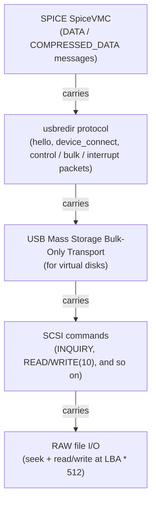
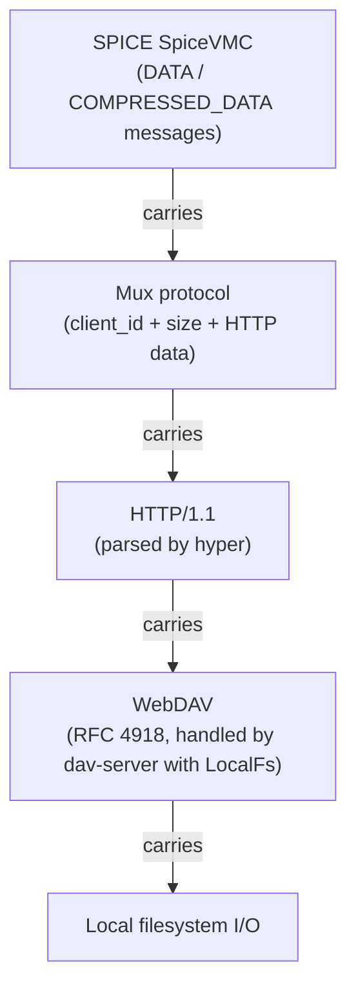
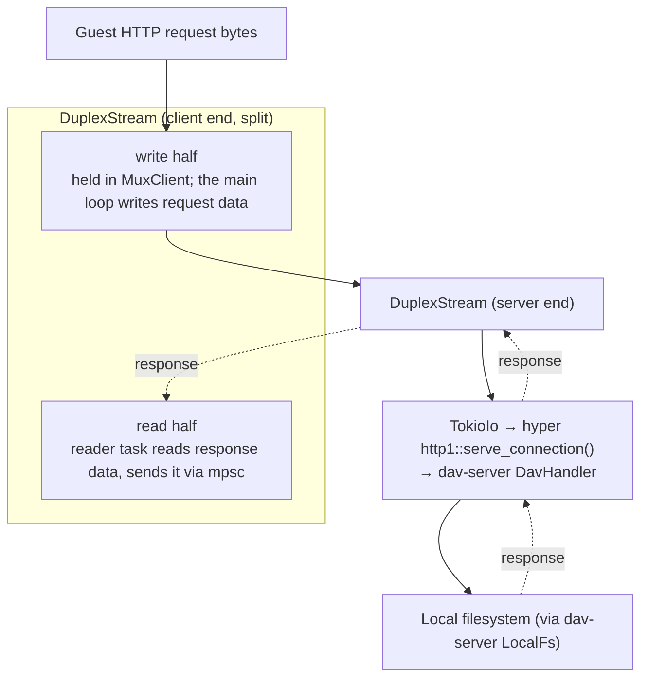

# Device redirection

Device redirection shares peripherals and data between the local machine
and the guest: USB devices over the usbredir channel, either as physical
pass-through on Linux or as virtual mass storage devices everywhere;
folder sharing over WebDAV; and clipboard text delivered as synthetic
keystrokes for guests without vdagent.

## USB Redirection

USB device redirection uses the SPICE usbredir channel (type 9) to
forward USB devices to the remote VM. The implementation spans
several protocol layers:



### Device backends

The `UsbDeviceBackend` trait (`shakenfist-spice-renderer/src/usb/mod.rs`)
abstracts over device types. The `DeviceBackend` enum provides
non-object-safe dispatch:

- **RealDevice** (`shakenfist-spice-renderer/src/usb/real.rs`): Physical USB
  device via the `nusb` crate. Linux only (`#[cfg(target_os = "linux")]`).
  Detaches kernel drivers, claims interfaces, forwards
  control/bulk/interrupt transfers. On non-Linux platforms, only virtual
  devices are available.
- **VirtualMsc** (`shakenfist-spice-renderer/src/usb/virtual_msc.rs`):
  Emulated USB mass storage device backed by a RAW disk image. Implements
  BOT protocol (CBW/CSW) and 8 SCSI commands. Reports as a USB 2.0 High
  Speed removable disk.

### Channel handler flow

1. Channel connects, sends usbredir hello with capabilities.
2. Server responds with hello.
3. If `--usb-disk` is configured, auto-connects after hello.
4. Device attachment sends `ep_info`, `interface_info`, `device_connect`.
5. Server sends lifecycle messages (`set_configuration`, `reset`, etc.)
   and data transfers (`control_packet`, `bulk_packet`).
6. Interrupt endpoints use background tokio polling tasks.
7. Disconnection aborts polling tasks and sends `device_disconnect`.

### CLI usage

```bash
ryll --file conn.vv --usb-disk /path/to/image.raw       # read-write
ryll --file conn.vv --usb-disk-ro /path/to/image.raw     # read-only
```

See the [configuration guide](/components/ryll/configuration/) for details. Use
`make test-qemu-usb` to start a QEMU instance with USB redirection
enabled.

### GUI Components

The USB panel is a right-side panel toggled by Menu → USB,
rendered alongside the traffic viewer panel (both use `egui::SidePanel::right`
with different IDs).

**State tracking on RyllApp:**

- `usb_tx` — mpsc sender to the UsbredirChannel, created in `RyllApp::new()`
  and threaded through `run_connection()`. Mirrors the `input_tx` pattern.
- `usb_channel_ready` — set when `UsbChannelReady` event arrives, cleared on
  usbredir channel disconnect.
- `usb_connecting` / `usb_disconnecting` — operation in progress flags, cleared
  on success/failure events.
- `usb_device_description` — set by `UsbDeviceConnected`, cleared by
  `UsbDeviceDisconnected` and channel disconnect.
- `usb_connected_at` — timestamp for the elapsed connection timer.
- `usb_available_devices` — enumerated device list, refreshed on panel open
  and via Refresh button.
- `usb_virtual_disks` — session-scoped virtual disk paths from CLI flags and
  runtime additions.

**Command flow:**

The GUI sends identity-based `UsbCommand` variants (`ConnectPhysical { bus,
address }` (Linux only), `ConnectVirtualDisk { path, read_only }`,
`DisconnectDevice`) via
`usb_tx`. The channel handler does async device lookup and open in its tokio
context, sending `UsbDeviceConnected`, `UsbDeviceDisconnected`, or
`UsbConnectFailed` events back to the app. If a device is already connected
when a connect command arrives, the handler disconnects it first.

**File picker:**

The "Add Disk..." button spawns `rfd::FileDialog` on a background thread. The
result is polled via `std::sync::mpsc::try_recv()` each frame. Selected files
are validated (regular file, >= 512 bytes) and added to the session's virtual
disk list.

**Bug report integration:**

USB errors show a "Report this as a bug" button that opens the bug report
dialog pre-populated with `BugReportType::Usb`, which captures the usbredir
channel's pcap traffic. Generic channel errors (displayed in the central
panel) also offer a bug report button pre-populated with
`BugReportType::Connection`.

## WebDAV Folder Sharing

WebDAV folder sharing uses the SPICE WebDAV channel (type 11) to export a
local directory to the guest VM. Like usbredir, it uses the SpiceVMC transport
(`SPICEVMC_DATA` / `SPICEVMC_COMPRESSED_DATA` messages). The guest's
`spice-webdavd` daemon issues HTTP WebDAV requests through the channel;
ryll runs an embedded WebDAV server that fulfils them against the local
filesystem.

### Protocol layers



### Mux protocol

The WebDAV channel multiplexes multiple concurrent HTTP clients over a
single byte stream. Each frame is:

```
client_id:  i64 LE  (8 bytes) — identifies the HTTP client
data_size:  u16 LE  (2 bytes) — payload size (0 = disconnect)
data:       [u8]    (data_size bytes) — raw HTTP bytes
```

The `MuxDemuxer` (`shakenfist-spice-renderer/src/webdav/mux.rs`) accumulates
bytes and extracts complete frames, handling frames that span VMC messages
or are packed together.

### Per-client architecture

Each mux client gets a `tokio::io::DuplexStream` pair:



Response data flows back through an `mpsc::Sender<MuxResponse>` from
the per-client reader task to the main `run()` loop, which muxes the
responses back to the guest. This is the same pattern used by usbredir's
interrupt polling tasks.

### Server lifecycle

The `WebdavServer` (`shakenfist-spice-renderer/src/webdav/server.rs`) wraps
`dav-server::DavHandler` with `LocalFs` and is cheaply cloneable (inner
`Arc`). It is created when
a `ShareDirectory` command arrives from the UI or `--share-dir` is
specified on the CLI, and destroyed on `StopSharing`. Read-only mode uses
`DavMethodSet::WEBDAV_RO` to restrict allowed HTTP methods.

### CLI usage

```bash
ryll --file conn.vv --share-dir /path/to/dir          # read-write
ryll --file conn.vv --share-dir /path/to/dir --share-dir-ro  # read-only
```

See the [configuration guide](/components/ryll/configuration/) for details. Use
`make test-qemu-webdav` to start a QEMU instance with WebDAV enabled.

### GUI Components

The Folders panel is a right-side panel toggled by
Menu → Folders. It mirrors the USB panel structure:
channel status indicator, active
share display with elapsed timer, error display with auto-clear, read-only
checkbox, and native directory picker via `rfd::FileDialog::pick_folder`.


## Paste-as-Keystrokes

The inputs channel includes a cooperative paste state machine for
typing text into guests that lack a vdagent clipboard channel.
Characters are translated to US-QWERTY AT scancodes via
`char_to_scancode()` and `translate_paste()` (both in `inputs.rs`),
capped at 4096 characters per paste.

The state machine (`PasteState`) runs as a conditional third arm in
the inputs channel's `tokio::select!` loop. A `tokio::time::sleep_until`
future fires on schedule; each firing sends one sub-step (press or
release) and yields back to the loop so the other two arms (server
reads and UI input events) remain responsive.

Per-character event sequence:
1. If shifted: KeyDown(Left Shift)
2. KeyDown(scancode)
3. Sleep half the inter-character delay
4. KeyUp(scancode)
5. If shifted: KeyUp(Left Shift)
6. Sleep the remaining half

At paste start, held modifier keys (Ctrl, Shift, Alt) are released
and saved; at paste end they are restored. Translation errors
(non-ASCII characters) emit `ChannelEvent::PasteFailed` and cause
a non-zero exit in headless mode.

CLI flags: `--enable-paste-as-keystrokes` (master gate),
`--paste-text TEXT` (headless trigger, implies enable),
`--paste-char-delay-ms N` (default 16ms).

GUI surface: When enabled, a "Paste" entry appears in the hamburger
menu with "Ctrl+Alt+V" shortcut text. The entry is disabled (greyed
out) when vdagent is connected, with a tooltip explaining to use
normal Ctrl+V. The Ctrl+Alt+V shortcut is detected before
`handle_input()` to prevent the V keypress from reaching the guest.
Pre-validation via `translate_paste()` catches unrepresentable
characters and shows an error dialog listing up to three sample
codepoints. The clipboard is read via `arboard::Clipboard` (lazily
initialised in `RyllApp::clipboard()`, separate from the
`MainChannel` instance).

