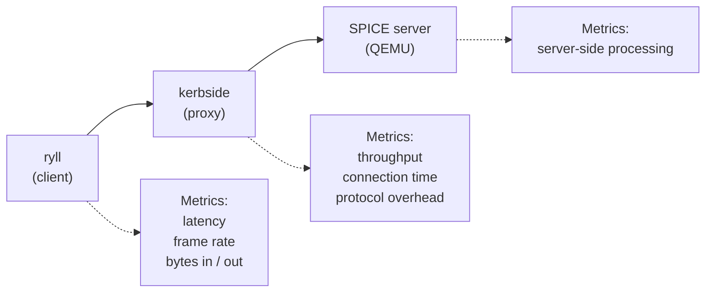

# Ryll Documentation

## What is Ryll?

Ryll is a multi-modal SPICE VDI client, written in Rust. It began life as a
purpose-built test client for performance testing of the **Kerbside** SPICE
proxy, and has since grown into a client suitable for day-to-day interactive
use — while keeping the instrumentation that made it useful for testing.

## Background

[Kerbside](https://github.com/shakenfist/kerbside) is a SPICE protocol native
proxy that sits between SPICE clients and servers. Unlike layer 4 proxies
that simply pass through unparsed traffic, Kerbside understands the SPICE
protocol itself, allowing it to make intelligent routing and optimization
decisions.

Getting Kerbside integrated into OpenStack has been a long process (see
[kerbside-patches](https://github.com/shakenfist/kerbside-patches)), and now
the focus has started to shift to performance validation.

## What's With The Name?

Honestly, I am not super into Star Wars or anything, but "ryll" was the first
good spice pun I came across. To quote the excellently named Wookieepedia:

!!! quote

    Ryll was a precious ore harvested from the mines of Ryloth, and could also
    be found in the Krost Mountains on Aaloth. It had military and scientific
    applications, but could also be used as a drug in the form of refined spice,
    which was less effective than glitterstim.

    https://starwars.fandom.com/wiki/Ryll

I guess I should think of a project to name "glitterstim" now too.

## Why Build a Custom Client?

Existing SPICE clients like `remote-viewer` (spice-gtk) are designed for
end-user use. They work well for connecting to VMs, but they're not designed
to be instrumented for performance testing.

Ryll was originally built to:

1. **Generate controlled traffic** - Predictable workloads for benchmarking
2. **Measure latency precisely** - Track time from keystroke to display update
3. **Run headless** - Automated testing without GUI overhead
4. **Be fully instrumented** - Every metric needed for proxy performance analysis

Those goals still stand, but along the way ryll grew broad enough protocol
coverage (display, cursor, inputs, audio, USB redirection, WebDAV folder
sharing) and enough delivery modes (desktop GUI, headless, web browser) that
it is now a practical client for real workloads, not just test ones.

## The Testing Setup

With ryll, we can:

- Measure end-to-end latency through the proxy
- Compare performance with and without the proxy
- Identify bottlenecks in the proxy implementation
- Validate that the proxy doesn't degrade user experience

## Future Direction

It's likely that a **custom SPICE server** will also be needed, to control
both ends of the traffic through the proxy. This would allow:

- Generating specific display patterns (gradients, text, video-like content)
- Precise timing of server-side events
- Controlled latency injection for testing
- Complete instrumentation of the entire path

## Documentation Index

- [Features](/components/ryll/features/) - The detailed feature catalogue and mode guides
- [Installation](/components/ryll/installation/) - Pre-built packages, pip, and building from source
- [Configuration](/components/ryll/configuration/) - CLI options and .vv file format
- [Web frontend](/components/ryll/web-frontend/) - Operator guide for `--web` mode
- [Control socket protocol](/components/ryll/control-socket-protocol/) - Driving headless sessions from external tools, and how the socket is implemented
- [Key design decisions](/components/ryll/design-decisions/) - Why ryll is shaped the way it is
- [SPICE protocol handling](/components/ryll/spice-protocol/) - Channels, handshake, image encodings, scancodes
- [Rendering and audio pipeline](/components/ryll/rendering-pipeline/) - Surfaces, window sizing, multi-monitor, audio, notifications
- [Device redirection](/components/ryll/device-redirection/) - USB, WebDAV folder sharing, paste-as-keystrokes
- [Diagnostics and instrumentation](/components/ryll/diagnostics/) - Capture, statistics, snapshots, bug reports
- [Session lifecycle](/components/ryll/session-lifecycle/) - Reconnection and graceful shutdown
- [Web mode internals](/components/ryll/web-mode-internals/) - Encoder, WebRTC bridge, and the `--web` relays
- [Multi-mode feature parity](/components/ryll/multi-mode-parity/) - Which features work in GUI, headless, and web modes
- [Development](/components/ryll/development/) - Building, testing, and contributing
- [macOS Development](/components/ryll/development-macos/) - Build and test locally on macOS
- [Continuous integration](/components/ryll/ci/) - The two CI tiers, the merge queue, and where binaries come from
- [Troubleshooting](/components/ryll/troubleshooting/) - Common issues and debugging
- [Binary Portability](/components/ryll/portability/) - How to share built binaries
- [Releasing](/components/ryll/releasing/) - How to publish a new release
- [Channel Diagnostics Audit](/components/ryll/channel-diagnostics-audit/) - Per-channel observability checklist
- [Libvirt / SPICE Server Recommendations](/components/ryll/libvirt-spice-recommendations/) - Guest XML settings for best display responsiveness

## Project Files

- [README](https://github.com/shakenfist/ryll/blob/develop/README.md) - Quick start and usage
- [ARCHITECTURE](https://github.com/shakenfist/ryll/blob/develop/ARCHITECTURE.md) - The crate map, code organisation, and concurrency model
- [AGENTS](https://github.com/shakenfist/ryll/blob/develop/AGENTS.md) - Guide for AI coding assistants
