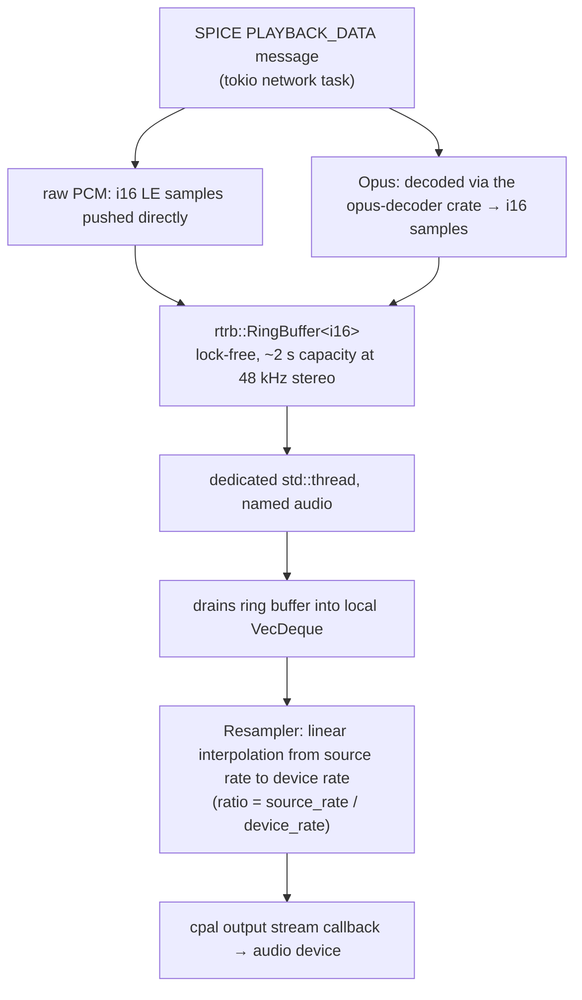

# Rendering and audio pipeline

The rendering and audio pipeline turns decoded SPICE surfaces into pixels
on a screen. This page covers that path in both GUI and headless modes,
how the window is sized and how multiple monitors are handled, how audio
playback is driven, and how user-facing notifications are raised.

## Display Rendering

### GUI Mode (egui)

Ryll uses **immediate mode rendering** via egui:

```rust
// Each frame:
fn update(&mut self, ctx: &egui::Context, _frame: &mut eframe::Frame) {
    // 1. Process incoming events (new images, cursor updates)
    self.process_events();

    // 2. For each surface, get texture and draw
    for surface in &mut self.surfaces {
        let texture = surface.texture(ctx);  // Upload pixels to GPU
        ui.image(texture, size);              // Draw texture
    }
}
```

No objects accumulate - the surface pixel buffer is updated in place, and the
texture is re-uploaded each frame when dirty.

Each frame's `process_events` drains the `ChannelEvent`
channel and dispatches image / fill / copy-bits /
invert / chroma / alpha events into the corresponding
`DisplaySurface` helper. See the [draw-op coverage
table](/components/ryll/spice-protocol/#draw-op-coverage) for the full
mapping from opcode to event to surface method.

### Headless Mode

In headless mode, the egui/eframe code is bypassed entirely:

```rust
// Just run tokio runtime
tokio::runtime::Runtime::new()?.block_on(async {
    run_connection(config, event_tx, input_rx).await
});

// Process events without rendering
loop {
    match event_rx.recv().await {
        ChannelEvent::ImageReady { .. } => stats.frames += 1,
        // ... track stats, no rendering
    }
}
```

### Control surface (headless control socket)

Headless mode optionally exposes a Unix-domain control socket via the
`--control-socket <path>` CLI flag, which lets an external harness
drive the session and observe draw activity. The flag is only valid
when `--headless` is also present.

The wire contract and ryll's implementation of it — module layout,
the single-client accept model, and the broadcast-bus and
drop-oldest backpressure path that carries events to a client — are
both documented in
[control-socket-protocol.md](/components/ryll/control-socket-protocol/).

## Multi-Monitor Support

Ryll supports multiple monitors via the `--monitors N` CLI option.
Each monitor gets its own display channel, and the main channel
sends a `VDAgentMonitorsConfig` message to the guest via the VDI
port agent infrastructure to inform it of the desired monitor
layout.

Surfaces are isolated by a `(display_channel_id, surface_id)`
tuple so that draw operations from different display channels
target the correct surface even when surface IDs overlap across
channels. This prevents cross-channel surface corruption in
multi-head configurations.

## Window sizing

The ryll window auto-fits to the guest display surface.
On every primary `SURFACE_CREATE` (and on the
`ImageReady` auto-create fallback for surface 0), the
event-handling path queues a viewport resize via
`pending_resize`. `RyllApp::update` consumes the pending
value, runs the pure `compute_auto_resize` decision
helper, and — if the helper returns Some — issues a
`ViewportCommand::InnerSize` to ask egui to make the
window match the surface. The aligned target is also
seeded into `last_sent_resize` so the next frame's
`maybe_send_monitors_resize` dedupes and we do not echo
our own resize back to the guest as a fresh
`VDAgentMonitorsConfig`.

The reverse direction — user drags the ryll window —
runs each frame in `maybe_send_monitors_resize`. The
viewport's inner-rect size is reduced by
`STATS_BAR_HEIGHT` (zero when maximised or fullscreen),
8-pixel aligned, and clamped to a floor of 8 on each
axis via `compute_outgoing_resize`. The result is sent
to the guest as a `VDAgentMonitorsConfig` if it differs
from `last_sent_resize`. The guest may honour the hint
exactly, pick the closest supported mode, or decline —
whatever resolution the guest actually chooses comes back
as a fresh `SURFACE_CREATE`, and the auto-fit pipeline
above re-syncs the window.

Three short-circuits keep the loop stable:

* `compute_auto_resize` returns None when the viewport is
  maximised or fullscreen; the surface renders at native
  size inside the available area rather than fighting
  egui for the inner size.
* `compute_auto_resize` dedupes against `last_auto_resize`
  so a no-op resize event does not refire the
  `ViewportCommand` every frame.
* `compute_outgoing_resize` plus `last_sent_resize`
  dedupes the outgoing side, so an auto-fit's seeded
  target does not bounce back to the guest as if the
  user had just dragged the window.

Both decision helpers are pure functions and are
unit-tested in `ryll/src/app.rs`'s `tests` module.

The auto-fit can be turned off with the
`Obey guest size hints` checkbox in the hamburger menu
(or the `--no-obey-guest-size` CLI flag at launch).
With the toggle off, the window stays where the user put
it and the surface renders at native pixel size inside
it — overflowing or letterboxing as the dimensions
require. The toggle is a session-level preference and
is **not** reset across a reconnect.

Every primary-surface mode change is also surfaced as an
Info notification ("Display resolution: WxH") through the
existing notification panel, debounced by
`RESOLUTION_NOTIFY_DEBOUNCE` (500 ms) so a burst of
events — boot probes that step `640×480 → 800×600 →
1024×768` over a second, or a drag-resize that steps
through dozens of 8-pixel-aligned sizes — collapses to a
single entry carrying the latest resolution. The
debounce is on top of the 30-second
`NOTIFICATION_DEDUP_WINDOW` from
`ryll/src/notifications.rs`, which folds same-resolution
repeats into a `count++` on the existing entry. The
decision is in the pure
`resolution_notification_due` helper next to the
window-fit helpers, and is unit-tested alongside them.

`pending_resize` is only set when the affected surface
key is `(display_channel_id == 0, surface_id == 0)`
(centralised as `is_primary_surface`), so a secondary
monitor's surface event cannot resize the primary
window.

Both auto-fit arms additionally refuse to honour
`SurfaceCreated` dimensions above
`MAX_AUTO_FIT_DIMENSION` (16384 px per axis,
`GL_MAX_TEXTURE_SIZE` on common hardware). A hostile
SPICE server can announce
`SurfaceCreated { width: u32::MAX, height: u32::MAX }`;
without the bound, ryll would forward that as
`ViewportCommand::InnerSize` (platform-dependent
behaviour, possibly large internal allocations) and
emit a notification carrying the absurd value. The cap
is checked at the trigger sites by
`auto_fit_size_acceptable`, which is unit-tested with
the other pure helpers; rejected sizes log a `warn!`
and leave the SPICE renderer's own surface bookkeeping
untouched.

## Audio Playback Pipeline

SPICE audio data arrives on the **Playback channel** (type 5) as
`PLAYBACK_DATA` messages containing a 4-byte multimedia timestamp
followed by encoded audio. The codec is negotiated via `PLAYBACK_MODE`
(raw PCM = 1, Opus = 3).



The tokio network task is the **producer**: it decodes incoming audio
and pushes i16 samples into the ring buffer via `rtrb::Producer<i16>`.
Back-pressure is applied by dropping samples when the ring buffer is
full (the server is sending faster than the device can consume).

The audio thread is the **consumer**: it owns the `cpal` output stream
and the `Resampler`. The cpal callback drains the ring buffer into a
local `VecDeque` and calls `Resampler::next_frame()` to produce
resampled output at the device's native sample rate. The resampler
uses linear interpolation and handles underruns silently (outputs
silence).

Volume control (`VolumeControl`) is shared between the UI thread and
the audio thread via `Arc<VolumeControl>`, using atomic operations to
avoid locking in the cpal real-time callback.

The audio thread is spawned on `PLAYBACK_START` and stopped (joined)
on `PLAYBACK_STOP` or channel disconnect.


## Notifications

Ryll surfaces three categories of operator-relevant events through a
unified in-memory store and a single GUI surface:

1. **Protocol gaps** — distinct `warn_once!` keys registered in
   `shakenfist-spice-protocol/src/logging.rs`. Each new key produces
   one Warn-severity Gap entry via the gap observer registered in
   `notifications.rs`.

2. **SPICE_MSG_NOTIFY** — opcode 7 messages parsed on every channel
   handler; each is pushed as a Spice-source entry tagged with the
   receiving channel and the SPICE `what` enum value.

3. **Internal status** — bug-report writer success/failure,
   screenshot Ok/Err/no-surface, paste-completed.

The store (`ryll/src/notifications.rs`) is a 500-entry
`VecDeque<NotificationEntry>` behind `Arc<Mutex<NotificationStore>>`.
Pushes apply a 30-second deduplication window: identical
`(source, severity, message, visibility)` tuples within the window
fold into the most recent entry's `count`, incrementing the `[N×]`
suffix the side panel renders.

The bell glyph in the status-bar right-edge cluster tints by the
highest-severity unread entry's colour (default text colour for Info,
amber for Warn, muted red for Error). Low-visibility SPICE entries are
excluded from the bell colour calculation — they record but do not
flash.
Clicking the bell toggles a right-side Notifications panel that lists
entries newest first; closing the panel marks every visible entry
read.

The `register_gap_observer` hook in
`shakenfist-spice-protocol/src/logging.rs` supports multiple
observers, so the `--pedantic` zip writer and the notifications
observer coexist independently.

Bug-report zips include a `notifications.json` with the full store
snapshot at submit time, alongside the existing `metadata.json`,
`session.json`, `channel-state.json`, and `runtime-metrics.json`.
Operators handing zips to third parties should be aware that
notification messages can include server-side text such as
hostnames, paths, and error strings.

