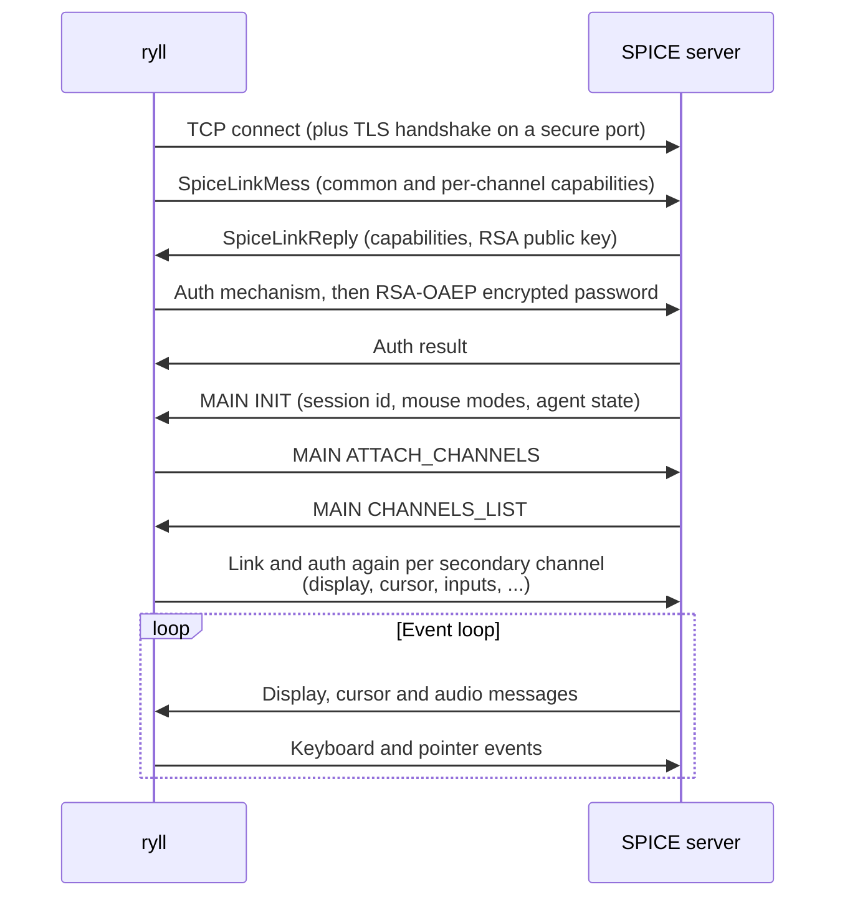

# SPICE protocol handling

This page describes how ryll speaks SPICE on the wire: the channel model
and handshake, mouse-mode negotiation, the image encodings it decodes, the
display channel capabilities it advertises, and the keyboard scancode
mapping. See [Architecture](https://github.com/shakenfist/ryll/blob/develop/ARCHITECTURE.md) for where these pieces
sit in the crate layout.

## SPICE Protocol

### Connection Sequence

### Message Format

All SPICE messages use a 6-byte mini-header, immediately followed
by the payload:

| Offset | Size | Field |
|---|---|---|
| 0 | 2 | `message_type` (u16 LE) |
| 2 | 4 | `message_size` (u32 LE) |
| 6 | `message_size` | payload |

### Channel Types

| Channel | Purpose | Message Examples |
|---------|---------|------------------|
| Main (1) | Session control | init, channels_list, ping/pong |
| Display (2) | Graphics | surface_create, draw_fill, draw_copy, draw_blackness, draw_whiteness, draw_invers, copy_bits, draw_opaque, draw_blend, draw_transparent, draw_alpha_blend, mark |
| Inputs (3) | User input | key_down, key_up, mouse_position, mouse_motion (see "Mouse-Mode Negotiation" below) |
| Cursor (4) | Pointer | cursor_set, cursor_move, cursor_hide |
| Playback (5) | Audio playback | playback_start, playback_data, playback_mode, playback_stop |
| Usbredir (9) | USB redirection | vmc_data, vmc_compressed_data (SpiceVMC transport) |
| WebDAV (11) | Folder sharing | vmc_data, vmc_compressed_data (SpiceVMC transport) |

### Mouse-Mode Negotiation

The SPICE server can drive input dispatch in either of two
mouse modes, and which mode is in effect changes how ryll
sends pointer events:

- **SERVER mode (1, "relative")** — the server expects
  `MOUSE_MOTION` messages with `(dx, dy)` deltas. Common
  on minimal setups without a guest agent.
- **CLIENT mode (2, "absolute")** — the server expects
  `MOUSE_POSITION` messages with `(x, y)` in screen
  coordinates. Required for the cursor to track a
  windowed client cleanly. CLIENT is what ryll asks for
  whenever the server says it is supported.

#### Wire format

Both directions use 16-bit fields, even though the
in-memory C struct is `u32` — `spice.proto` declares
`mouse_mode` as `flags16`, and the marshaller narrows it
on the wire. Misreading the wire as `u32` produces
nonsense values like 131075 (`0x00020003` for
supported=3 / current=2) which fail every mode check.

| Direction | Message | Payload |
|-----------|---------|---------|
| Server → client | `MAIN_MOUSE_MODE` (`SpiceMsgMainMouseMode`) | Two little-endian u16: `supported_modes`, then `current_mode` |
| Client → server | `MAIN_MOUSE_MODE_REQUEST` (`SpiceMsgcMainMouseModeRequest`) | One little-endian u16: requested mode flags |

`parse_mouse_mode_payload` and
`build_mouse_mode_request_payload` in
[`main_channel.rs`](https://github.com/shakenfist/ryll/blob/develop/shakenfist-spice-renderer/src/channels/main_channel.rs)
own the read and write sides; both have unit tests next
to them.

#### Negotiation flow

1. **At session INIT**, the server announces both
   `supported_modes` (a bitmask) and `current_mode`. Ryll
   calls `maybe_request_client_mouse_mode`, which sends a
   `MOUSE_MODE_REQUEST(CLIENT)` if CLIENT is supported but
   not current.
2. **On any subsequent `MAIN_MOUSE_MODE`** — typically
   triggered by guest events such as a guest reboot
   (which often reverts the server to SERVER/relative
   while the agent reattaches) — ryll re-evaluates the
   same predicate. This is the recovery path that keeps
   absolute pointer events working without a manual
   reconnect.

#### Request-loop guard

`MainChannel::mouse_mode_request_pending` tracks whether
a `MOUSE_MODE_REQUEST` is outstanding.
`maybe_request_client_mouse_mode` skips sending if this
flag is already set, and the flag clears when a
subsequent `MAIN_MOUSE_MODE` arrives announcing
`current_mode == CLIENT`. This caps outbound requests at
one per round trip, so a flappy or buggy server that
never honours the request cannot amplify its
`MAIN_MOUSE_MODE` traffic into a storm of client-side
requests.

The predicate `should_request_client_mouse_mode` and the
encoder `build_mouse_mode_request_payload` are pure
functions with their own tests — three branches and a
byte-shape assertion respectively — so a regression in
either the negotiation logic or the wire format fails
loudly during `cargo test`.

#### Agent reply-lag tracking

The main channel tracks guest agent responsiveness by measuring the round-trip
time of `VD_AGENT_REPLY` messages to periodic `VD_AGENT_MONITORS_CONFIG`
probes. Reply-lag fields (`agent_request_count`, `agent_reply_count`,
`last_agent_reply_lag_us`, `recent_agent_reply_lag_us`, and
`outstanding_agent_request_count`) are exposed on `MainSnapshot` for
bug reports and diagnostics. See the "Guest agent diagnostics" section
in [troubleshooting.md](/components/ryll/troubleshooting/) for interpretation.

## Image Types and Compression

SPICE uses several image types for display updates. The type is
specified in the `ImageDescriptor` that precedes each image's data.
Values from `spice-protocol/spice/enums.h`:

| Type | Name             | Status in ryll |
|-----:|------------------|----------------|
|    0 | Pixmap           | Supported (BitmapData header + raw BGRX/RGBA) |
|    1 | Quic             | Supported (Golomb-coded wavelet compression) |
|  100 | LZ_PLT           | Not implemented |
|  101 | LZ_RGB           | Supported |
|  102 | GLZ_RGB          | Supported (with cross-frame dictionary) |
|  103 | FromCache        | Supported (image cache lookup) |
|  104 | Surface          | Not implemented |
|  105 | Jpeg             | Supported (via the `image` crate) |
|  106 | FromCacheLossless| Not implemented |
|  107 | ZlibGlzRgb      | Supported (zlib-wrapped GLZ) |
|  108 | JpegAlpha        | Not implemented |
|  109 | LZ4              | Supported (per-row compressed) |

Streaming video codecs (MJPEG and H.264) are handled separately: they are not
`ImageType`s but delivered via `STREAM_DATA` / `STREAM_DATA_SIZED` messages.
The codec type byte in the stream header selects the decoder. At `STREAM_CREATE`,
`shakenfist_spice_compression::video::for_stream(codec_type, jpeg_decoder)`
constructs a boxed `VideoDecoder` stored on `StreamState`. Each `STREAM_DATA`
packet is dispatched through `stream.video_decoder.decode(packet)` regardless
of codec — the per-codec logic lives in the impl, not the dispatch.

Currently supported codec types:
- `1` (MJPEG): decoded by `MJpegVideoDecoder`, which wraps the
  platform-optimised JPEG backend and maintains a DHT cache for frames
  that omit the Huffman tables after the first. The backend selection is
  described below.
- `3` (H.264): decoded via `H264VideoDecoder` using the openh264 software
  decoder; H.264 is typically more bandwidth-efficient than MJPEG for
  sustained video playback.

**JPEG decoder selection** (used by `MJpegVideoDecoder`) runs once per
display channel at startup and selects the fastest available backend:
- **macOS**: ImageIO (uses Apple Silicon's dedicated media block when available)
- **Windows**: WIC (uses hardware codec support where available)
- **Linux**: VA-API (hardware-accelerated JPEG via libva, probed at runtime
  via dlopen; gracefully unavailable on systems without VA-API drivers)
- **Fallback**: libjpeg-turbo via the `mozjpeg` crate (vendored, no runtime
  dependency), then pure-Rust `jpeg-decoder` crate as a last resort

The active decoder backend name is exposed in the channel snapshot as
`mjpeg_decoder_backend` (from `video_decoder.name()`) so bug reports identify
which path was used. Aggregate decode-duration statistics (min/max/mean) are
tracked per display channel and included in bug reports for performance analysis.

### Wire format differences

- **LZ_RGB and GLZ_RGB**: preceded by a 4-byte `data_size` (u32 LE),
  then the LZ/GLZ stream with its own big-endian header.
- **ZLIB_GLZ_RGB**: preceded by `glz_data_size` (u32 LE) +
  `compressed_size` (u32 LE), then zlib-compressed GLZ data.
- **LZ4**: NO `data_size` prefix. Data starts immediately with a
  1-byte `top_down` flag, 1-byte `spice_format`, then per-row
  LZ4 blocks each with a 4-byte big-endian size prefix.
- **Pixmap**: preceded by an 18-byte `BitmapData` header (format u8,
  flags u8, x u32, y u32, stride u32, palette_addr u32), then raw pixel
  rows. Only 32-bit formats (BGRX=8, RGBA=9) are supported. The
  `top_down` flag (bit 2 of flags) controls row ordering.
- **JPEG**: preceded by a 4-byte `data_size` (u32 LE), then a standard
  JPEG stream. Decoded via the `image` crate and converted to RGBA.
- **FromCache**: no pixel data, uses `image_id` from the descriptor
  to look up a previously cached decompressed image.

### Compression algorithms

**GLZ** -- Dictionary-based compression that can reference pixels from
previous images (cross-frame). The GLZ decompressor maintains a cache
of decompressed images keyed by `image_id`. Cross-frame references
use `image_dist` to compute the source image ID. Each GLZ header
includes a `win_head_dist` field that defines the reference window
size; after decompressing an image, the display channel evicts all
cached images whose id falls below `image_id - win_head_dist`. In
multi-monitor configurations, the GLZ dictionary is shared across
all display channels via a `GlzDictionary` struct (in the
`shakenfist-spice-compression` crate) that wraps the image HashMap
with a `tokio::sync::Notify`. When one channel inserts a decoded
image, any other channel waiting on a cross-frame reference to
that image is woken immediately instead of polling. Non-GLZ images
are only cached when the server sets `IMAGE_FLAGS_CACHE_ME` in the
image descriptor; GLZ images are always cached since they form the
cross-frame reference dictionary. Server-initiated invalidation
(`INVALIDATE_LIST`, `INVAL_ALL_PIXMAPS`) clears both the per-channel
image cache and the shared GLZ dictionary.

**LZ** — Simpler variant that only references pixels within the
current image. No cross-frame dependencies.

**ZLIB_GLZ_RGB** — GLZ data compressed with zlib for additional
bandwidth savings. Common for incremental updates from QEMU/KVM
through kerbside.

**LZ4** — Fast per-row compression. Each row is individually
LZ4-compressed with a big-endian size prefix. The `spice_format`
byte indicates the pixel format (4=BGRX, 6=BGRA, 3=BGR).

**QUIC** -- SPICE's proprietary image codec based on the SFALIC
algorithm (Simple Fast Adaptive Lossless Image Compression). Not
to be confused with the IETF QUIC network protocol. Each colour
channel (R, G, B, and optionally A) is coded independently with
adaptive Golomb coding. The decoder is a pure-Rust port of the
canonical C implementation in `spice-common/common/quic.c` — no
pre-existing Rust crate provides SPICE QUIC decoding (the
`spice-client` crate on crates.io only handles JPEG/PNG, and
`spice-client-glib` wraps the C library via FFI). The decoder
clamps Golomb coding parameters to safe bounds to prevent panics
on malformed data. QUIC images are preceded by a 4-byte
`data_size` (u32 LE), then a QUIC header containing the image
dimensions, version (major=0, minor=1), and codec type.

All decompressors output RGBA pixels (BGRX/BGRA/BGR on the wire
is converted to RGBA with alpha=255 for opaque formats).

## Display Channel Capabilities

During the link handshake, ryll advertises per-channel capability flags
to the server. The display channel capabilities are particularly
important:

| Flag | Bit | Effect |
|------|----:|--------|
| SIZED_STREAM | 0 | Streaming video support |
| MONITORS_CONFIG | 1 | Multi-monitor configuration |
| COMPOSITE | 2 | Compositing operations (DRAW_COMPOSITE opcode 318) |
| A8_SURFACE | 3 | Alpha-only surface support |
| STREAM_REPORT | 4 | Streaming video diagnostics (stream lifecycle notifications) |
| LZ4_COMPRESSION | 5 | LZ4-compressed image payloads (fallback from Zlib) |
| PREF_COMPRESSION | 6 | Client preference messaging for image compression algorithm |
| MULTI_CODEC | 8 | Multiple video codec support in streaming |
| CODEC_MJPEG | 9 | MJPEG video codec for streaming |
| CODEC_H264 | 11 | H.264 video codec for streaming |
| PREF_VIDEO_CODEC_TYPE | 12 | Client preference messaging for video codec selection |

Without **COMPOSITE**, the guest QXL driver falls back to a slow
software rendering path that produces only `draw_copy` messages with
Pixmap images. With it, the driver uses hardware-accelerated
compositing and sends compressed image types (GLZ, LZ, JPEG). This
was the root cause of an earlier issue where keyboard input appeared
to have no effect -- the server was rendering via the slow path and
flooding the client with uncompressed data.

The correct display server opcodes are:
- `SURFACE_CREATE` = 314 (not 1, as some references suggest)
- `MONITORS_CONFIG` = 317
- `DRAW_COMPOSITE` = 318

### Draw-op coverage

The display channel handles the full set of
`DRAW_*` / `COPY_BITS` opcodes that modern QXL emits in
practice. Each opcode parses through a protocol struct in
`shakenfist-spice-protocol`, runs through a per-op
`decode_*` classifier (a
pure free function that returns an `Outcome` enum), and
emits a typed `ChannelEvent` that the app-side handler
turns into a `DisplaySurface` mutation.

| Opcode | Status | Channel event | Surface helper |
|--------|--------|---------------|----------------|
| `COPY_BITS` (104) | implemented | `CopyBits` | `copy_bits` (snapshot-safe for overlap) |
| `DRAW_FILL` (302) | implemented | `FillRect` | `fill_rect` |
| `DRAW_OPAQUE` (303) | implemented | `ImageReady` | `blit` |
| `DRAW_COPY` (304) | implemented | `ImageReady` | `blit` |
| `DRAW_BLEND` (305) | implemented | `ImageReady` | `blit` |
| `DRAW_BLACKNESS` (306) | implemented | `FillRect` (colour `[0,0,0,255]`) | `fill_rect` |
| `DRAW_WHITENESS` (307) | implemented | `FillRect` (colour `[255,255,255,255]`) | `fill_rect` |
| `DRAW_INVERS` (308) | implemented | `Invert` | `invert_rect` |
| `DRAW_ROP3` (309) | warn-once | — | — |
| `DRAW_STROKE` (310) | warn-once | — | — |
| `DRAW_TEXT` (311) | warn-once | — | — |
| `DRAW_TRANSPARENT` (312) | implemented | `ImageReadyChroma` | `blit_chroma` (chroma-key) |
| `DRAW_ALPHA_BLEND` (313) | implemented | `ImageReadyAlpha` | `blit_alpha` (constant-alpha source-over) |
| `DRAW_COMPOSITE` (318) | warn-once | — | — |

Implemented ops silently ignore a handful of sub-features
that modern QXL rarely uses (non-`SPICE_ROPD_OP_PUT`
rops, non-solid brushes in `DRAW_FILL`/`DRAW_OPAQUE`,
non-null `SpiceQMask`). Each such fallback fires a
`warn_once!` with a stable registry key (see
STYLEGUIDE.md §"warn_once for protocol gaps" for the
convention) so the fallback is visible exactly once per
session. The `--pedantic` mode and always-visible
`Gaps: N` status-bar counter surface these the moment
they happen. See the pedantic-mode entry below.

### Colour byte-order convention

All SPICE colour fields (brush colours, chroma keys, etc.)
are BGRX on the wire: a `u32` read little-endian gives
bytes `[B, G, R, X]`. `DisplaySurface` stores pixels as
RGBA. **The BGRX → RGBA conversion happens in the channel
handler, not in the surface helpers** — surfaces trust
their inputs. This means:

* `FillRect.colour`, `ImageReadyChroma.chroma_rgba`, and
  every `ImageReady*.pixels` buffer is RGBA by the time
  it reaches the app-side handler.
* The conversion idiom at the channel site is:
  `[r, g, b, a] = [(c>>16)&0xff, (c>>8)&0xff, c&0xff, 0xff]`
  where `c` is the wire `u32`. Decoded image pixels are
  byte-swapped (when the source format isn't already
  RGBA) at decode time in `decode_image_and_emit`.

### `--pedantic` mode and the warn_once registry

Every protocol gap — truly-unknown opcode, known-but-
unimplemented opcode, ignored sub-feature on an
implemented op, recoverable decode failure — is
registered in the process-global warn_once registry
defined in
[shakenfist-spice-protocol/src/logging.rs](https://github.com/shakenfist/ryll/blob/develop/shakenfist-spice-protocol/src/logging.rs).
Each call site holds a stable `&'static str` key shaped
`"<channel>:<kind>:<detail>"`; the registry fires
`tracing::warn!` exactly once per key per session.

The registry has a subscribe-and-replay hook
(`register_gap_observer`). `--pedantic` mode registers
an observer that writes one bug-report zip per new gap
into `--pedantic-dir` (default `./ryll-pedantic-reports/`,
capped at 50 zips per session). The observer runs inside
the app constructor (`RyllApp::new` for the GUI,
`run_headless` for headless) so the zips capture live
`TrafficBuffers` and `ChannelSnapshots` at the moment
the gap fires.

The always-visible `Gaps: N` button in the bottom status
panel polls `warn_once_count()` each frame; clicking opens
a floating window listing every fired key. The counter
works without `--pedantic` — `--pedantic` only adds the
bug-report-per-gap automation on top.

## Keyboard Scancodes

Ryll maps egui key events to AT keyboard scancodes for the SPICE protocol.
Keys in the navigation cluster (arrow keys, Home, End, Insert, Delete,
PageUp, PageDown) require the E0 extended prefix to distinguish them from
their numpad equivalents. These are encoded in the u32 scancode field as
`(scancode << 8) | 0xE0`, matching spice-gtk's `spice_make_scancode()`.
The mapping table uses the 0x1xx convention internally (bit 8 set = extended).
