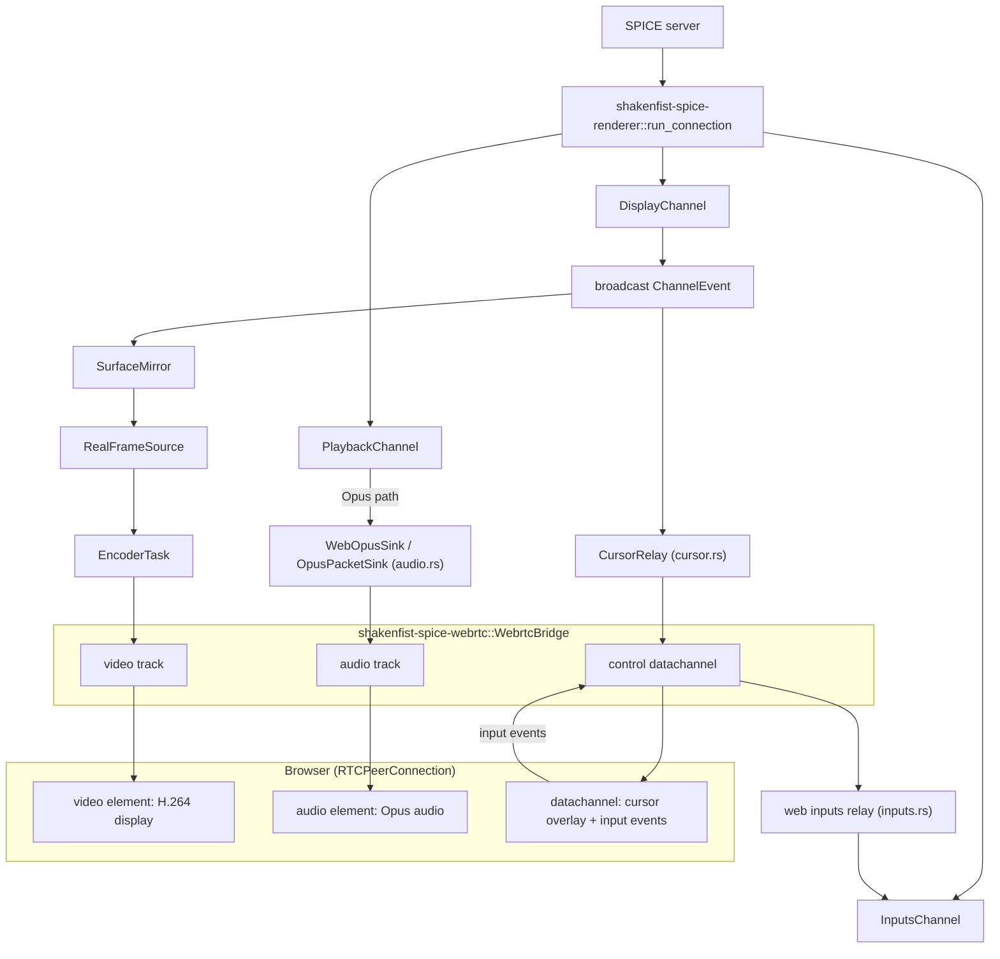

# Web mode internals

How `ryll --web` turns a live SPICE session into something a browser can
consume: the H.264 encoder pipeline, the WebRTC bridge, the four real-data
relays that connect them to the SPICE channels, and the lifecycle and
packaging concerns around them.

This is the developer-facing companion to the
[`--web` operator guide](/components/ryll/web-frontend/), which covers running the thing.
See [Architecture](https://github.com/shakenfist/ryll/blob/develop/ARCHITECTURE.md) for where these crates sit overall.

## Encoder module

`shakenfist-spice-renderer/src/encoder/` is the live H.264 encoder
pipeline.

### `H264Encoder`

A stateful wrapper around openh264. Takes an RGBA pixel buffer,
converts to YUV 4:2:0, encodes to Annex-B framed NAL units
(each NAL prefixed with the 4-byte start code `00 00 00 01`).
Every IDR frame is accompanied by SPS (NAL type 7) and PPS
(NAL type 8) NALs so keyframes are self-contained. Even-dimension
constraint: width and height are rounded down to even numbers
before encoding, via the shared `even_dimensions()` helper that
every producer of a size the encoder will see uses. The
`force_keyframe: bool` parameter to `encode()` calls openh264's
`force_intra_frame()` for the next encode.

`encode()` demands a buffer of exactly the encoder's (rounded)
size. `encode_cropped()` takes the *source* size instead and
discards the last row and/or column to reach it — an odd height
alone is a free subslice, an odd width needs a row-wise copy into
a staging buffer. Odd surfaces are ordinary: the browser asks the
guest for `Math.round()` of a CSS viewport and X grants odd modes.

Bitrate is not openh264's default. That default is a flat
120 kbit/s regardless of resolution, which is a webcam-era number
that renders a desktop unreadable. `H264Encoder::new` derives a
target from surface area and frame rate instead
(`MILLIBITS_PER_PIXEL_PER_FRAME`, ~2.4 Mbit/s at 1024x768@30),
clamped to 1–20 Mbit/s, and selects `UsageType::ScreenContentRealTime`.
The derivation is **open-loop**: nothing feeds the receiver's
bandwidth estimate (REMB/TWCC) back into the encoder, because
`EncoderControl` carries only keyframe and stop. On a constrained
link the encoder overshoots the path and the browser sees loss
rather than a softer picture.

### `EncoderTask`

Async driver that lives on tokio's blocking pool (openh264 is a
synchronous C library; `spawn_blocking` keeps it off the async
executor). The task loop:

- Ticks at a configurable FPS cap (default 30; period ≈ 33 333 µs).
- On each tick, calls `source.next_frame()`. If `Some`, encodes
  and sends `EncodedFrame` on the output channel. If `None`,
  skips the tick — no idle frames are produced.
- Handles `EncoderControl::RequestKeyframe` by setting a
  `keyframe_pending` flag consumed on the next encode.
- Handles `EncoderControl::Stop` by breaking the loop.
- Rebuilds the encoder when the frame's *rounded* size stops
  matching the encoder's, and forces an IDR so the decoder gets
  fresh SPS/PPS. This is how a mid-session guest resize is
  survived: the encoder is built for one size and rejects any
  other, and nothing restarts this task, so without the rebuild
  the first frame after a resize froze the viewer's video until
  it renegotiated. Comparing *rounded* sizes matters — an odd
  surface never compares equal to the encoder's rounded-down
  dimensions, which made every frame look like a resize.
- Tolerates up to `MAX_CONSECUTIVE_ERRORS` failed frames in a
  row before returning `Err`, for the same reason: one bad frame
  should not end the session's video.

### `FrameSource` and `FrameRef`

`FrameSource` is a trait that decouples the encoder from how
pixels arrive. The implementing type handles dirty tracking and
synchronisation with concurrent display-channel writers. It
returns `Option<FrameRef<'_>>` where `FrameRef` carries width,
height, RGBA bytes, and a `timestamp_us` used to derive RTP
timestamps. `SyntheticFrameSource` is a test/CI source that
generates animated gradient frames.

## WebRTC bridge (`shakenfist-spice-webrtc`)

`shakenfist-spice-webrtc` is a separate crate (not part of the
renderer) because the webrtc-rs dependency tree (DTLS, SRTP,
ICE, SCTP, STUN) is heavy and not all SPICE-client consumers
need it. The renderer stays a pure SPICE substrate; the bridge
is one specific delivery mechanism.

### `WebrtcBridge`

Wraps an `Arc<dyn PeerConnection>` (webrtc-rs 0.20's builder
hands back an unnameable `impl PeerConnection`, so the bridge
stores it behind the trait object) and owns:

- A video `TrackLocalStaticRTP` (H.264, 90 kHz clock rate).
- An audio `TrackLocalStaticRTP` (Opus, 48 kHz clock rate).
- A "control" datachannel (`Arc<dyn DataChannel>`, ordered +
  reliable — 0.20 has no `RTCDataChannel` user type).
- An `mpsc::Sender<EncoderControl>` to request keyframes.

Construction via `WebrtcBridge::new(WebrtcBridgeConfig)`: builds
a `MediaEngine` and registers H.264 and Opus codecs, enumerates
the host's bindable UDP addresses (`bind_addrs::host_udp_bind_addrs`;
see the UDP bind addresses subsection below), then builds the peer
connection through `PeerConnectionBuilder`, supplying the media
engine, the interceptor registry, the UDP addresses, and — the one
mandatory builder call, `build()` errors without it — a single
`BridgeHandler` wrapping one `BridgeEvents` struct. Only after the
peer connection exists does `new` create both tracks (with explicit
SSRC and codec `codings`) and add them, then create the control
datachannel and spawn a task that pumps its events into
`BridgeEvents::on_control_message`.

`BridgeEvents` holds the shared state and the callback bodies;
`BridgeHandler` is a thin newtype around `Arc<BridgeEvents>`
implementing 0.20's `PeerConnectionEventHandler` trait, which
replaces 0.17's four separate callback registrations with one
object supplied to the builder *before* the peer connection
exists. Every method on it is awaited inline by the peer
connection's driver event loop, so none of them may block — see
the WebRTC conventions section of AGENTS.md. `BridgeHandler`
implements three methods: `on_connection_state_change` and
`on_ice_gathering_state_change` delegate straight to
`BridgeEvents`; `on_data_channel` (fired when the remote peer
opens a datachannel — see the Control datachannel section below
for when that actually happens) spawns another pump task for that
channel rather than looping inline. Both the control DC's own pump
and any spawned from `on_data_channel` share one `JoinHandle` list
so `WebrtcBridge::close` can abort whichever pumps are still
running after `pc.close()`.

The state-change handler shadows the latest
`RTCPeerConnectionState` in a `Mutex` (the inherent accessor does
not survive the 0.20 port — there is no replacement on the trait
or the core) and raises the sticky `dead` signal on the first
terminal transition. The gathering handler raises the sticky
`gathered` signal on `Complete`. Both signals are
`StickySignal`s (`sticky.rs`): a `Notify` + sticky `AtomicBool`
pair giving level-triggered, raise-exactly-once semantics — see
the WebRTC conventions section of AGENTS.md for why a bare
`Notify` is not safe here.

`WebrtcBridgeConfig` carries the ICE server list (empty for
LAN-only use, populated by `--web-ice-server`), the UDP bind
policy described below, and the `EncoderControl` sender.

#### UDP bind addresses

webrtc-rs 0.17 bound its own sockets and enumerated the host's
interfaces internally; 0.20 inverts that — the caller binds the
sockets and hands the bound addresses to
`PeerConnectionBuilder::with_udp_addrs`, and those addresses are
the *only* input to ICE host-candidate generation. Binding the
obvious placeholder, `0.0.0.0:0`, succeeds and then produces a
literal `a=candidate:... 0.0.0.0 ...` in the answer SDP, which
every browser discards — and is invisible to the in-process test
suite, since two Rust peers on one host agree about the bogus
address and connect happily.
`shakenfist-spice-webrtc/src/bind_addrs.rs` reproduces what 0.17
did internally, as a `UdpBindPolicy` the bridge resolves. With no
selectors — the default, and what `host_udp_bind_addrs()` is — it
enumerates the host's network interface addresses via the
`if-addrs` crate and returns one ephemeral-port `SocketAddr` per
address, skipping loopback, unspecified, and IPv6 link-local
addresses. `--web-media-addr` fills the selectors with addresses
or interface names, and `--web-media-port` replaces the ephemeral
port.

The module splits its exclusions into two kinds, and the split is
what the configuration surface means:

- *Policy* — loopback, and everything not filtered at all (RFC
  1918, IPv4 link-local, IPv6 ULA). Defaults about what is worth
  advertising, overridden by naming addresses explicitly. This is
  what makes `--web-media-addr 127.0.0.1` a supported
  loopback-only deployment.
- *Mechanism* — unspecified (`0.0.0.0`, `::`) and zoneless
  `fe80::/10`. A `SocketAddr` cannot represent either in a way ICE
  can use, so `UdpBindPolicy::validate` refuses them at startup
  and no flag re-enables them.

The policy is resolved on every `WebrtcBridge::new` rather than
once per process, so a session that outlives a DHCP lease or a
VPN coming up binds what exists when the viewer arrives.
`WebrtcBridge::new` rejects an empty result rather than building
a peer connection that could only ever offer unroutable
candidates, and distinguishes the two empty cases: nothing
bindable on this host, versus nothing matching the configured
selectors. All of this is independent of the `--web-host` flag,
which only controls the HTTP/HTTPS signalling listener; see the
reverse-proxy callout in the
[web frontend guide](/components/ryll/web-frontend/) for the operator-facing
consequences.

### SDP flow

`accept_offer(sdp: String) -> Result<String>` is the single SDP
entry point for the HTTP `/offer` handler. It:

1. Sets the remote description (browser's offer).
2. Creates an answer.
3. Sets the local description.
4. Waits for ICE gathering to complete, by awaiting the sticky
   `gathered` signal raised by `BridgeEvents` (webrtc-rs 0.17's
   `gathering_complete_promise()` does not exist in 0.20).
5. Returns the fully-resolved answer SDP.

ICE gathering completion is awaited so the answer already
contains all host candidates — trickle ICE is not needed for
LAN-only use. Because the gathering signal is sticky and
never resets, a `WebrtcBridge` handles exactly one offer/answer
exchange; renegotiation requires a new bridge, and the web
frontend constructs one per `POST /offer`.

### Video pump

`spawn_video_pump(rx: mpsc::Receiver<EncodedFrame>)` drives the
video track:

- Consumes `EncodedFrame`s from the encoder output channel.
- Strips Annex-B start codes from each NAL.
- Payloads raw NALs via `H264Payloader` (from
  `rtc::rtp::codec::h264` — the sans-io core's payloader, not the
  abandoned standalone `rtp` crate; see the webrtc entry in
  the [development guide](/components/ryll/development/)'s dependency list).
- Sets the `marker` bit on the last RTP packet of each access unit
  (per RFC 6184 §5.1 — decoder pacing depends on this).
- Derives RTP timestamps from `EncodedFrame::timestamp_us` at
  90 kHz: `rtp_ts = (timestamp_us × 90_000) / 1_000_000`.
- Sequence numbers increment via `wrapping_add`.

SPS/PPS NALs produce empty payload sets (the `H264Payloader`
caches them and bundles them as STAP-A with the next IDR slice);
the pump skips empty sets cleanly.

### Control datachannel

Ordered + reliable, labelled "control". It carries ping/pong for
smoke testing, input events (scancodes, pointer coordinates), and
cursor overlay updates. `send_control(&[u8])` and `control_rx()`
are the public API.

A datachannel's SCTP stream id is assigned from the DTLS role at
creation time, and there is no role before the handshake, so any
datachannel created ahead of negotiation — on both sides — lands
on stream 1. Our `control` datachannel and the browser shell's
`control-seed` (`ryll/src/web/assets/app.js`) are both created
ahead of negotiation, so in the common case they collide on the
same stream: each side's channel is already in its own id map when
the peer's DCEP open arrives, the driver does not announce it, and
`on_data_channel` never fires. The remote peer's messages instead
surface on our *own* `control_dc`, pumped as `"local-dc"` — which
is harmless here, since both directions still work, but it means
the `on_data_channel` path (pumped as `"remote-dc"`) is dead in
normal operation. What is left for it is a datachannel the peer
opens *after* negotiation, where the stream ids no longer collide.

`spawn_synthetic_audio_pump()` remains available for testing
without a SPICE server: it emits a 440 Hz sine wave encoded as
Opus at 50 fps (20 ms per frame, 960 samples at 48 kHz), through
the same `TrackLocalStaticRTP` consumer interface the real audio
path uses.

### Keyframe-on-attach

The bridge sends `EncoderControl::RequestKeyframe` when the peer
connection transitions to the `Connected` state, so the first
frame the browser sees is always a full IDR. There is currently
no RTCP PLI (Picture Loss Indication) handler requesting a
keyframe on a viewer-initiated refresh: `bridge.rs` registers no
`on_rtcp_packet`-equivalent handling, so a browser that loses the
IDR has no way to ask for another one and must reconnect. The
WebRTC bring-up explicitly allowed stubbing this, and it is
carried as future work in
[`PLAN-web-frontend.md`](/components/ryll/plans/PLAN-web-frontend/).

### webrtc-rs convention: handler methods must never block

See the "WebRTC conventions" section in [`AGENTS.md`](https://github.com/shakenfist/ryll/blob/develop/AGENTS.md) for the
normative rule. In short: webrtc-rs 0.20 awaits every
`PeerConnectionEventHandler` method inline in the peer
connection's driver event loop, so a handler method that loops
(like a datachannel or track read loop) or blocks on a slow
consumer stalls the whole connection. `bridge.rs` has no
`on_track` implementation — the bridge only sends media, it does
not receive any — but the same rule is why `on_data_channel`
spawns a pump task instead of polling inline, and why
`BridgeEvents::on_state_change` uses `try_send` rather than
`send().await`.

The rule follows the dispatch path, not the type. Only the
methods reached from `BridgeHandler` run inline.
`on_control_message` lives on the same struct but is called from
the spawned `run_dc_pump` loops, so awaiting there parks one
datachannel's poll loop and nothing else — which is why it
awaits. That is the right trade for an ordered, reliable channel
carrying input: back-pressure onto SCTP costs latency, whereas a
dropped key-up leaves a modifier stuck down in the guest and
never gets redelivered.

## SPICE wire-up

Four connections carry real data between the SPICE session and the
bridge: display frames, audio, keyboard/mouse input, and cursor overlay.

### `SurfaceMirror`

`shakenfist-spice-renderer/src/surface_mirror.rs` — subscribes
to the renderer's broadcast `ChannelEvent` stream and maintains
a `HashMap<(u8, u32), DisplaySurface>` keyed by
`(channel_id, surface_id)`. The mirror is the authoritative
surface state for the web encoder path; it is separate from
the `RyllApp` surface map so the `--web` mode can run without
any egui dependency.

### `RealFrameSource`

`shakenfist-spice-renderer/src/encoder/frame_source.rs` — a
`FrameSource` implementation that reads from a `SurfaceMirror`
under `try_lock`. Returns `None` on lock contention (the encoder
skips the tick rather than blocking) and also returns `None` when
the primary surface is not dirty, achieving genuine
encode-on-dirty behaviour within the 30 fps cap.

### `OpusPacketSink` trait

`shakenfist-spice-renderer/src/audio_sink.rs` — a pre-decode
tap on the SPICE playback channel. When a type implementing this
trait is injected into the playback channel constructor, raw Opus
packets from the SPICE server are delivered to `push_opus_packet`
before being decoded to PCM for the cpal path. The `--web` mode
uses this to route Opus packets to the WebRTC audio track without
re-encoding. When the SPICE server negotiates raw PCM (not Opus),
the sink receives no packets; the web audio track is silent (a
warning is logged).

### Control-message module

`ryll/src/web/control.rs` — everything the server pushes to
`app.js` travels as JSON over the one control datachannel the
bridge owns, so the message envelopes and the outbound path live in
one place rather than in whichever relay needed them first.

The path is a queue, not a direct write. Producers (the cursor
relay, the mouse-mode tracker, each input relay) hold a plain
`mpsc::Sender<Vec<u8>>`; a single long-lived writer task drains it
onto whichever bridge is installed. Three reasons:

- Producers do not have to know how a bridge is stored, or take the
  bridge lock on the cursor hot path.
- The queue outlives any one bridge, so "no browser connected" is
  handled in one place rather than at every producer.
- A test can hold the receiving end and read exactly what the
  browser would have been sent, without a live peer connection.

A full queue drops rather than parking the producer: a browser that
far behind is better served by the next state than by a backlog.

Sends are best-effort at the far end too. `WebrtcBridge::send_control`
writes straight to the datachannel with no buffering and no
open-state tracking, so a message written before SCTP has opened the
channel is simply lost, and the error is logged at debug. Anything
the browser must not miss therefore has to be *pulled* by the
browser rather than pushed at a moment the server guesses is safe —
which is what `BrowserMsg::Hello` is for.

### Input relay

`ryll/src/web/inputs.rs` — drains the bridge's control
datachannel, parses the JSON input events that the browser shell
posts, and emits `InputEvent` variants (key down/up with AT
scancodes, mouse position/button) into the renderer's existing
inputs channel handler. Viewport-resize messages from the browser
are forwarded to `maybe_send_monitors_resize` so the SPICE guest
can track the browser viewport size at connect time. Viewport
sizes are rounded down to even here, because nothing between this
point and vdagent rounds and the encoder cannot code an odd
surface.

Which pointer message the relay sends depends on the negotiated
mouse mode, and a SPICE server discards the form it did not
negotiate without saying anything — so getting it wrong presents
as a dead pointer rather than as an error:

- **Client mode** (guest has vdagent, so an absolute pointing
  device): absolute `InputEvent::MouseMove`.
- **Server mode** (no vdagent): relative
  `InputEvent::MouseMotion`, derived from the difference between
  consecutive browser positions. Zero deltas are dropped, because
  each `MouseMotion` occupies a slot in an ack window that only
  drains on `MOUSE_MOTION_ACK`.

`BrowserMsg::Hello` is the browser's first message after
`dc.onopen`, and the relay answers it with the current mouse mode.
This is the only correct moment to deliver it: the SPICE server
announces the mode at session-init, seconds before any browser
exists, and the tracker below only re-broadcasts on a change that
a healthy session never has. The browser is the only party that
knows its channel is open, so it asks.

### Mouse-mode tracker

`run_mouse_mode_tracker`, also in `inputs.rs` — a task with the
lifetime of the *process*, not of a bridge. It subscribes to the
`ChannelEvent` broadcast bus and stores each `MouseMode` into the
shared `AtomicU32` the relay reads.

Its subscription lifetime is load-bearing. A `broadcast::Receiver`
only sees what is sent after it was created, and the mouse mode is
announced during session-init, so a per-bridge subscription would
always start out not knowing the mode. For the same reason
`run_web` takes this subscription (and the cursor relay's, and the
surface mirror's) *before* spawning the SPICE session, rather than
relying on session-init being slower than the code that follows it.

### Cursor relay

`ryll/src/web/cursor.rs` — subscribes to the renderer's
broadcast `ChannelEvent` stream and watches for `CursorImage`
and `CursorPos` events (the same events the egui frontend
consumes). Cursor shapes are encoded as PNG (`base64 = "0.22"`
for the data-URL wrapper) and sent as JSON over the control
datachannel. The browser shell decodes the data-URL, updates
an `` overlay element, and repositions it to follow cursor
motion events — keeping cursor latency on the datachannel path
rather than the video encoder path.

### Audio adapter

`ryll/src/web/audio.rs` — `WebOpusSink` implements
`OpusPacketSink`. When the peer connection reaches
`Connected`, the bridge activates the audio pump; `WebOpusSink`
routes each incoming Opus packet to the bridge's audio track
via the WebRTC audio pump. PCM-only SPICE servers do not
trigger any `push_opus_packet` calls, so the audio track emits
silence (and a one-time warning is logged).

### End-to-end data flow

The handler-methods-must-never-block webrtc-rs rule (documented
above) and the rustls `CryptoProvider` init (required once at
process start, before any TLS handshake) both apply to the
`--web` mode; the latter is handled in `ryll/src/main.rs` before
`run_web()` is called.

## Bridge lifecycle

### Bridge dead signal

`WebrtcBridge` carries a `dead: Arc<StickySignal>` field —
raised at most once, when the *peer* goes away: `Failed`,
`Disconnected`, or a `Closed` observed from the remote side.
`StickySignal` (`sticky.rs`) pairs a `Notify` with a sticky
`AtomicBool`, so late callers do not wait on an already-dead
bridge and a raise landing mid-subscribe is not lost.

A locally-initiated `close()` usually does **not** raise it. On
webrtc-rs 0.20 `close()` consumes the driver before it dispatches
the queued `Closed` transition, and a stopped driver cannot
deliver an ICE or DTLS event either. So `dead` means "the peer
went away", not "the bridge is finished" — anything that needs
the latter must observe it another way. The reaper below is the
consumer this matters to.

Public API:

- `wait_for_dead(&self) -> impl Future` — resolves when the
  signal is raised, per the qualification above. Returns
  immediately if it already is (late-subscriber safety).
- `dead_signal(&self) -> Arc<StickySignal>` — exposes the
  signal for consumers that hold their own clone without
  keeping a reference to the bridge; `handle.wait().await`
  is equivalent to `wait_for_dead()`.

### Server-side reaper (`ryll/src/web/lifecycle.rs`)

`run_bridge_reaper(state: Arc<WebState>)` is a long-lived
task spawned from `run_web`. Its loop:

1. Clones the active bridge's `dead_signal()` without
   holding the slot lock for long.
2. If no bridge is active, sleeps 500 ms and retries.
3. Awaits either the dead signal or `WebState::bridge_replaced`,
   which `POST /offer` raises after installing a new bridge. The
   second arm is required, not an optimisation: the task watches
   one bridge at a time, and a bridge closed by `/offer` does not
   raise its own dead signal (above), so waiting on `dead` alone
   parks it for the life of the process the first time a viewer
   reloads.
4. Re-checks that the bridge is genuinely dead, and that the
   generation counter has not moved. A wake is not evidence of
   death — `notify_one` stores a permit when nothing is parked,
   which is exactly the state `/offer` finds the reaper in — so
   the reap is gated on the signal itself.
5. Takes the bridge out of `bridge_slot`, calls
   `bridge.close().await`.
6. Calls `EncoderInfra::stop()` — sends `EncoderControl::Stop`
   and awaits the encoder task handle (2-second ceiling).
7. Clears `opus_active_tx`.

The SPICE session (`run_connection`) is left completely
untouched. A subsequent `/offer` from the browser rebuilds
a fresh bridge and encoder from the same live SPICE state.

Race condition: a new `/offer` and the reaper both race to
take the bridge via `bridge_slot.lock()`. Both serialise on
the mutex; whichever arrives first takes the slot, the other
observes `None` and no-ops.

### `EncoderInfra::stop`

A helper alongside `restart()`: sends `EncoderControl::Stop`
to the running encoder task and joins the handle with a
2-second timeout. Used by both the reaper (bridge died) and
the shutdown path (process exiting). Any orphaned task exits
naturally on its next send error.

### Graceful shutdown sequence

`run_web`'s shutdown sequence is:

1. Ctrl-C → `SHUTDOWN_REQUESTED.store(true)`.
2. The bridge between `SHUTDOWN_REQUESTED` and the SPICE
   `cancel` flag flips the cancel.
3. `axum::serve(…).with_graceful_shutdown(…).await` drains.
4. Take the active bridge from the slot and close it
   (2-second ceiling) so DTLS/SRTP tears down cleanly.
5. Call `EncoderInfra::stop()` to release the encoder task.
6. `run_web` returns; the tokio runtime drops.

### Browser-side auto-reconnect

`app.js` keeps the `RTCPeerConnection` setup and SDP offer flow
inside a callable `connect()` function rather than a one-shot
IIFE. On ICE-failed or connection-state-failed events,
`scheduleReconnect()` is called with backoff delays of 1 s, 2 s,
4 s, 8 s, 16 s (max 5 attempts). A hidden "Click to reconnect"
button is revealed when all attempts are exhausted. Each attempt
constructs a brand-new `RTCPeerConnection`; the backoff counter
resets on a successful `Connected` transition.

## CI and packaging

- `shakenfist-spice-renderer` and `shakenfist-spice-webrtc`
  are in the `publish-crates` step in `release.yml`
  in dependency order (renderer after compression; webrtc
  after usbredir; ryll last).
- `libopus-dev` is present in the devcontainer (and installed
  on the aarch64 Linux CI runner) so the `opus` crate
  dynamic-links against a system libopus. The deb/rpm
  packaging metadata records `libopus0` as a runtime
  dependency. On macOS and Windows the `audiopus_sys`
  source-build fallback applies (pkg-config absent → compile
  from source → no runtime dep).
- `tools/web-smoke.sh` is a CI step on the Linux x86_64
  build job only (`make web-smoke` / `make web-smoke-tls`,
  run inside the devcontainer). It launches `ryll --web`
  with a stub `.vv`, asserts the process stays alive for 3
  seconds, sends SIGTERM, and verifies clean exit within 5
  seconds. macOS and Windows CI verifies the `--web`
  dependencies link but does not run the smoke test.

## Native TLS

`axum-server` (with the `tls-rustls` feature) provides HTTPS.
Two CLI flags — `--web-tls-cert <PATH>` and `--web-tls-key
<PATH>` — activate it; clap's `requires =` enforces that both
are supplied together or neither. When TLS is active the startup
URL line prints `https://` and the server uses
`axum_server::bind_rustls(addr, RustlsConfig)` with a
`Handle::graceful_shutdown` shim driven by `SHUTDOWN_REQUESTED`,
keeping the graceful-shutdown semantics above intact. A
reference systemd unit at `examples/ryll-web.service` shows the
TLS-enabled invocation with an `EnvironmentFile` pattern.

Operator-facing TLS setup, cert recipes and the reverse-proxy
fallback are in the [`--web` operator guide](/components/ryll/web-frontend/).
