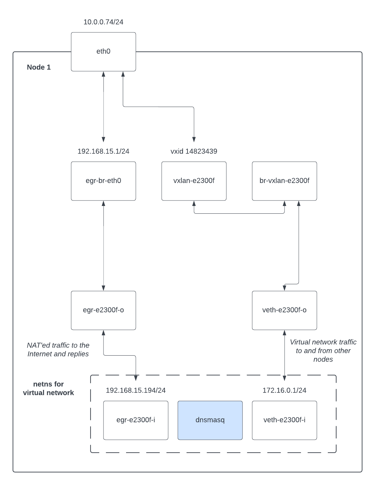
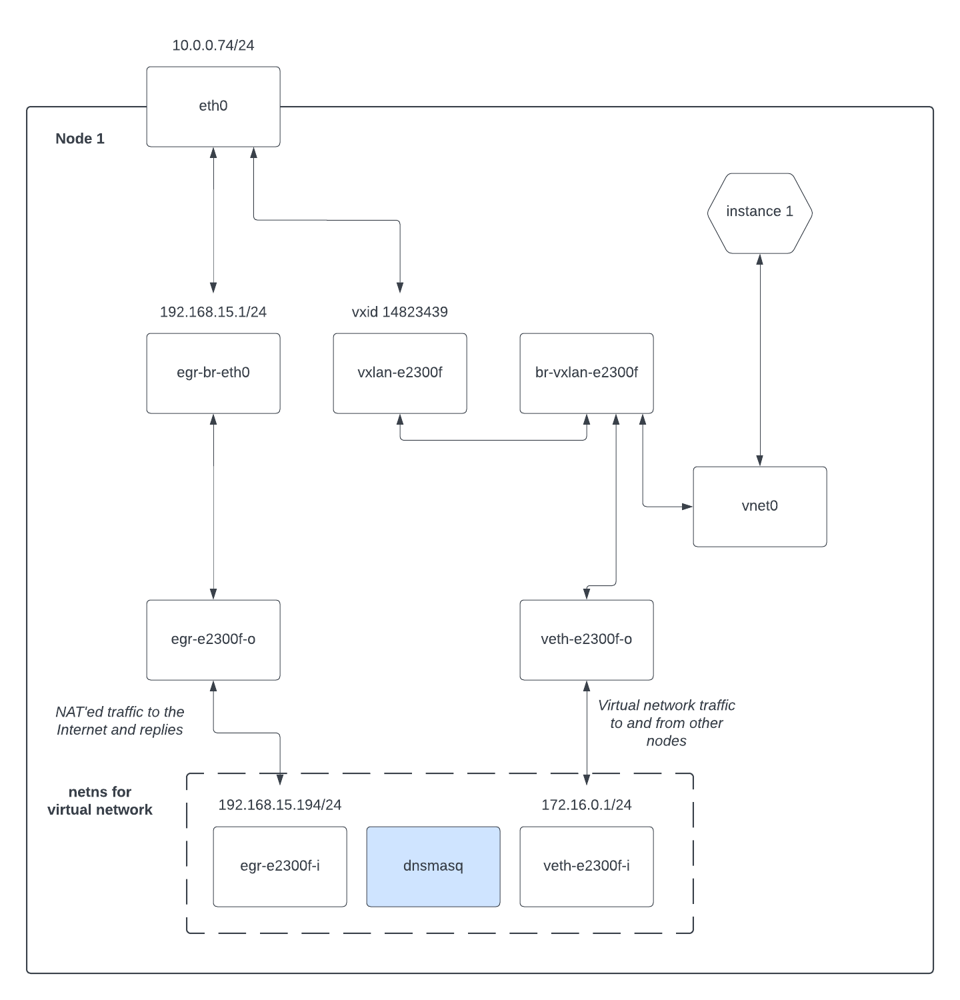
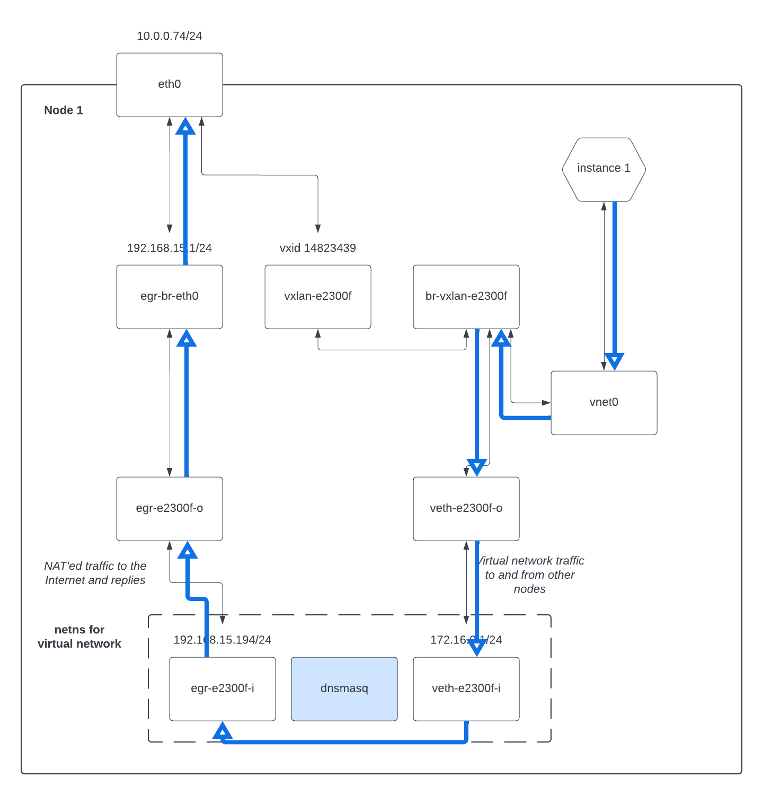
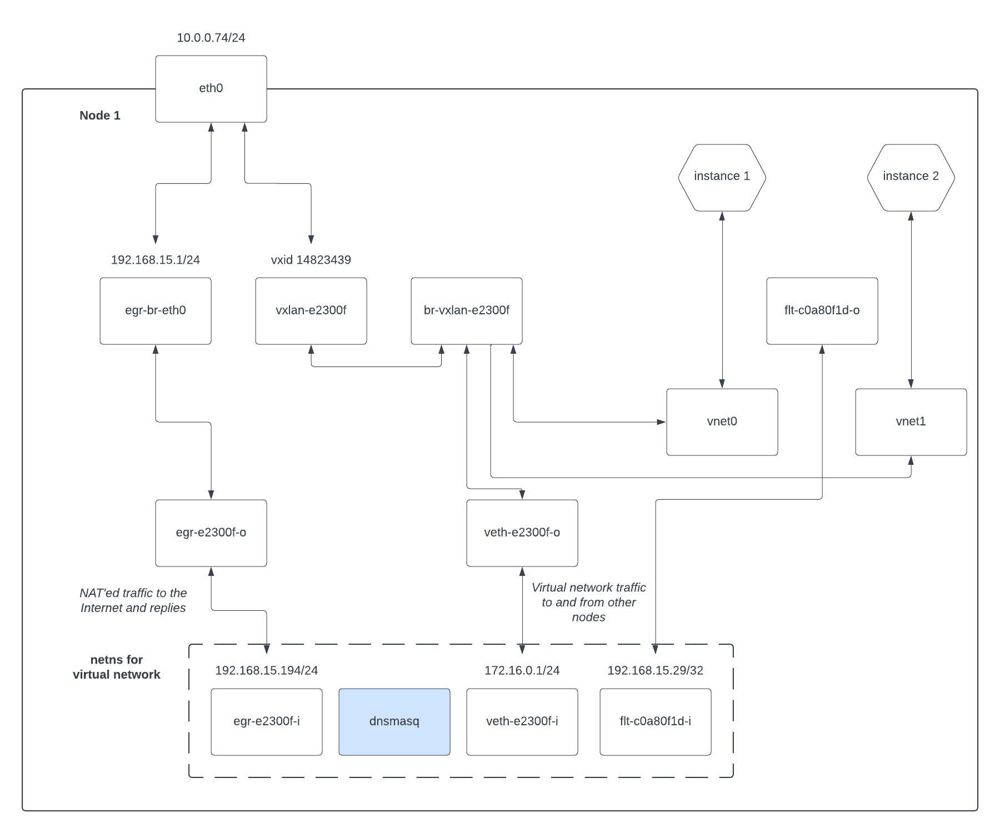
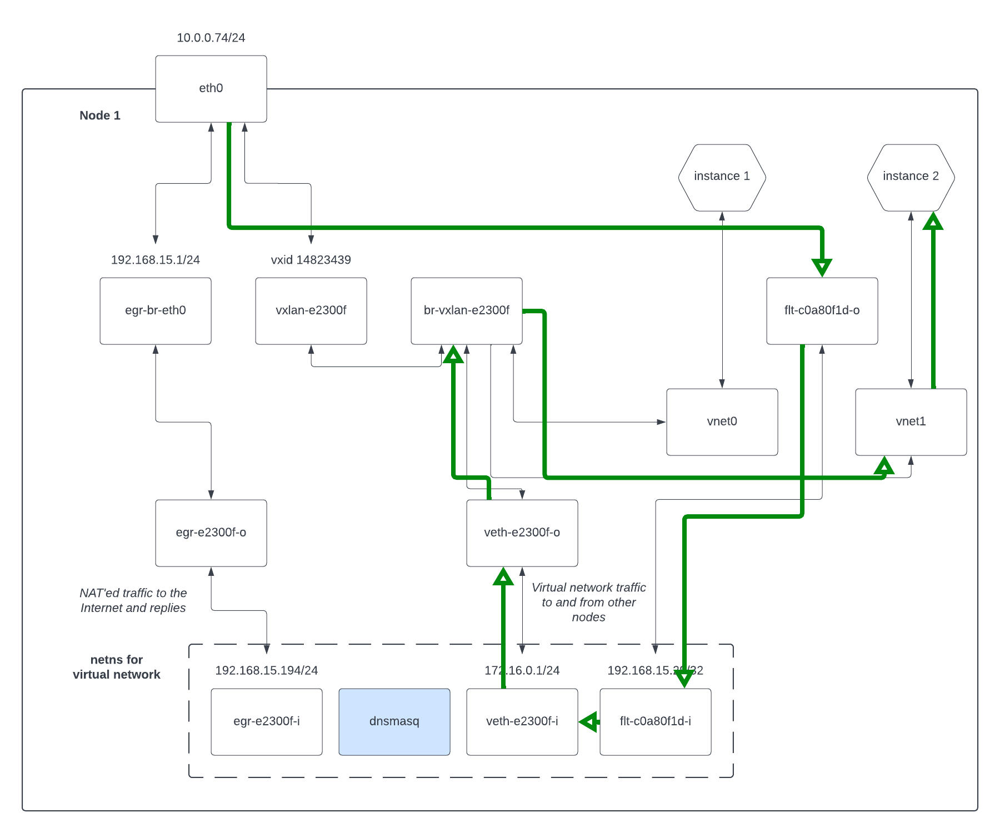
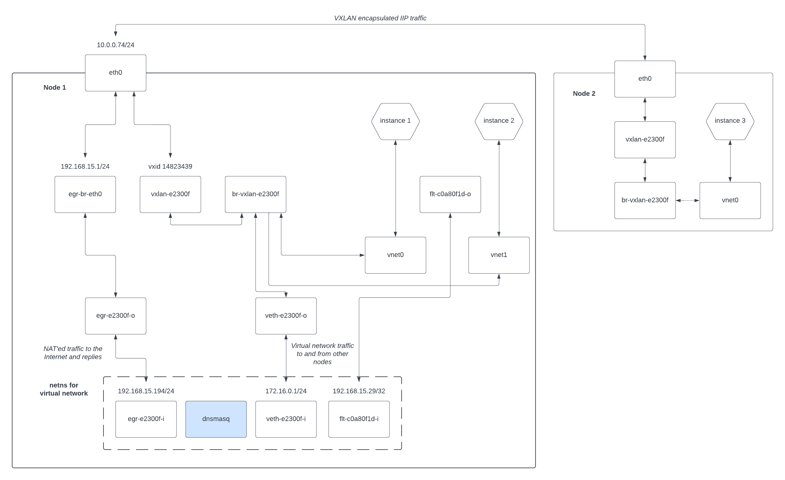

# Explaining Shaken Fist networking

Shaken Fist networking is complicated, but not as complicated as OpenStack
Neutron -- its more like the old OpenStack Compute nova-network implementation
if you're looking for a mental model. Let's work through some examples to explain
what it is doing.

!!! note "Asynchronous network deletion (REST API)"
    `DELETE /networks/{network_ref}` and `DELETE /networks` now return
    HTTP 202 (Accepted) with a cluster-operation handle in the body
    rather than performing the work synchronously. Operators scripting
    directly against the REST API (rather than via the Python client)
    must poll the returned op uuid at
    `GET /clusteroperations/{op_type}/{op_uuid}` until the op reaches a
    terminal state (`complete`, `abort`, `deleted`, or `error`). The
    Python client (`shakenfist_client`) handles this transparently —
    `delete_network()` polls by default and raises
    `ClusterOperationFailed` on a terminal-error state. See the
    [clusteroperations API reference](/developer_guide/api_reference/clusteroperations)
    for the full polling contract.

## Single node install, no networks or instances

```bash
debian@test:~$ ip a
1: lo: <LOOPBACK,UP,LOWER_UP> mtu 65536 qdisc noqueue state UNKNOWN group default qlen 1000
    link/loopback 00:00:00:00:00:00 brd 00:00:00:00:00:00
    inet 127.0.0.1/8 scope host lo
       valid_lft forever preferred_lft forever
2: eth0: <BROADCAST,MULTICAST,UP,LOWER_UP> mtu 8950 qdisc pfifo_fast state UP group default qlen 1000
    link/ether 02:00:00:00:0e:a3 brd ff:ff:ff:ff:ff:ff
    altname enp0s11
    altname ens11
    inet 10.0.0.74/24 brd 10.0.0.255 scope global eth0
       valid_lft forever preferred_lft forever
3: egr-br-eth0: <NO-CARRIER,BROADCAST,MULTICAST,UP> mtu 1500 qdisc noqueue state DOWN group default qlen 1000
    link/ether f6:d1:c6:05:15:fd brd ff:ff:ff:ff:ff:ff
    inet 192.168.15.1/24 scope global egr-br-eth0
       valid_lft forever preferred_lft forever
```

Explaining this:

* `lo` is the loopback interface, and not relevant here.
* `eth0` is the primary interface for the machine, and `10.0.0.74` is the IP
  address of the machine.
* `egr-br-eth0` is a linux bridge that is currently empty and has the IP
  `192.168.15.1`, which is the first IP on this cluster's floating network.
  Networks will get attached

## Single node install, one network and no instances

Let's make a network, but not put any instances on it yet:

```bash
debian@test:~$ sf-client network create demo 172.16.0.0/24
uuid            : 17be6538-8f96-4ccb-b71e-a7e3022fead3
name            : demo
vxlan id        : 14823439
netblock        : 172.16.0.0/24
provide dhcp    : True
provide nat     : True
floating gateway: 192.168.15.194
namespace       : system
state           : created

Metadata:

debian@test:~$ ip a
1: lo: <LOOPBACK,UP,LOWER_UP> mtu 65536 qdisc noqueue state UNKNOWN group default qlen 1000
    link/loopback 00:00:00:00:00:00 brd 00:00:00:00:00:00
    inet 127.0.0.1/8 scope host lo
       valid_lft forever preferred_lft forever
2: eth0: <BROADCAST,MULTICAST,UP,LOWER_UP> mtu 8950 qdisc pfifo_fast state UP group default qlen 1000
    link/ether 02:00:00:00:0e:a3 brd ff:ff:ff:ff:ff:ff
    altname enp0s11
    altname ens11
    inet 10.0.0.74/24 brd 10.0.0.255 scope global eth0
       valid_lft forever preferred_lft forever
3: egr-br-eth0: <BROADCAST,MULTICAST,UP,LOWER_UP> mtu 1500 qdisc noqueue state UP group default qlen 1000
    link/ether f6:d1:c6:05:15:fd brd ff:ff:ff:ff:ff:ff
    inet 192.168.15.1/24 scope global egr-br-eth0
       valid_lft forever preferred_lft forever
10: vxlan-e2300f: <BROADCAST,MULTICAST,UP,LOWER_UP> mtu 8900 qdisc noqueue master br-vxlan-e2300f state UNKNOWN group default qlen 1000
    link/ether 6a:c0:ee:6f:83:6f brd ff:ff:ff:ff:ff:ff
11: br-vxlan-e2300f: <BROADCAST,MULTICAST,UP,LOWER_UP> mtu 8900 qdisc noqueue state UP group default qlen 1000
    link/ether 8a:a6:8d:31:c9:09 brd ff:ff:ff:ff:ff:ff
13: veth-e2300f-o@if12: <BROADCAST,MULTICAST,UP,LOWER_UP> mtu 8900 qdisc noqueue master br-vxlan-e2300f state UP group default qlen 1000
    link/ether 6e:34:bc:25:68:c2 brd ff:ff:ff:ff:ff:ff link-netns 17be6538-8f96-4ccb-b71e-a7e3022fead3
15: egr-e2300f-o@if14: <BROADCAST,MULTICAST,UP,LOWER_UP> mtu 1500 qdisc noqueue master egr-br-eth0 state UP group default qlen 1000
    link/ether 5a:9c:f3:eb:2f:bc brd ff:ff:ff:ff:ff:ff link-netns 17be6538-8f96-4ccb-b71e-a7e3022fead3
```

Here, we allocated a network, which was assigned VXLAN id 14823439 (`e2300f` in
hexadecimal). That created a VXLAN interface named `vxlan-e2300f` on the machine,
which is where other machines in a multinode cluster would attach for the VXLAN
mesh which forms our virtual network. `br-vxlan-e2300f` is a linux bridge used to
attach the local network namespace for this network to the VXLAN interface. That
is, the members of the bridge look like this:

```bash
debian@test:~$ sudo brctl show br-vxlan-e2300f
bridge name	        bridge id		    STP enabled	    interfaces
br-vxlan-e2300f		8000.8aa68d31c909	no		        veth-e2300f-o
							                            vxlan-e2300f
```

Similarly, the egress bridge `egr-br-eth0` now contains a veth as well:

```bash
debian@test:~$ sudo brctl show egr-br-eth0
bridge name	        bridge id		    STP enabled	    interfaces
egr-br-eth0		    8000.f6d1c60515fd	no		        egr-e2300f-o
```

And there is a linux network namespace named with the UUID of the network:

```bash
debian@test:~$ ls /var/run/netns/
17be6538-8f96-4ccb-b71e-a7e3022fead3
```

That linux network namespace contains the other ends of the veths:

```bash
debian@test:~$ sudo ip netns exec 17be6538-8f96-4ccb-b71e-a7e3022fead3 ip a
1: lo: <LOOPBACK> mtu 65536 qdisc noop state DOWN group default qlen 1000
    link/loopback 00:00:00:00:00:00 brd 00:00:00:00:00:00
12: veth-e2300f-i@if13: <BROADCAST,MULTICAST,UP,LOWER_UP> mtu 1500 qdisc noqueue state UP group default qlen 1000
    link/ether 36:da:87:ea:ce:16 brd ff:ff:ff:ff:ff:ff link-netnsid 0
    inet 172.16.0.1/24 scope global veth-e2300f-i
       valid_lft forever preferred_lft forever
    inet6 fe80::34da:87ff:feea:ce16/64 scope link
       valid_lft forever preferred_lft forever
14: egr-e2300f-i@if15: <BROADCAST,MULTICAST,UP,LOWER_UP> mtu 1500 qdisc noqueue state UP group default qlen 1000
    link/ether d2:b0:c8:31:f4:83 brd ff:ff:ff:ff:ff:ff link-netnsid 0
    inet 192.168.15.194/24 scope global egr-e2300f-i
       valid_lft forever preferred_lft forever
    inet6 fe80::d0b0:c8ff:fe31:f483/64 scope link
       valid_lft forever preferred_lft forever
```

This network namespace exists to contain a `dnsmasq` process providing DHCP to
the virtual network, as well as to contain routing and iptables rules for mangling
traffic into and out of the virtual network.

Specifically, NAT for traffic from the virtual network to the outside world is
implemented with routing and iptables like this:

```bash
debian@test:~$ sudo ip netns exec 17be6538-8f96-4ccb-b71e-a7e3022fead3 ip route
default via 192.168.15.1 dev egr-e2300f-i
172.16.0.0/24 dev veth-e2300f-i proto kernel scope link src 172.16.0.1
192.168.15.0/24 dev egr-e2300f-i proto kernel scope link src 192.168.15.194

debian@test:~$ sudo ip netns exec 17be6538-8f96-4ccb-b71e-a7e3022fead3 iptables -L -t nat
Chain PREROUTING (policy ACCEPT)
target     prot opt source               destination

Chain INPUT (policy ACCEPT)
target     prot opt source               destination

Chain OUTPUT (policy ACCEPT)
target     prot opt source               destination

Chain POSTROUTING (policy ACCEPT)
target     prot opt source               destination
MASQUERADE  all  --  172.16.0.0/24        anywhere
```

So, the default route is via the egress veth at `egr-e2300f-i` (inside the
namespace), which comes out on `egr-br-eth0` (outside the namespace) to be routed
as normal. Traffic to other machines participating in this virtual network (that
is, with the same VXLAN id configured), is routed to `veth-e2300f-i` (inside the
namespace) which comes out on the `br-vxlan-e2300f` (outside the namespace) bridge
which is wired to the linux kernel VXLAN interface at `vxlan-e2300f`. Finally,
traffic to other floating IPs on `192.168.15.0/24` is routed to the egress
bridge as well.

The iptables `MASQUERADE` entry is there to convert internal addresses to the
external `192.168.15.194` "floating gateway" address so instances can talk outside
their virtual network.

Perhaps a diagram would help!



## Single node install, one network and one instance with no floating IP

Now let's create a single instance on that network, with the instance specifically
not having a floating IP:

```bash
debian@test:~$ sf-client instance create demo 1 1024 -d 10@debian:11 -n demo
uuid          : 3b9c13ee-405f-4195-b904-cffb34e022d3
...

Interfaces:

    uuid    : afc470fb-8348-4711-8c16-be4c4662d705
    network : 17be6538-8f96-4ccb-b71e-a7e3022fead3
    macaddr : 02:00:00:bd:cd:9b
    order   : 0
    ipv4    : 172.16.0.232
    floating: None
    model   : virtio
...
```

There is only one new outer network interface created by adding the instance:

```bash
debian@test:~$ ip a
...
16: vnet0: <BROADCAST,MULTICAST,UP,LOWER_UP> mtu 8900 qdisc noqueue master br-vxlan-e2300f state UNKNOWN group default qlen 1000
    link/ether fe:00:00:bd:cd:9b brd ff:ff:ff:ff:ff:ff
```

`vnet0` is a libvirt construct to attach the virtual machine's network interface
to the host OS. We attach that interface to the bridge that is the virtual network
for this machine, in this case `br-vxlan-e2300f`:

```bash
debian@test:~$ sudo brctl show br-vxlan-e2300f
bridge name	        bridge id		    STP enabled	    interfaces
br-vxlan-e2300f		8000.8aa68d31c909	no		        veth-e2300f-o
							                            vnet0
							                            vxlan-e2300f
```

There are no changes to the inside of the network namespace for this VM -- the
`dnsmasq` process for example is already connected to the virtual network by
virtue of the `veth-e2300f` pair and can therefore provide DHCP to the instance.

Again perhaps a diagram will help:



This instance is not accessible from outside our virtual network as it does not
have a floating IP. It can however talk to the outside world because our virtual
network has NAT enabled. This is done by routing the traffic from `vnet0` to the
virtual network's network namespace, where the iptables `MASQUERADE` rule will
then NAT the traffic out.

We can show this NAT traffic like this:



## Single node install, one network and one instance with no floating IP

Let's add a second instance, but this time with a floating IP associated with it:

```bash
debian@test:~$ sf-client instance create floatingdemo 1 1024 -d 10@debian:11 -f demo
uuid          : 08c0ae07-6a4b-4f63-9d50-a172039091a0
...

Interfaces:

    uuid    : a4cfa174-cce9-4cda-907a-b90d7f54efd1
    network : 17be6538-8f96-4ccb-b71e-a7e3022fead3
    macaddr : 02:00:00:c7:f9:cc
    order   : 0
    ipv4    : 172.16.0.37
    floating: 192.168.15.29
    model   : virtio
...
```

Again we add a `vnet` device via libvirt:

```bash
debian@test:~$ ip a
...
17: vnet1: <BROADCAST,MULTICAST,UP,LOWER_UP> mtu 8900 qdisc noqueue master br-vxlan-e2300f state UNKNOWN group default qlen 1000
    link/ether fe:00:00:c7:f9:cc brd ff:ff:ff:ff:ff:ff
19: flt-c0a80f1d@if18: <BROADCAST,MULTICAST> mtu 8900 qdisc noop state DOWN group default qlen 1000
    link/ether aa:5c:1c:0c:7c:f6 brd ff:ff:ff:ff:ff:ff link-netns 17be6538-8f96-4ccb-b71e-a7e3022fead3
```

But we've also added another veth pair, this time named `flt-c0a80f1d` on the
outside of the network namespace. You can see in the instance details above that
the floating IP associated with this instance is `192.168.15.29`, which just so
happens to be `c0a80f1d` in hexadecimal. So this veth is how floating IP traffic
is delivered to an instance.

Here's another diagram showing the new setup:



Its important to note that traffic _from_ the instance still goes via the NAT
route shown above, while traffic _to_ the instance via the floating IP uses this
veth. Replies to floating IP requests return via this veth as well though.

The instance isn't aware of its floating IP at an operating system level at all.
That is, inside the network namespace the veth attaches to, we do DNAT to mangle
the traffic to the instance:

```bash
debian@test:~$ sudo ip netns exec 17be6538-8f96-4ccb-b71e-a7e3022fead3 iptables -L -t nat
Chain PREROUTING (policy ACCEPT)
target     prot opt source               destination
DNAT       all  --  anywhere             192.168.15.29        to:172.16.0.37

Chain INPUT (policy ACCEPT)
target     prot opt source               destination

Chain OUTPUT (policy ACCEPT)
target     prot opt source               destination

Chain POSTROUTING (policy ACCEPT)
target     prot opt source               destination
MASQUERADE  all  --  172.16.0.0/24        anywhere
```

So our floating IP of `192.168.15.29` is DNAT'ed to the instance's IP of
`172.16.0.37`. This means floating IP traffic "bounces" off the network namespace.
To make that work, the inside of the veth is configured with the floating IP:

```bash
debian@test:~$ sudo ip netns exec 17be6538-8f96-4ccb-b71e-a7e3022fead3 ip a
...
18: flt-c0a80f1d-i@if19: <BROADCAST,MULTICAST> mtu 1500 qdisc noop state DOWN group default qlen 1000
    link/ether fe:cb:4c:4a:17:ef brd ff:ff:ff:ff:ff:ff link-netnsid 0
    inet 192.168.15.29/32 scope global flt-c0a80f1d-i
       valid_lft forever preferred_lft forever
```

Note the `/32` netmask for that address assignment. Notably, the routing table
for the outer linux still looks like this:

```bash
debian@test:~$ ip route
default via 10.0.0.1 dev eth0
10.0.0.0/24 dev eth0 proto kernel scope link src 10.0.0.74
192.168.15.0/24 dev egr-br-eth0 proto kernel scope link src 192.168.15.1
```

The outer linux knows to route the floating IP down that veth because of this
address assigned on the inside of the namespace.

Let's have a final diagram showing how a packet for a floating IP gets to its
instance:



## Multiple nodes

Its actually a relatively small step from the above to multiple hypervisor nodes,
as additional nodes don't have the network namespace or the veths -- those exist
only on the network node (node 1 in our example).



## Routed IPs

Shaken Fist v0.8 introduced the concept of *routed IPs* to support Kubernetes
services in the K3S orchestration support. A routed IP is an address from the
floating address pool which uses routing to deliver traffic to the relevant
virtual network. An interface on the virtual network must then have been
configured by the user to answer ARP requests for that address. This works well
with metallb, which our K3S orchestration uses to expose services, but would
work equally well for other traffic.

???+ tip

    The fundamental difference between a floating IP and a routed IP is whether
    the destination of the traffic inside the virtual network is aware of the
    address. A floating IP is packet mangled on its way to an interface so that
    the interface can't tell that the traffic was sent to a floating IP. On the
    other hand, an interface with a routed address can tell that the traffic was
    intended for a specific floating IP, but in return must have been configured
    to use that floating IP.

The implementation of routed IPs is relatively trivial. For each routed IP, a
route on the network node into the relevant virtual network bridge is created.
Such a route might look like this:

```
ip route add 192.168.15.29/32 dev br-vxlan-e2300f
```

## Interface naming conventions

The interface names in the examples above are a contract, not a
coincidence: the privexec daemon derives them independently when adding
and when removing resources, so the add and remove paths must agree on
the names or removal silently does nothing. Exactly that happened when
the floating IP add path dropped the `-o` suffix from the outer veth end
but the removal path kept looking for it -- every floating IP release
leaked its veth pair and DNAT rule, and reuse of those floating IPs then
failed or misdirected traffic (github issues #3378 through #3383).

All names are derived either from the network's VXLAN id as six lower
case hex digits (`e2300f` for VXLAN id 14823439 in the examples above),
or from the floating IPv4 address as eight lower case hex digits
(`c0a80f1d` for 192.168.15.29). Linux limits interface names to 15
characters, which these conventions exactly fill in the worst case.

On the network node:

| Name | Where | Purpose |
|------|-------|---------|
| `vxlan-<vxid>` | root namespace | VXLAN mesh interface for the virtual network |
| `br-vxlan-<vxid>` | root namespace | bridge joining the VXLAN interface, instance taps and the namespace veth |
| `veth-<vxid>-o` / `veth-<vxid>-i` | root namespace / network namespace | veth pair attaching the network namespace to `br-vxlan-<vxid>`; the inner end holds the virtual network gateway address and serves DHCP |
| `egr-<vxid>-o` / `egr-<vxid>-i` | root namespace / network namespace | veth pair attaching the network namespace to the egress bridge for NAT and floating traffic |
| `flt-<hex ip>` / `flt-<hex ip>-i` | root namespace / network namespace | veth pair delivering traffic for one floating IP; the inner end holds the floating address as a /32 |
| `egr-br-<nic>` | root namespace | egress bridge on the physical egress NIC, holding the first address of the floating network |

The network namespace itself is named with the UUID of the virtual
network. Note the asymmetry for floating veth pairs: the outer end has
no suffix (not `-o`), while the inner end is suffixed `-i`. Each
floating IP also has a DNAT PREROUTING rule inside the network
namespace directing the floating address to the instance's inner
address.

Hypervisor nodes which are not the network node only carry
`vxlan-<vxid>`, `br-vxlan-<vxid>` and the instance tap devices.

These conventions are asserted by the unit tests in
`shakenfist/tests/test_privexec_floating_ip.py` and exercised end to
end by `TestFloatingIPLifecycle` in the cluster CI suite. If you change
a name, change it in the add path, the remove path, the tests, this
page and `docs/components/cloudgood/networking-shakenfist.md` together.

## Stray vxlan reaping

Every node's network maintainer compares the vxlan devices actually
present on the host against the networks that node should be carrying.
A device which matches nothing is a *stray* -- residue from a network
teardown which did not finish, or from a network which has since been
hard deleted entirely.

Once a stray has been present for `MAINTAIN_STRAY_VXLAN_GRACE_SECONDS`
(default 300) the maintainer acts on it:

* If no `networks` row claims the vxid at all, the maintainer deletes
  `br-vxlan-<vxid>`, `veth-<vxid>-o`, `egr-<vxid>-o` and
  `vxlan-<vxid>` itself, and records a **`reaped stray vxlan`** audit
  event on the node. The `extra` field of that event names the devices
  which were actually removed, and the message says why the vxid was
  considered reapable. If some devices were removed but others could
  not be deleted, the event is **`partially reaped stray vxlan`**
  instead and `extra` carries a `failed` list alongside `devices`; the
  remaining devices are retried after another grace period.
* If the network still exists but no instance on this hypervisor uses
  it, the maintainer enqueues an ordinary network teardown operation
  for that network on that node instead of touching the devices
  itself, and records an **`enqueued teardown of stray vxlan`** audit
  event.
* Otherwise the stray is left alone and logged once per episode. It is
  *not* re-logged on every pass -- it used to be, which on a busy
  cluster produced thousands of identical `Extra vxlan present!` lines
  per day (github issue #3597).

Before either of the first two outcomes touches anything, the
maintainer also asks the host itself: if a device it did not create --
a guest's tap interface -- is still enslaved to `br-vxlan-<vxid>`,
then a virtual machine is attached to that bridge right now whatever
the database says, and the stray is protected and logged instead. If
that question cannot be answered at all, the stray is likewise
protected.

A bridge which does not exist is an answer to that question, not a
failure to answer it -- nothing can be attached to a bridge which is
not there. This matters because teardown deletes `br-vxlan-<vxid>`
before `vxlan-<vxid>`, so a teardown which was interrupted leaves the
vxlan interface behind with no bridge. That is the most common stray
shape there is, and treating it as unanswerable would protect exactly
the residue this reaping exists to remove.

All three audit events are worth watching for. None is an error on its
own -- the maintainer is doing the job it exists to do -- but a node
producing them repeatedly is a node where network teardown is failing
somewhere upstream, and that is worth investigating. Note that a
`partially reaped stray vxlan` event fires once per stray episode, not
once per retry: later attempts on the surviving devices are silent
until one succeeds. A `partially reaped stray vxlan` with no follow-up
`reaped stray vxlan` therefore means a device on that host will not go
away, which usually needs manual attention.

**A reap on the network node implies manual cleanup.** The devices
listed above are all named from the VXLAN id, so the maintainer can
find them without the network object. The network namespace, and the
NAT and DNAT rules inside it, are named from the network *uuid* --
which is exactly what has been lost by the time a reap happens. They
are therefore not cleaned up, and once the vxlan devices are gone
nothing in Shaken Fist will report them again. Previously the
never-ending `Extra vxlan present!` warning was, in effect, the
standing notification that this residue existed; now the single audit
event is the only record, so if you see a `reaped stray vxlan` event on
your network node, check for a leftover namespace:

```bash
sudo ip netns list
```

Namespaces are named with the virtual network's UUID, so any name which
does not correspond to a network in `sf-client network list` is residue
and can be removed with `sudo ip netns delete <uuid>`.

## Dispatcher diagnostic events

Operators reading the event log for a cluster operation will see two
events emitted directly by the queue dispatcher (in addition to the
operation-specific audit and mutate events emitted by the operation
itself):

* **`execution duration`** (`EVENT_TYPE_USAGE`). Emitted when the
  dispatcher finishes running an op. Carries four fields in `extra`:
    * `seconds` — wall-clock time spent inside `op.execute()`
      (state writes, coalescing fold, the `_apply_*` work, the
      terminal state write).
    * `wait_seconds` — time between when the op was first inserted
      into `cluster_operations` and when the dispatcher claimed it.
      This is not queueing alone: it also counts deliberate
      deferral while an op waits on a dependency, and the seconds a
      `*_high_io` background op spends gated off while the local
      disk is busy. Both are designed behaviour, and each is large
      enough to be the whole of a tail on its own -- the worst
      operation type measured for the queue-performance plan had a
      15.78 s median wait which fell to 0.77 s once deferred ops
      were excluded. So read a large value against `defer_count`
      and against the node's disk busy metric before calling it a
      backup; only once those are excluded does it point at worker
      saturation or a stuck op blocking the worker. See "Reading
      these events back" below.
    * `defer_count` — how many times this op was re-enqueued via
      `defer()` / `defer_with_backoff()` before finally running. A
      first-time pickup is `0`; non-zero values indicate dependency
      waits or transient retries.
    * `queue_name` — the queue the op was claimed from. Useful for
      attributing wait time to a specific priority lane (e.g.
      `networknode-clusteroperation-user_facing_high_io`).

  The combined event replaces an earlier split into separate
  `'started executing'` and `'execution duration'` events. The
  combined form halves the eventlog gRPC cost on the dispatcher's
  critical path -- profiling identified that cost as the largest
  per-op overhead added during the queue-performance work. Ops
  loaded outside the dispatch path (unit tests, REST endpoints)
  still emit `'execution duration'` with `seconds` only; the
  wait fields are populated only when the dispatcher set the
  hints.

  The same event also carries the coalescing instrumentation, when
  the operation reached the cross-op fold's guards at all:
    * `coalesce_outcome` — `ran` if the fold's SQL was issued, or
      which guard skipped it: `batch_size_one` (the dispatcher
      dequeued only this op), `not_cluster_wide` (a per-node queue,
      where folding would be unsafe), `type_not_coalescible` (this
      operation type declares no coalescing at all, which is every
      cluster operation that is not a `net_op` and so most of them)
      or `no_coalescible_tasks` (a type which could have coalesced,
      carrying nothing coalescible this time). The last two are
      separate outcomes on purpose: merged, the boring case buries
      the interesting one.
    * `coalesce_seconds` — cost of the `claim_coalescible_siblings`
      call, present only when the fold ran. Measured with a monotonic
      clock, so it is an interval rather than a difference of two wall
      clock readings.
    * `coalesce_folded` — how many siblings that call folded away,
      which is legitimately zero.

  `coalesce_outcome` is the field which distinguishes "the fold ran
  and found nothing" from "the fold never ran". Those two look
  identical from outside, which is how #3878 stayed invisible for
  three months. `tools/queue-wait-report.py` reports the
  distribution and the outcome counts.

* **`coalesced sibling ops`** (`EVENT_TYPE_STATUS`). Emitted on a
  surviving op, *and on the op's coalescing target*, when one or
  more *other* pending ops on the same target with the same single
  coalescible task were folded into this one's execution. It lands
  on the target as well because an operation is hard deleted thirty
  seconds after it reaches a final state and takes its events with
  it (issue #3864), so an event recorded only against the survivor
  is unreadable within a minute of the fold; the network outlives
  it. For a `net_op` the target is the network, so this event is
  queryable through `GET /networks/<uuid>/events`. Carries three
  fields in `extra`:
    * `sibling_count` — how many siblings were folded.
    * `sibling_uuids` — their op uuids. Looking up any of those
      will show their state as `complete` with the message
      `coalesced into sibling op`.
    * `tasks` — which coalescible task(s) drove the fold.

  A burst of these on `network_apply_update_dnsmasq` is the
  expected outcome of multiple parallel instance starts on the
  same network and is healthy. A *complete absence* of these
  during a CI run that's known to be enqueueing duplicate work
  would point at a bug in either the enqueue-side dedup
  (`mariadb.find_existing_coalescible_op`) or the worker-side fold
  (`mariadb.claim_coalescible_siblings`).

  Note that the worker-side fold also skips itself when the
  dispatcher just observed an empty queue
  (`dispatcher_batch_size == 1`). A new sibling arriving after our
  dequeue will be folded on the next dispatcher cycle, not this
  one, so a moderate gap between sibling-arriving and
  `coalesced sibling ops` firing is expected.

  This paragraph described the diagnostic before anything used it.
  Between 2026-05-26 and 2026-08-24 the event never fired at all,
  on any cluster, because both primitives joined
  `cluster_operations` to `object_states` on columns that could
  never match (issue #3878). If you are reading historical event
  data from that window, its absence says nothing about the
  workload. There is now a functional test which asserts that one
  of the two coalescing events reaches a network after a burst of
  instance starts on it
  (`shakenfist/deploy/shakenfist_ci/cluster_ci_tests/test_coalescing.py`),
  so a repeat of that defect fails CI rather than waiting for an
  audit.

* **`enqueue-side dedup: reused pending op`** (`EVENT_TYPE_AUDIT`).
  Emitted on the *existing* operation, and on the network, when a
  new enqueue was answered with an already-pending op instead of a
  new row. Carries `requested_task` and `existing_op_uuid` in
  `extra`. This is the enqueue-side counterpart of
  `coalesced sibling ops`; without it a deduped enqueue would leave
  no trace on the network's event stream at all, since the op it
  reuses was created by some earlier caller.

  Only the cluster-wide `networknode` queue is ever deduped, in
  either direction. Neither primitive can filter on which queue a
  sibling is on -- `cluster_operations` has no queue column -- so a
  coalescible task on a per-node queue would be folded across
  nodes, and one hypervisor's work silently never applied. That is
  enforced at enqueue time rather than left to convention: a
  coalescible task enqueued to a per-node target raises
  `InvalidCoalescibleEnqueue`. It is also why `network_ensure_mesh`
  is *not* coalescible despite looking like the best candidate --
  it updates the local host's FDB, so two mesh ops on one network
  are the same work only if they are on the same node. See #3884.

### Reading these events back

Neither event survives its operation for long, so plan to read them
from the log stream rather than from the database.

A cluster operation is hard deleted 30 seconds after it reaches a
final state, and hard deleting an object removes the rows which join
its events to it. Roughly half a minute after an operation completes
there is nothing left to query: the operation is gone, and its events
are orphaned rows which the daily prune sweep then deletes. The
`MAX_USAGE_EVENT_AGE` and `MAX_STATUS_EVENT_AGE` retention settings
never come into it -- they bound how long an event may live, not how
long the object it describes does. This is issue #3864.

What does persist is the log stream. Every event is echoed as a log
line carrying the whole `extra` dict, unless `LOG_EVENTS_TO_LOKI` has
been turned off, so wherever the cluster's logs are shipped is where
an operation's history can still be read after the fact.

Do not grep that stream for `Added event`. That is the message the
echo is written with, but the logger merges the caller's fields over
the record last and one of those fields is the event's own `message`,
so the string never reaches the shipped JSON. Filter on the event's
message instead -- `execution duration` for the events above -- which
is what the record's `message` field actually holds.

`tools/queue-wait-report.py` in the source repository summarises the
`execution duration` events from such a stream: give it Shaken Fist
JSON log lines on standard input -- from Loki, from
`journalctl -u 'sf-*.service' -o cat`, or from a CI log bundle -- and
it reports the queue-wait distribution by queue class, priority lane
and operation type. It prints the two caveats needed to read those
numbers: that a p90 at or below two seconds is the dispatcher's idle
poll interval rather than queueing, and that `wait_seconds` includes
deliberate deferral, which is why every percentile is also reported
over just the operations which never deferred.
